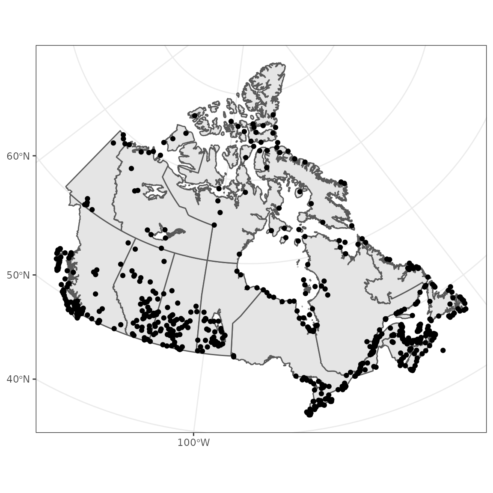
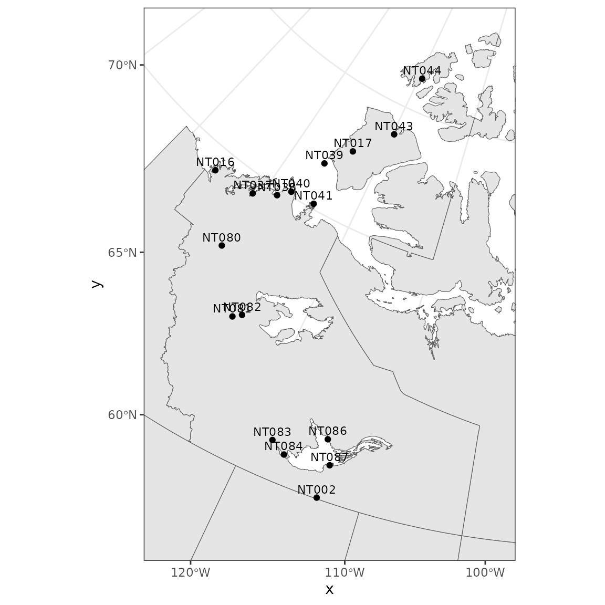
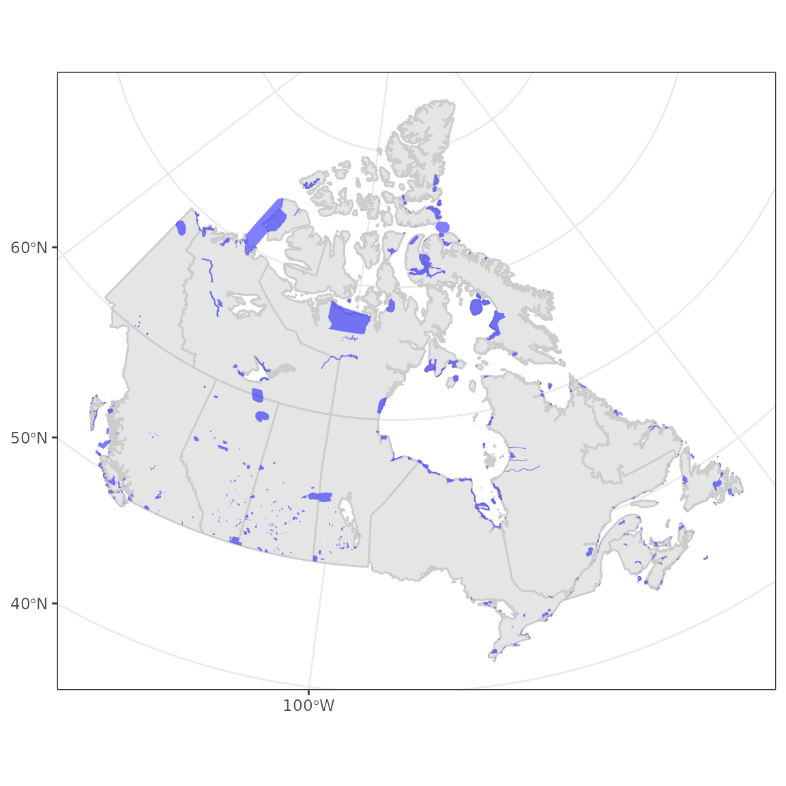
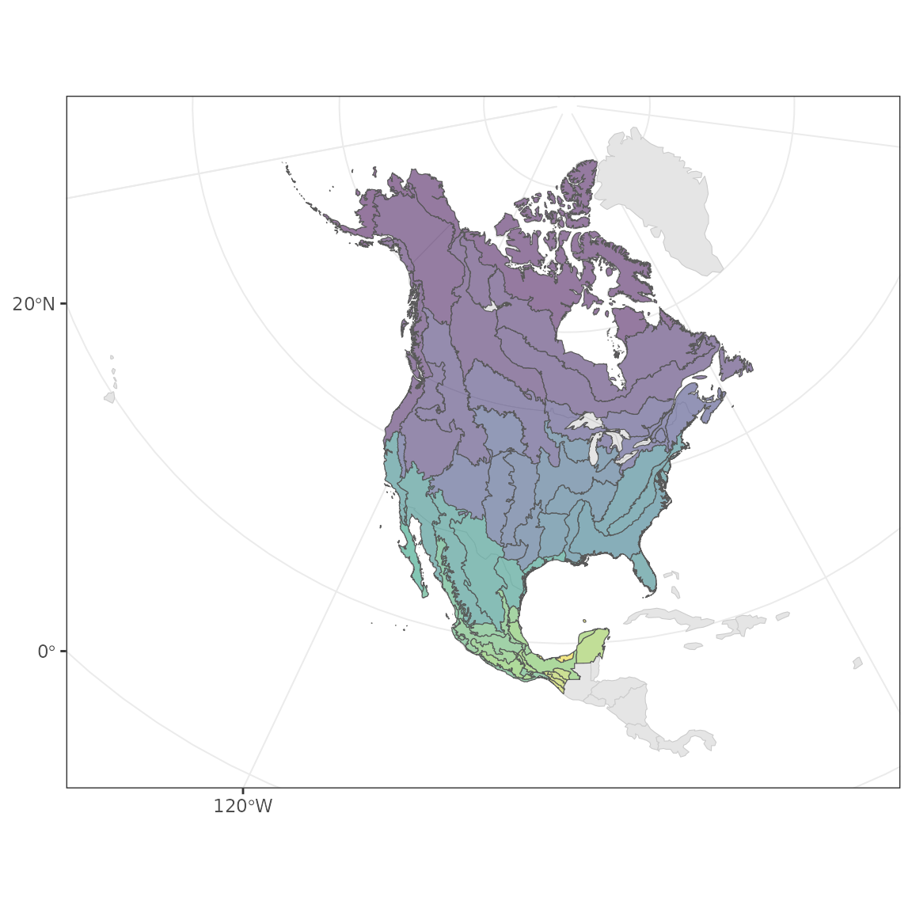

# Exploring IBAs and BCRs

In this section we’ll explore Important Bird Areas (IBAs) and Bird
Conservation Regions (BCRs), so you’ll have a better idea of what they
represent when used as data filters.

We’ll be using the [`tidyverse`](http://tidyverse.org) packages `dplyr`
and `ggplot2` for data manipulation and plotting, respectively. We’ll
use the `sf` package for working with spatial data, and the
`rnaturalearth` package to get example spatial data.

``` r
library(naturecounts)
library(dplyr)
library(ggplot2)
library(sf)
library(rnaturalearth)
library(mapview)
```

First we’ll get some spatial objects for our explorations from the
`rnaturalearth` package. A map of North America and of Canada, both
transformed from CRS EPSG code 4326 (unprojected lat/lon) to 3347 (NAD83
Statistics Canada).

``` r
na <- ne_countries(continent = "north america", returnclass = "sf") |>
  st_transform(3347)

canada <- ne_states(country = "canada", returnclass = "sf") |>
  st_transform(3347)
```

### Important Bird Areas

To get a visual idea of where different Important Bird Areas are, let’s
plot them on our map of Canada.

First we need to grab the IBA data frame and convert it to a spatial
object. Because the data contains lat/lon, we assign it to CRS 4326 for
GPS lat/lon data, and then convert it to match the crs of our maps.

``` r
iba <- meta_iba_codes() |>
  st_as_sf(coords = c("longitude", "latitude"), crs = 4326) |>
  st_transform(3347)

ggplot() +
  theme_bw() +
  geom_sf(data = canada) +
  geom_sf(data = iba)
```



If you want to narrow in on only one province,

1.  filter the IBA data frame

``` r
iba_nwt <- filter(iba, statprov == "NT")
```

2.  get the limits of the Northwest Territories

``` r
limits <- st_bbox(filter(canada, name == "Northwest Territories"))
```

Put it all together

``` r
ggplot() + 
  theme_bw() +
  geom_sf(data = canada) +
  geom_sf(data = iba_nwt) +
  geom_sf_text(data = iba_nwt, aes(label = iba_site), size = 3, vjust = -0.5) +
  coord_sf(xlim = limits[c("xmin", "xmax")], ylim = limits[c("ymin", "ymax")])
```



For a more detailed view of IBAs, we can also grab the shape files from
Birds Canada.

``` r
iba <- st_read("https://birdmap.birdscanada.org/geoserver/atlas/ows?service=WFS&version=1.0.0&request=GetFeature&typeName=atlas:iba&outputFormat=application%2Fjson") |>
  st_transform(3347)
```

    ## Reading layer `OGRGeoJSON' from data source 
    ##   `https://birdmap.birdscanada.org/geoserver/atlas/ows?service=WFS&version=1.0.0&request=GetFeature&typeName=atlas:iba&outputFormat=application%2Fjson' 
    ##   using driver `GeoJSON'
    ## Simple feature collection with 619 features and 7 fields
    ## Geometry type: MULTIPOLYGON
    ## Dimension:     XY
    ## Bounding box:  xmin: -141.2376 ymin: 41.67177 xmax: -52.66698 ymax: 78.10591
    ## Geodetic CRS:  WGS 84

``` r
iba <- filter(iba, Status == "confirmed") # Omit historical areas

ggplot() +
  theme_bw() +
  geom_sf(data = canada, colour = "grey80") +
  geom_sf(data = iba, fill = "blue", colour = NA, show.legend = FALSE, alpha = 0.5)
```



To really explore these areas, interactive maps can be really useful.
Note that you can move the map, zoom in and out, and click on specific
IBAs for more information.

``` r
mapview(iba)
```

### Bird Conservation Regions

Bird Conservation Regions are also available from Birds Canada.

``` r
bcr <- st_read("https://birdmap.birdscanada.org/geoserver/atlas/ows?service=WFS&version=1.0.0&request=GetFeature&typeName=atlas:bcr&outputFormat=application%2Fjson") |>
  st_transform(3347)
```

    ## Reading layer `OGRGeoJSON' from data source 
    ##   `https://birdmap.birdscanada.org/geoserver/atlas/ows?service=WFS&version=1.0.0&request=GetFeature&typeName=atlas:bcr&outputFormat=application%2Fjson' 
    ##   using driver `GeoJSON'
    ## Simple feature collection with 66 features and 3 fields
    ## Geometry type: MULTIPOLYGON
    ## Dimension:     XY
    ## Bounding box:  xmin: -179.1335 ymin: 14.54426 xmax: -52.54375 ymax: 83.14808
    ## Geodetic CRS:  WGS 84

``` r
ggplot() +
  theme_bw() +
  geom_sf(data = na, colour = "grey80") +
  geom_sf(data = bcr, aes(fill = bcr), show.legend = FALSE, alpha = 0.5) +
  scale_fill_viridis_c()
```



And again, interactive maps can be really useful.

``` r
mapview(bcr)
```
