# COSEWIC Tools

``` r
library(naturecounts)
library(dplyr) # For manipulating data frames
library(patchwork) # For combining plots
library(ggplot2) # For plotting the grid
```

## Getting started

These tools,
[`cosewic_ranges()`](https://birdscanada.github.io/naturecounts/dev/reference/cosewic_ranges.md)
and
[`cosewic_plot()`](https://birdscanada.github.io/naturecounts/dev/reference/cosewic_plot.md),
are designed to help with spatial calculations for COSEWIC assessments,
namely calculations of the EOO and IAO
(see[`cosewic_ranges()`](https://birdscanada.github.io/naturecounts/dev/reference/cosewic_ranges.md)
for more details on these calculations).

You can calculate both IAO and EOO with the
[`cosewic_ranges()`](https://birdscanada.github.io/naturecounts/dev/reference/cosewic_ranges.md)
function and you can use the
[`cosewic_plot()`](https://birdscanada.github.io/naturecounts/dev/reference/cosewic_plot.md)
function to create figures of these values.

In the next few examples, we’ll use a built in dataset `bcch`. In your
own workflows, you would replace this with your own data (see [Using
your own data](#using-your-own-data)).

### Calculating IAO and EOO

First we’ll calculate the ranges using default arguments and call `r`.

``` r
r <- cosewic_ranges(bcch)
```

Look at this data by printing the `r` object. This shows us that the `r`
object is a list with two items:

- `iao` which is a simple features collection (sf or spatial dataframe),
  and
- `eoo` which is also an sf or spatial data frame.

``` r
r
#> $iao
#> Simple feature collection with 475 features and 10 fields
#> Geometry type: POLYGON
#> Dimension:     XY
#> Bounding box:  xmin: 1407460 ymin: 785222 xmax: 1537823 ymax: 867036.6
#> Projected CRS: Canada_Albers_Equal_Area_Conic
#> # A tibble: 475 × 11
#>    species_id n_records_total grid_id n_records min_record max_record
#>         <int>           <int>   <int>     <int>      <int>      <int>
#>  1      14280             160       1         0          1         35
#>  2      14280             160       2         0          1         35
#>  3      14280             160       3         0          1         35
#>  4      14280             160       4         0          1         35
#>  5      14280             160       5         0          1         35
#>  6      14280             160       6         0          1         35
#>  7      14280             160       7         0          1         35
#>  8      14280             160       8         0          1         35
#>  9      14280             160       9         0          1         35
#> 10      14280             160      10         0          1         35
#>    median_record grid_size_km n_occupied    iao                         geometry
#>            <int>         [km]      <int> [km^2]                    <POLYGON [m]>
#>  1             1            2         33    132 ((1407460 864991.3, 1409466 864…
#>  2             1            2         33    132 ((1407460 862945.9, 1409466 862…
#>  3             1            2         33    132 ((1407460 860900.5, 1409466 860…
#>  4             1            2         33    132 ((1407460 858855.2, 1409466 858…
#>  5             1            2         33    132 ((1407460 856809.8, 1409466 856…
#>  6             1            2         33    132 ((1409466 864991.3, 1411472 864…
#>  7             1            2         33    132 ((1409466 862945.9, 1411472 862…
#>  8             1            2         33    132 ((1409466 860900.5, 1411472 860…
#>  9             1            2         33    132 ((1409466 858855.2, 1411472 858…
#> 10             1            2         33    132 ((1409466 856809.8, 1411472 856…
#> # ℹ 465 more rows
#> 
#> $eoo
#> Simple feature collection with 1 feature and 3 fields
#> Geometry type: POLYGON
#> Dimension:     XY
#> Bounding box:  xmin: 1415235 ymin: 792053.4 xmax: 1535250 ymax: 866555.2
#> Projected CRS: Canada_Albers_Equal_Area_Conic
#> # A tibble: 1 × 4
#>   species_id n_records_total
#>        <int>           <int>
#> 1      14280             160
#>                                                                       x eoo_p100
#>                                                           <POLYGON [m]>   [km^2]
#> 1 ((1426543 792053.4, 1415235 866555.2, 1490367 845020.1, 1535250 8179…    4729.
```

You can access either of these items with the `$` to pull out just what
you’re interested in.

``` r
r$eoo
#> Simple feature collection with 1 feature and 3 fields
#> Geometry type: POLYGON
#> Dimension:     XY
#> Bounding box:  xmin: 1415235 ymin: 792053.4 xmax: 1535250 ymax: 866555.2
#> Projected CRS: Canada_Albers_Equal_Area_Conic
#> # A tibble: 1 × 4
#>   species_id n_records_total
#>        <int>           <int>
#> 1      14280             160
#>                                                                       x eoo_p100
#>                                                           <POLYGON [m]>   [km^2]
#> 1 ((1426543 792053.4, 1415235 866555.2, 1490367 845020.1, 1535250 8179…    4729.
```

The values you are likely to be especially interested in are the `iao`
and the `eoo_p100` columns within these spatial dataframes

``` r
r$iao$iao[1]
#> 132 [km^2]
r$eoo$eoo_p100[1]
#> 4728.589 [km^2]
```

The EOO is called `eoo_p100` to remind you that in this analysis, we
used all the points (i.e. 100% or `eoo_p = 1`). You can change the
proportion of points included in the EOO to omit outliers if you like by
modifiying the `eoo_p` argument in
[`cosewic_ranges()`](https://birdscanada.github.io/naturecounts/dev/reference/cosewic_ranges.md),
and in that case, you’d use `r$eoo$eoo_pXX` where XX is the percentage
you used (i.e. `r$eoo$eoo_p95` if you used `eoo_p = 0.95`).

By default all points are included, so make sure you’re confident that
those points are accurate!

If this is too much information, omit the spatial data from the range
calculations.

``` r
cosewic_ranges(bcch, spatial = FALSE)
#> # A tibble: 1 × 9
#>   species_id n_records_total min_record max_record median_record grid_size_km
#>        <int>           <int>      <int>      <int>         <int>         [km]
#> 1      14280             160          1         35             1            2
#>   n_occupied    iao eoo_p100
#>        <int> [km^2]   [km^2]
#> 1         33    132    4729.
```

### Plotting IAO and EOO

By default,
[`cosewic_ranges()`](https://birdscanada.github.io/naturecounts/dev/reference/cosewic_ranges.md)
includes the spatial data so we can easily create figures of these
ranges.

``` r
r <- cosewic_ranges(bcch)
cosewic_plot(r, title = "Black-capped Chickadee")
#> Zoom: 9
#> Fetching 9 missing tiles
#>   |                                                                              |                                                                      |   0%  |                                                                              |========                                                              |  11%  |                                                                              |================                                                      |  22%  |                                                                              |=======================                                               |  33%  |                                                                              |===============================                                       |  44%  |                                                                              |=======================================                               |  56%  |                                                                              |===============================================                       |  67%  |                                                                              |======================================================                |  78%  |                                                                              |==============================================================        |  89%  |                                                                              |======================================================================| 100%
#> ...complete!
```


> **Remember**: By default we use map tiles from OpenStreetMap
> (`map = "osm"`). If you are using these figures in a public
> document/website/etc., you must [attribute
> OpenStreetMap](https://osmfoundation.org/wiki/Licence/Attribution_Guidelines).

You can try any map tile listed in
[`rosm::osm.types()`](https://rdrr.io/pkg/rosm/man/deprecated.html), but
note that not all may work for your region and many require an API key.

``` r
r <- cosewic_ranges(bcch)
cosewic_plot(r, map = "cartolight", title = "Black-capped Chickadee")
#> Zoom: 9
#> Fetching 9 missing tiles
#>   |                                                                              |                                                                      |   0%  |                                                                              |========                                                              |  11%  |                                                                              |================                                                      |  22%  |                                                                              |=======================                                               |  33%  |                                                                              |===============================                                       |  44%  |                                                                              |=======================================                               |  56%  |                                                                              |===============================================                       |  67%  |                                                                              |======================================================                |  78%  |                                                                              |==============================================================        |  89%  |                                                                              |======================================================================| 100%
#> ...complete!
```


## Using your own data

To use your own data in the
[`cosewic_ranges()`](https://birdscanada.github.io/naturecounts/dev/reference/cosewic_ranges.md)
function, you must load a data set of observations into R. This dataset
must have an ID column and columns defining latitude and longitude, and
optionally, a grouping column.

Let’s load the example black-capped chickadee file included in
naturecounts. We’ll use the
[`system.file()`](https://rdrr.io/r/base/system.file.html) function to
find the path to the csv file.

``` r
# Assign the path or location
path <- system.file("extdata", "bcch.csv", package = "naturecounts")
path
#> [1] "/home/runner/work/_temp/Library/naturecounts/extdata/bcch.csv"
```

For your data, you’ll a path something like
`path <- "location/of/my/data.csv"` depending where your data is stored.
See the [R for Data Science chapter on Data
import](https://r4ds.hadley.nz/data-import.html#reading-data-from-a-file)
for more details.

Now we’ll read the data and take a quick look.

``` r
bc <- read.csv(path)
head(bc)
#>          id      lat       lon n
#> 1 968039498 45.51110 -77.50533 1
#> 2 968039557 45.63436 -77.07484 1
#> 3 968039593 45.82732 -77.12012 1
#> 4 968039612 45.48730 -77.74651 2
#> 5 968039703 45.61956 -77.23577 2
#> 6 968039959 45.82851 -77.11430 3
```

To use this in
[`cosewic_ranges()`](https://birdscanada.github.io/naturecounts/dev/reference/cosewic_ranges.md)
we’ll tell the function how to interpret these columns. By default the
function expects these columns to be `record_id`, `latitude` and
`longitude`, so if they are different we need to specify what they are.
In our example we also specify `group = NULL` to tell the function that
we’re not using a grouping column.

``` r
r <- cosewic_ranges(
  bc,
  record = "id",
  coord_lat = "lat",
  coord_lon = "lon",
  group = NULL
)
```

## Working with multiple DUs (Designatable Units)

Let’s assume we have two populations or Designatable Units which we
would like to work with. We’ll use the built in `pops` data set for
this.

``` r
head(pops)
#>   record_id latitude longitude   population
#> 1 968039498 45.51110 -77.50533 Population 1
#> 2 968039557 45.63436 -77.07484 Population 1
#> 3 968039593 45.82732 -77.12012 Population 1
#> 4 968039612 45.48730 -77.74651 Population 1
#> 5 968039703 45.61956 -77.23577 Population 1
#> 6 968039959 45.82851 -77.11430 Population 1
```

Because we have multiple groups, we’ll use the `group = "population"`
option to tell the function which column contains the groups. Then
calculations are performed separately for each group.

``` r
r <- cosewic_ranges(pops, group = "population")
r$eoo
#> Simple feature collection with 2 features and 3 fields
#> Geometry type: POLYGON
#> Dimension:     XY
#> Bounding box:  xmin: 1081628 ymin: 336781.2 xmax: 1578702 ymax: 866555.2
#> Projected CRS: Canada_Albers_Equal_Area_Conic
#> # A tibble: 2 × 4
#>   population   n_records_total
#>   <chr>                  <int>
#> 1 Population 1             160
#> 2 Population 2              19
#>                                                                       x eoo_p100
#>                                                           <POLYGON [m]>   [km^2]
#> 1 ((1426543 792053.4, 1415235 866555.2, 1490367 845020.1, 1535250 8179…    4729.
#> 2 ((1093717 336781.2, 1081628 348770.3, 1124206 429489, 1578702 823548…   58194.
```

And we get a list of plots, one for each group.

``` r
p <- cosewic_plot(r, group = "population")
p[[1]]
#> Zoom: 9
```

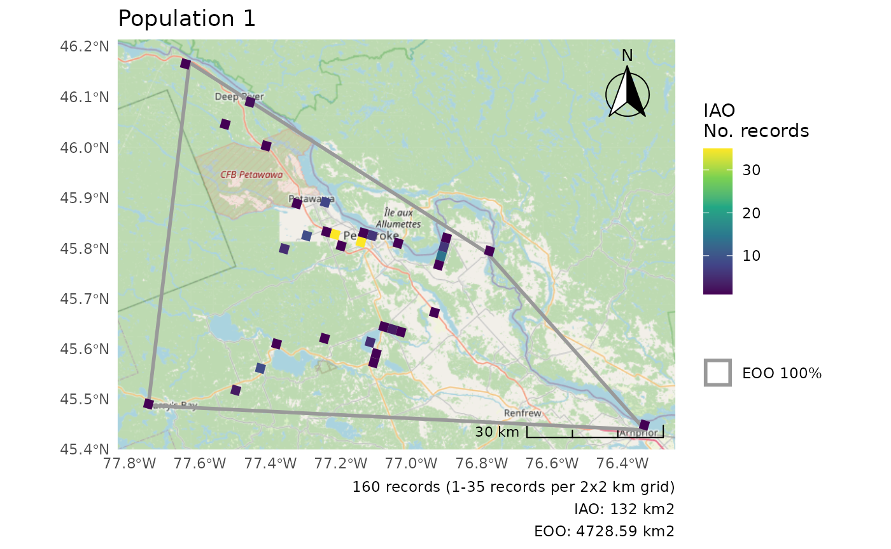

``` r
p[[2]]
#> Zoom: 6
#> Fetching 4 missing tiles
#>   |                                                                              |                                                                      |   0%  |                                                                              |==================                                                    |  25%  |                                                                              |===================================                                   |  50%  |                                                                              |====================================================                  |  75%  |                                                                              |======================================================================| 100%
#> ...complete!
```

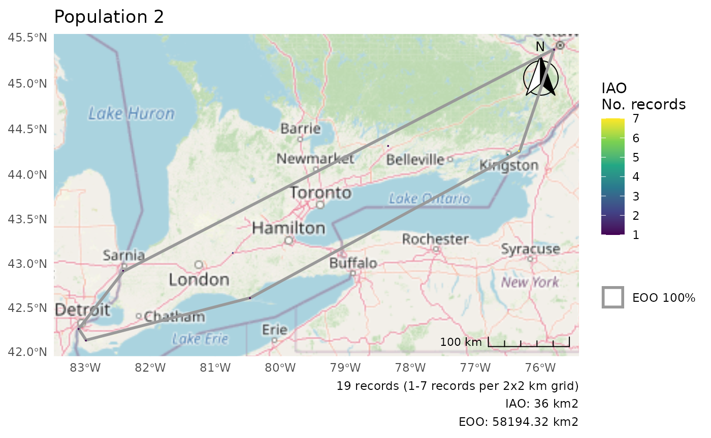

For a combined plot, we can use the
[`wrap_plots()`](https://patchwork.data-imaginist.com/reference/wrap_plots.html)
function from the patchwork package to combine these figures.

``` r
wrap_plots(p)
#> Zoom: 9
#> Zoom: 6
```

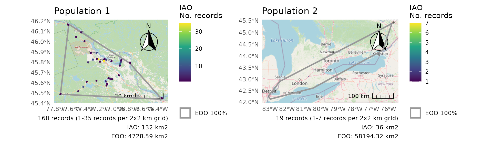

## Using the COSEWIC’s IAO grid

By default,
[`cosewic_ranges()`](https://birdscanada.github.io/naturecounts/dev/reference/cosewic_ranges.md)
constructs an IAO grid for each analysis. This means that there might be
small discrepancies in IAO values calculated by naturecounts and those
calculated with a different grid. Even if the grids are the same size
and with the same projection, exactly where the bounds of the grid are
may not be the same.

If this is of concern, you can supply your own IAO grid for these
calculations, to ensure that there are no discrepancies.

First, use the sf package to read in your IAO grid. Here we’ll use a
mini example IAO grid stored in the package

``` r
path <- system.file("extdata", "iao_bcch_grid.gpkg", package = "naturecounts")
path
#> [1] "/home/runner/work/_temp/Library/naturecounts/extdata/iao_bcch_grid.gpkg"

grid <- sf::st_read(path)
#> Reading layer `iao_bcch_grid' from data source 
#>   `/home/runner/work/_temp/Library/naturecounts/extdata/iao_bcch_grid.gpkg' 
#>   using driver `GPKG'
#> Simple feature collection with 3575 features and 1 field
#> Geometry type: POLYGON
#> Dimension:     XY
#> Bounding box:  xmin: 1406468 ymin: 786875.6 xmax: 1535250 ymax: 894738.5
#> Projected CRS: Canada_Albers_Equal_Area_Conic
```

This is what our example grid looks like

``` r
ggplot(data = grid) + geom_sf()
```

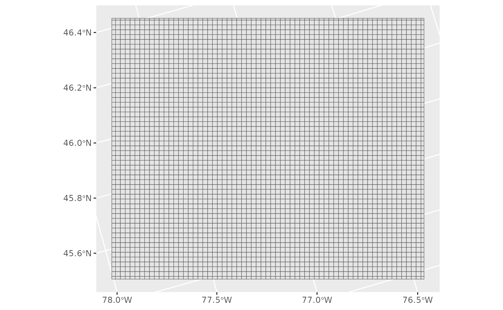

Next we’ll pass this as an argument to our
[`cosewic_ranges()`](https://birdscanada.github.io/naturecounts/dev/reference/cosewic_ranges.md)
function.

``` r
r <- cosewic_ranges(bcch, iao_grid = grid)
#> User-provided grid has cell size of 2 [km]
```

And take a look at the figure of these calculations.

``` r
cosewic_plot(r)
#> Zoom: 9
```

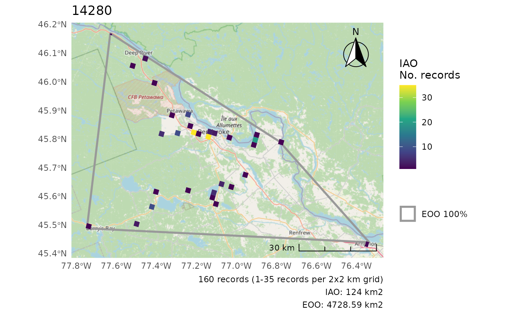

For comparison, note how the calculations are very slightly different
when using
[`cosewic_ranges()`](https://birdscanada.github.io/naturecounts/dev/reference/cosewic_ranges.md)’s
default grid.

``` r
r0 <- cosewic_ranges(bcch)
cosewic_plot(r0)
#> Zoom: 9
```

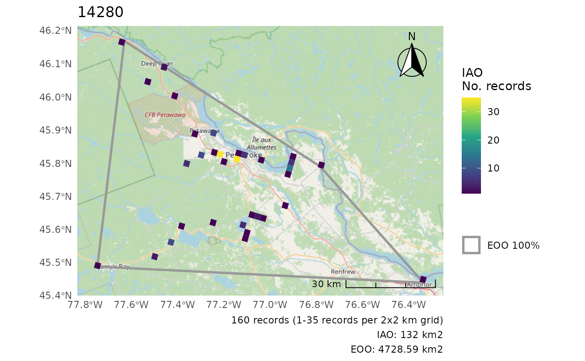

## Appendix

### Customizing Plots

These examples all use the `bcch` dataset.

``` r
r <- cosewic_ranges(bcch)
```

#### Adding observation points

``` r
cosewic_plot(r, points = bcch)
#> Zoom: 9
```


#### Plot only either EOO or IAO

``` r
cosewic_plot(r, which = "eoo", points = bcch)
#> Zoom: 9
```

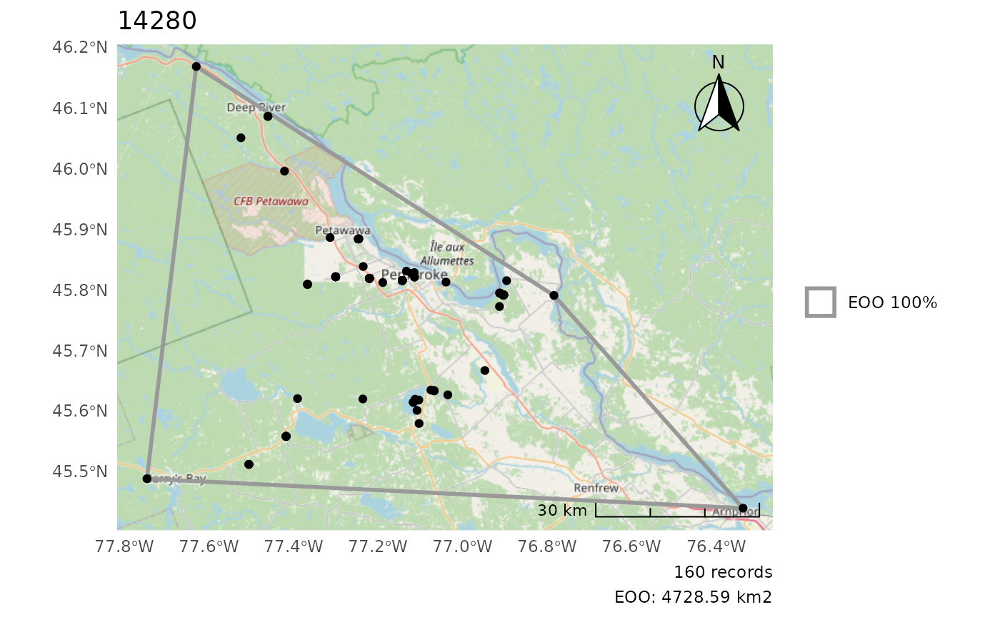

``` r
cosewic_plot(r, which = "iao")
#> Zoom: 9
```

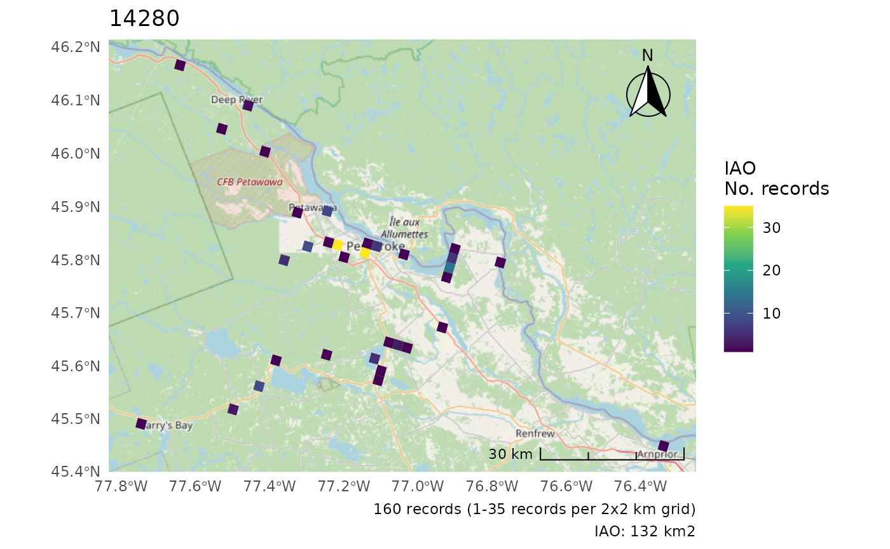

#### Change the CRS

Only applies if not using map tiles as map tile projections cannot be
changed.

No change

``` r
cosewic_plot(r, crs = 3347)
#> 'crs' is only applicable when not using map tiles. Map tiles always use CRS of EPSG:3857.
#> Loading required namespace: raster
#> Zoom: 9
```

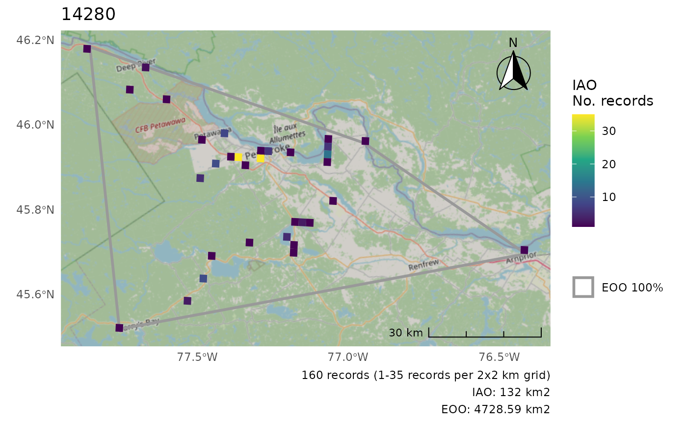

Using a custom polygon, we can change the CRS.

``` r
cosewic_plot(r, map = map_canada(), crs = 3347)
```

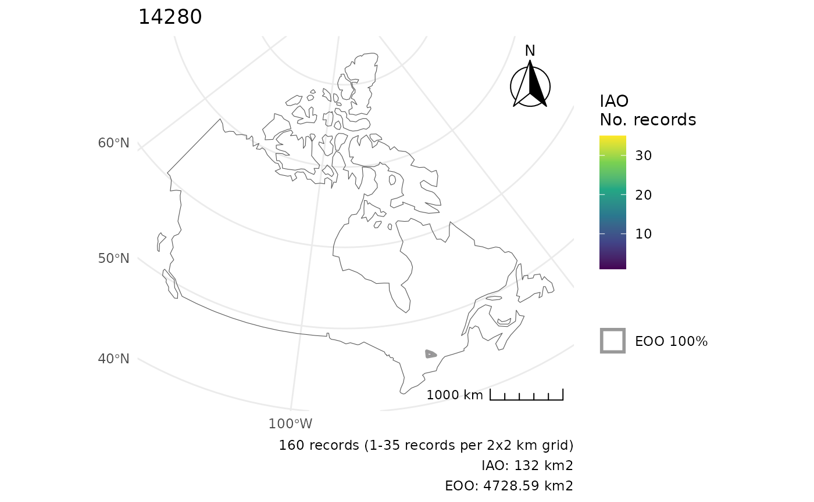

#### Move the scale/arrow

``` r
r <- cosewic_ranges(hofi)
cosewic_plot(r, arrow_location = "br", scale_location = "br")
#> Zoom: 6
```

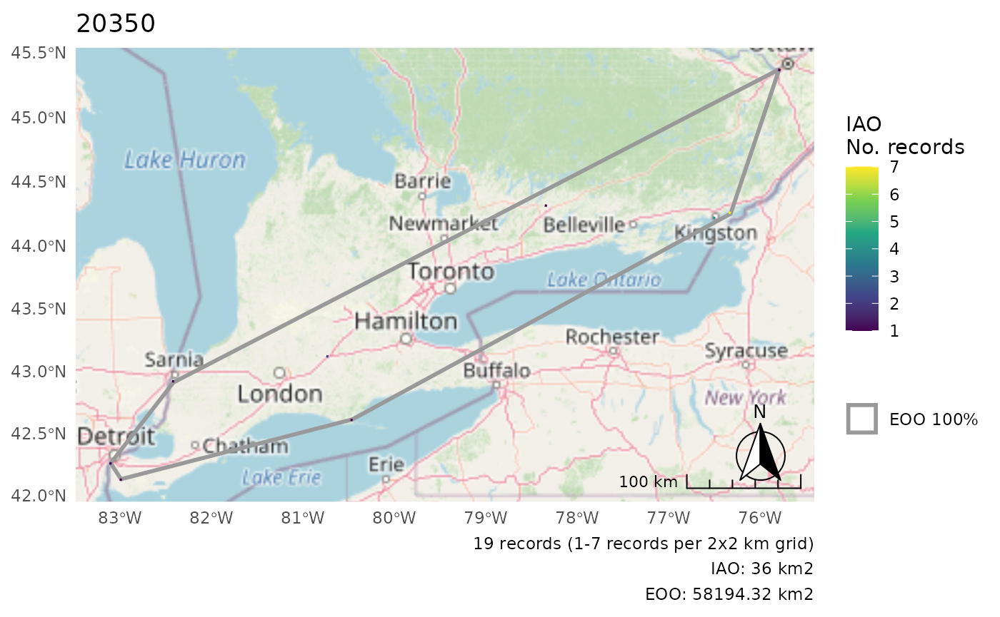

#### Summarize IAO over larger grid

When the cells are really small, it can be helpful to summarize over a
larger grid for better visibility of the patterns.

``` r
cosewic_plot(
  r,
  grid = grid_canada(25),
  title = "House Finch",
  arrow_location = "br",
  scale_location = "br"
)
#> Zoom: 6
```

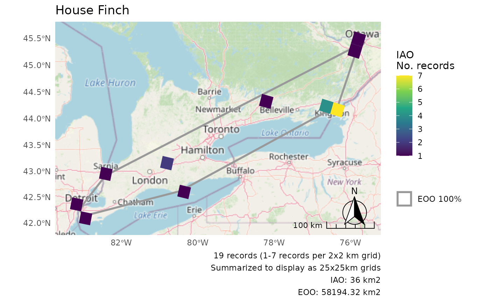

### Customizing Multiple Plots

These examples all use the `pops` dataset.

``` r
r <- cosewic_ranges(pops, group = "population")
```

#### Using IAO proportions

When plotting multiple DUs the IAO scales may be different enough that
it would be better use IAO proportions rather than absolute values.

``` r
p <- cosewic_plot(r, group = "population", iao_prop = TRUE)

wrap_plots(p) +
  plot_layout(guides = "collect")
#> Zoom: 9
#> Zoom: 6
```

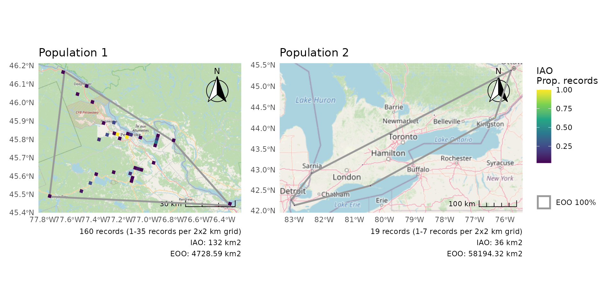

#### Summarize IAO over larger grid

As for single plots, when the cells are really small, it can be helpful
to summarize over a larger grid for better visibility of the patterns.

``` r
p <- cosewic_plot(
  r,
  group = "population",
  iao_prop = TRUE,
  grid = grid_canada(10)
)

wrap_plots(p) +
  plot_layout(guides = "collect")
#> Zoom: 9
#> Zoom: 6
```

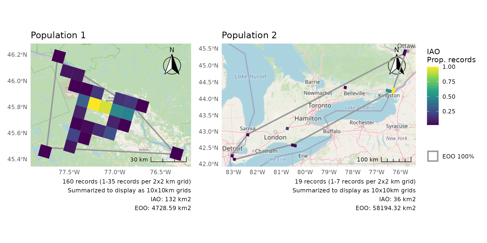

#### Combining separate plots

But for the ultimate control, create plots separately and then combine.

We’ll first split the two populations, but you could also load them
separately if they are already split on your computer (see “Working with
your own data”).

We’ll use `group = "population` to ensure correct titles.

``` r
# Split the two populations
pops1 <- dplyr::filter(pops, population == "Population 1")
pops2 <- dplyr::filter(pops, population == "Population 2")

# Calculate the ranges separately
r1 <- cosewic_ranges(pops1, group = "population")
r2 <- cosewic_ranges(pops2, group = "population")

# Create separate plots
p1 <- cosewic_plot(r1, group = "population", iao_prop = TRUE)
p2 <- cosewic_plot(
  r2,
  group = "population",
  iao_prop = TRUE,
  grid = grid_canada(10)
)
```

Now arrange your plots how you like.

``` r
p1 +
  p2 +
  plot_layout(guides = "collect") +
  plot_annotation(title = "EOO and IAO for all Designatable Units")
#> Zoom: 9
#> Zoom: 6
```

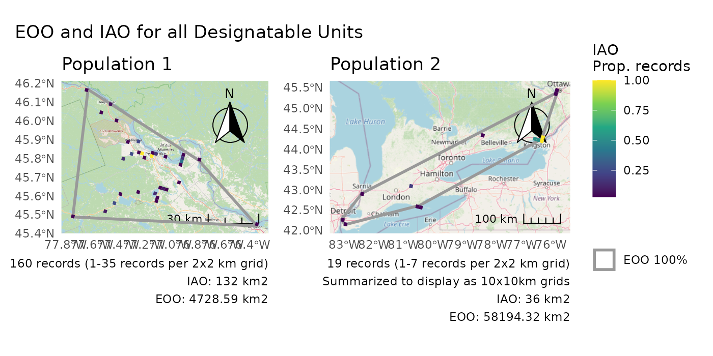

``` r
p1 /
  p2 +
  plot_layout(guides = "collect") +
  plot_annotation(
    title = "EOO and IAO for all Designatable Units",
    subtitle = "2025 Assessment performed with naturecounts R package"
  )
#> Zoom: 9
#> Zoom: 6
```

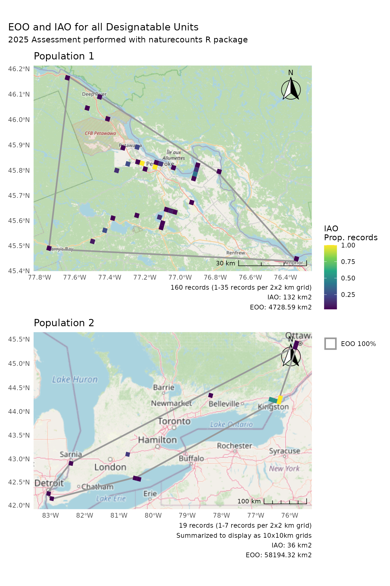
