# COSEWIC Tools

``` r
library(naturecounts)
```

Basic plot

``` r
r <- cosewic_ranges(bcch)
#> As of naturecounts v0.5.0 `cosewic_ranges()` now uses a default of `eoo_p = 1` instead of `eoo_p = 0.95`.
#> This message is displayed once per session.
cosewic_plot(r, title = "Black-capped Chickadee")
#> Zoom: 9
#> Fetching 9 missing tiles
#>   |                                                                              |                                                                      |   0%  |                                                                              |========                                                              |  11%  |                                                                              |================                                                      |  22%  |                                                                              |=======================                                               |  33%  |                                                                              |===============================                                       |  44%  |                                                                              |=======================================                               |  56%  |                                                                              |===============================================                       |  67%  |                                                                              |======================================================                |  78%  |                                                                              |==============================================================        |  89%  |                                                                              |======================================================================| 100%
#> ...complete!
```

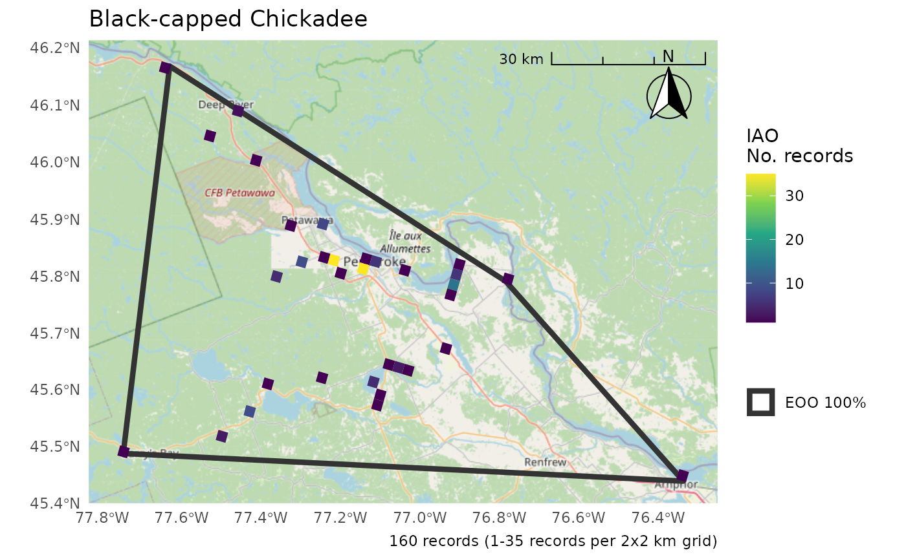

Adding observation points

``` r
cosewic_plot(r, points = bcch, title = "Black-capped Chickadee")
#> Zoom: 9
```

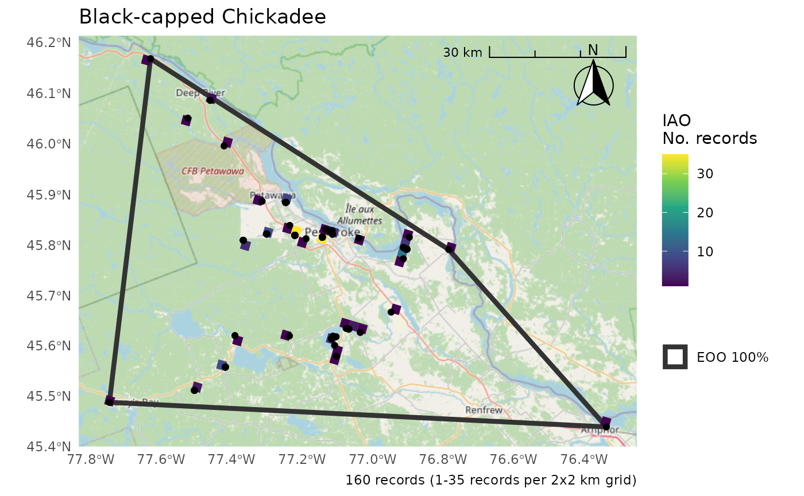

Only EOO or IAO

``` r
cosewic_plot(r, which = "eoo", points = bcch)
#> Zoom: 9
```

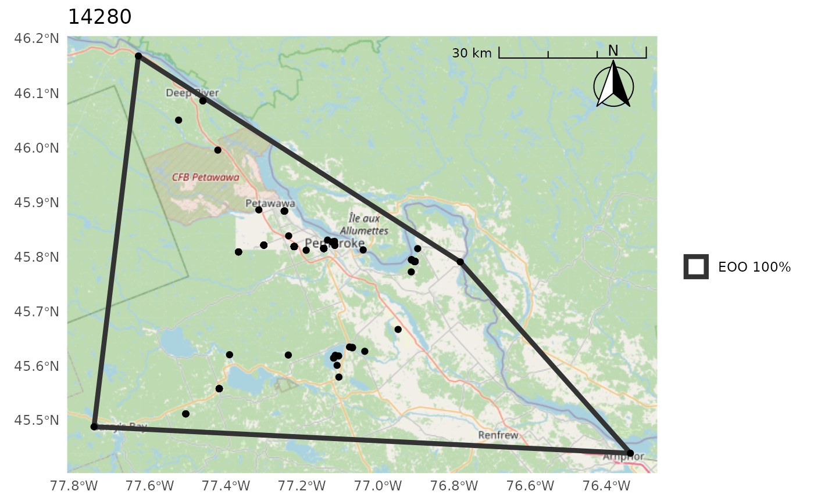

``` r
cosewic_plot(r, which = "iao")
#> Zoom: 9
```

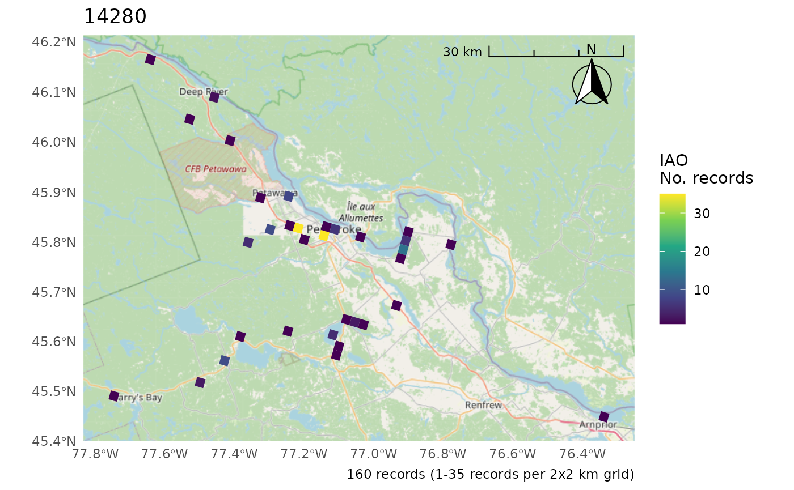

Change the CRS

- Only applies if not using map tiles as they *must* be in the CRS of
  the tile (i.e. EPSG:3857 Web Mercator)

``` r
cosewic_plot(r, crs = 3347) # No change
#> 'crs' is only applicable when not using map tiles. Map tiles always use CRS of EPSG:3857.
#> Loading required namespace: raster
#> Zoom: 9
```

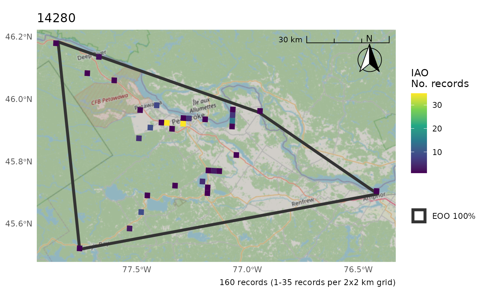

``` r
cosewic_plot(r, map = map_canada(), crs = 3347)
```

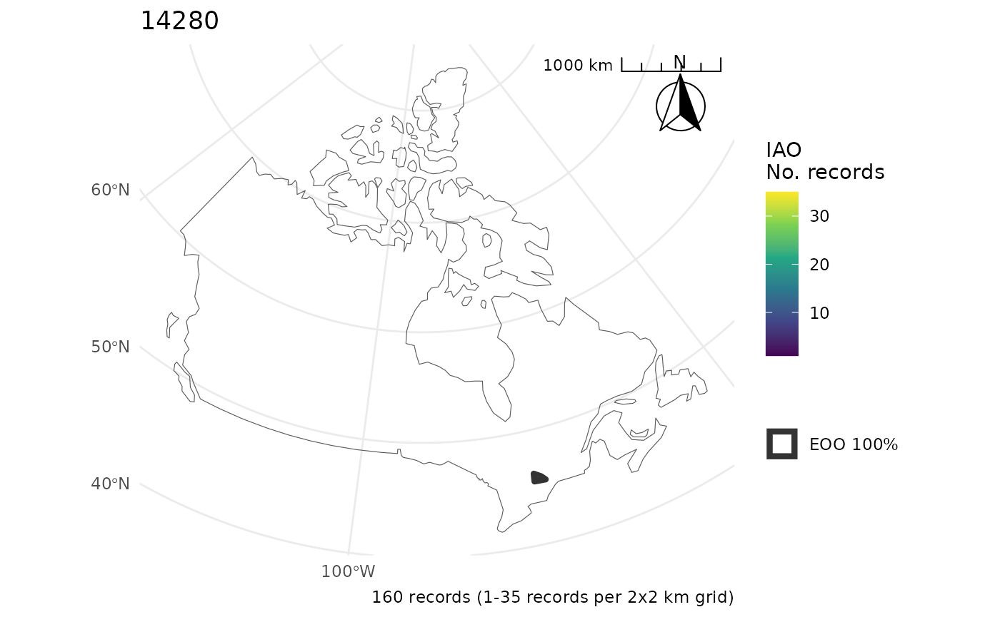

Move the scale/arrow

``` r
r <- cosewic_ranges(hofi)
cosewic_plot(r, arrow_location = "br", scale_location = "br")
#> Zoom: 6
#> Fetching 4 missing tiles
#>   |                                                                              |                                                                      |   0%  |                                                                              |==================                                                    |  25%  |                                                                              |===================================                                   |  50%  |                                                                              |====================================================                  |  75%  |                                                                              |======================================================================| 100%
#> ...complete!
```

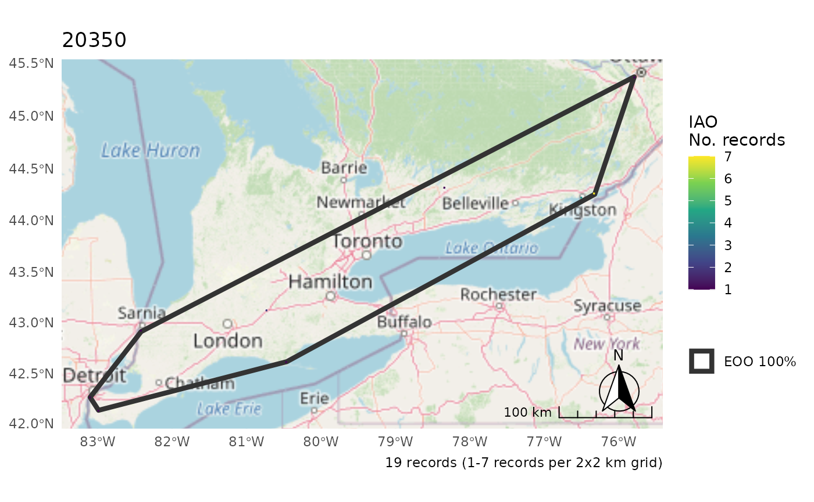

Summarize IAO over larger grid for better visibility

``` r
cosewic_plot(
  r,
  grid = grid_canada(25),
  title = "House Finch",
  arrow_location = "br",
  scale_location = "br"
)
#> Zoom: 6
```

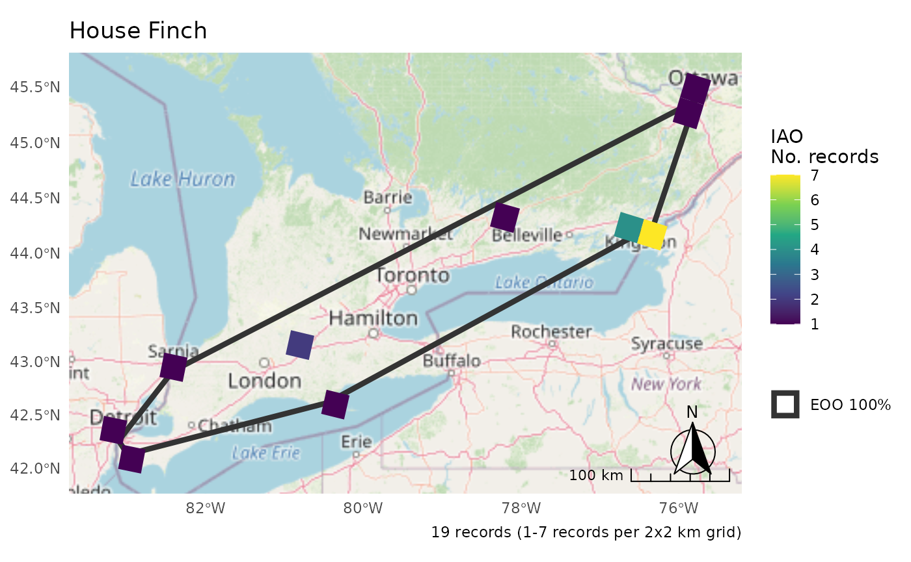

Plot multiple species as separate plots

``` r
m <- rbind(bcch, hofi)
r <- cosewic_ranges(m)
p <- cosewic_plot(
  r,
  title = c("14280" = "Black-capped chickadees", "20350" = "House Finches")
)
p[[1]]
#> Zoom: 9
```

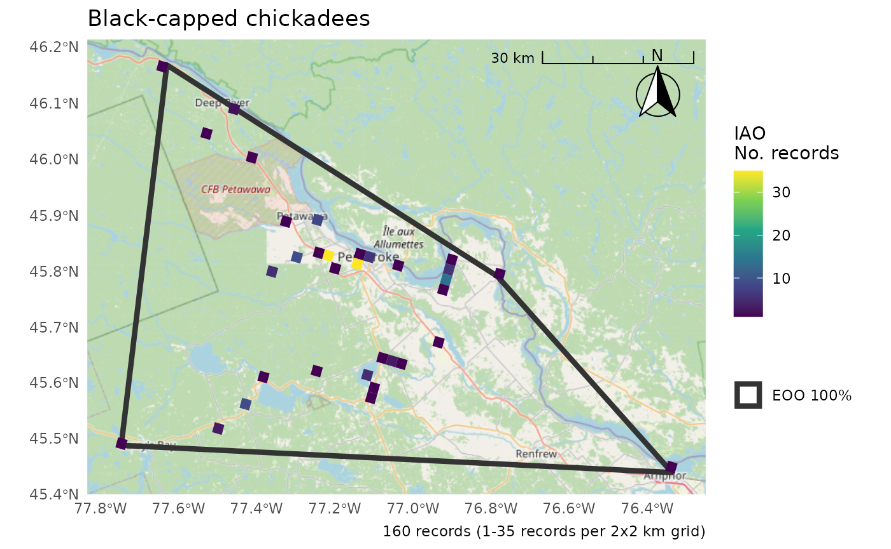

``` r
p[[2]]
#> Zoom: 6
```

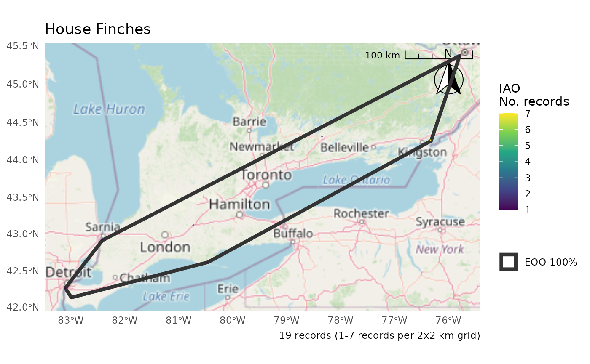

Use patchwork to combine

``` r
library(patchwork)
wrap_plots(p) +
  plot_layout(guides = "collect")
#> Zoom: 9
#> Zoom: 6
```

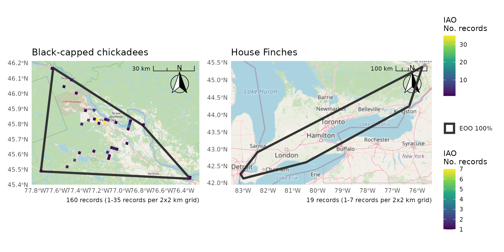

Use IAO as a proportion for better legends

``` r
p <- cosewic_plot(
  r,
  iao_prop = TRUE,
  title = c("14280" = "Black-capped chickadees", "20350" = "House Finches")
)

wrap_plots(p) +
  plot_layout(guides = "collect")
#> Zoom: 9
#> Zoom: 6
```

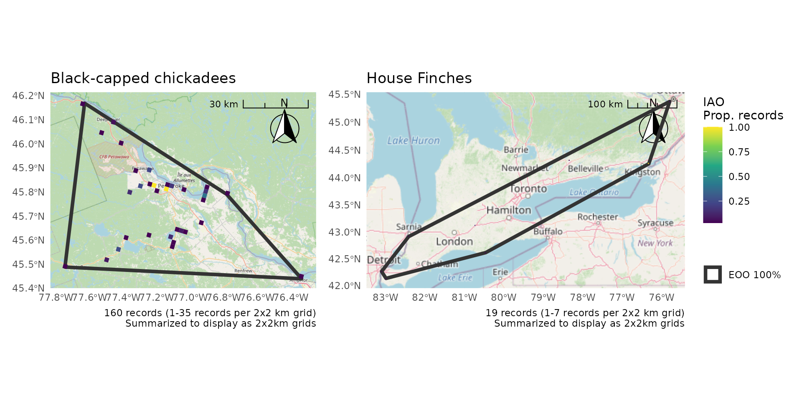

Consider summarizing over a larger IAO grid (10x10km) for better
visibility

``` r
p <- cosewic_plot(
  r,
  iao_prop = TRUE,
  grid = grid_canada(10),
  title = c("14280" = "Black-capped chickadees", "20350" = "House Finches")
)

wrap_plots(p) +
  plot_layout(guides = "collect")
#> Zoom: 9
#> Zoom: 6
```

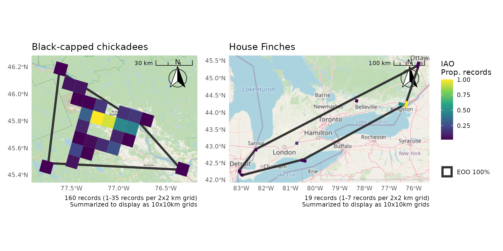

For more nuanced control, create plots separately and then combine

``` r
b <- cosewic_ranges(bcch)
h <- cosewic_ranges(hofi)
p1 <- cosewic_plot(b, title = "Black-capped chickadee", iao_prop = TRUE)
p2 <- cosewic_plot(
  h,
  title = "House Finches",
  iao_prop = TRUE,
  arrow_location = "br",
  scale_location = "br",
  grid = grid_canada(25)
)

p1 + p2 + plot_layout(guides = "collect")
#> Zoom: 9
#> Zoom: 6
```

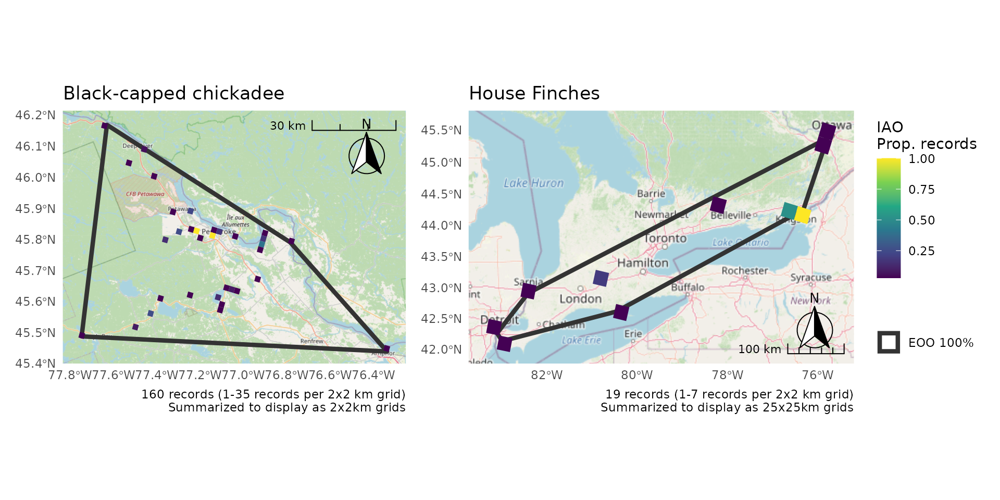

``` r
p1 / p2 + plot_layout(guides = "collect")
#> Zoom: 9
#> Zoom: 6
```

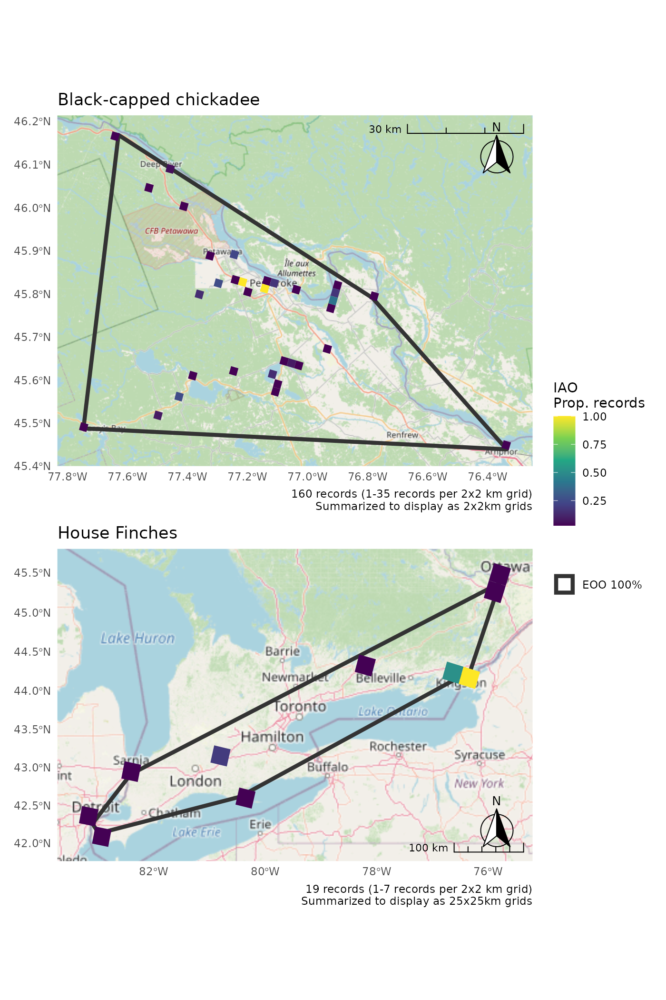
