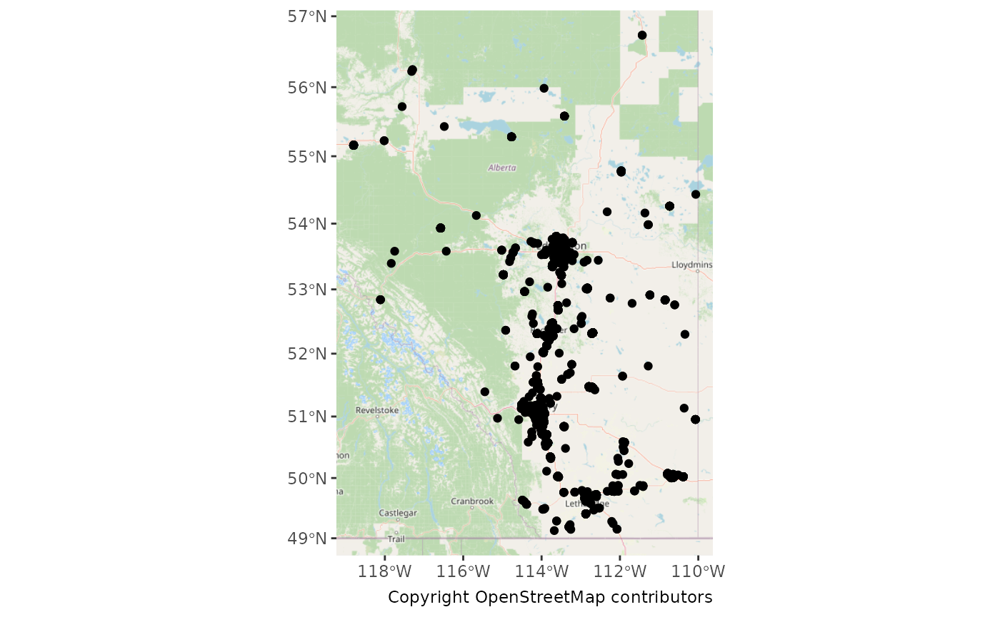
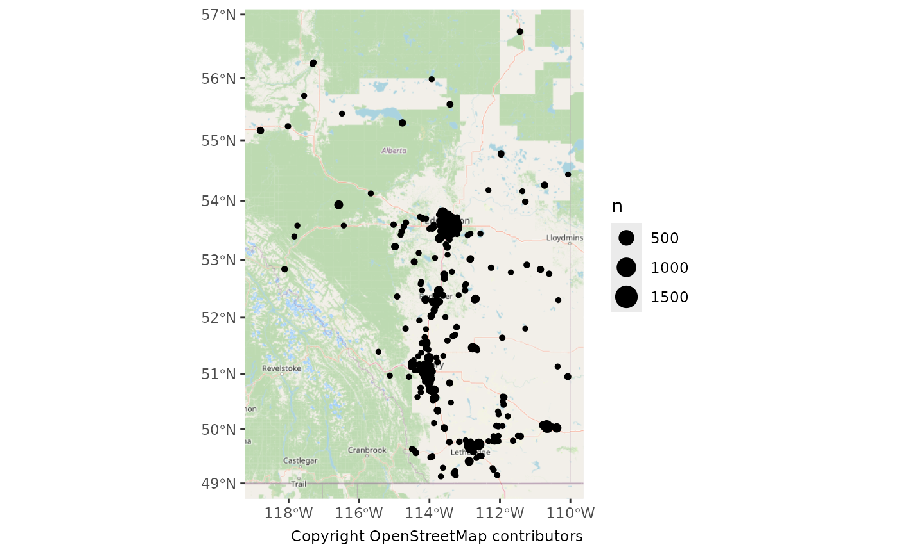
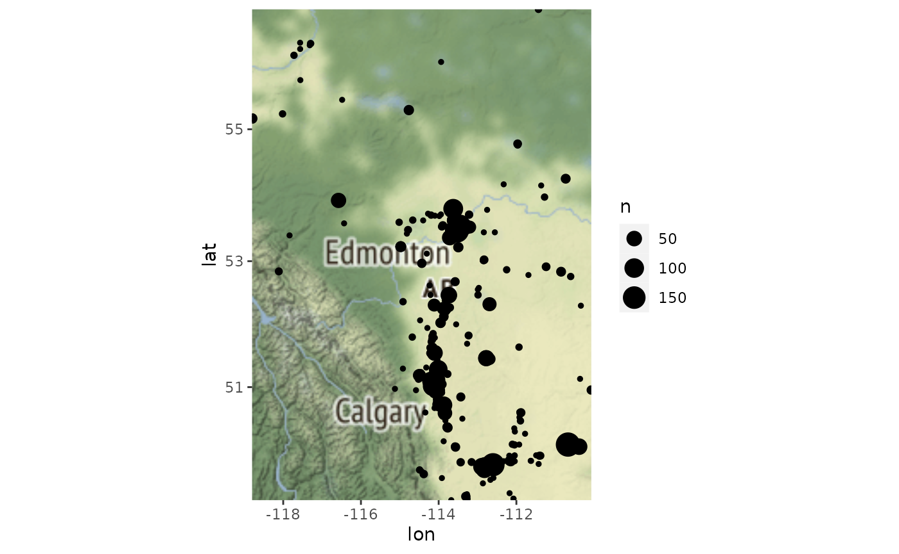
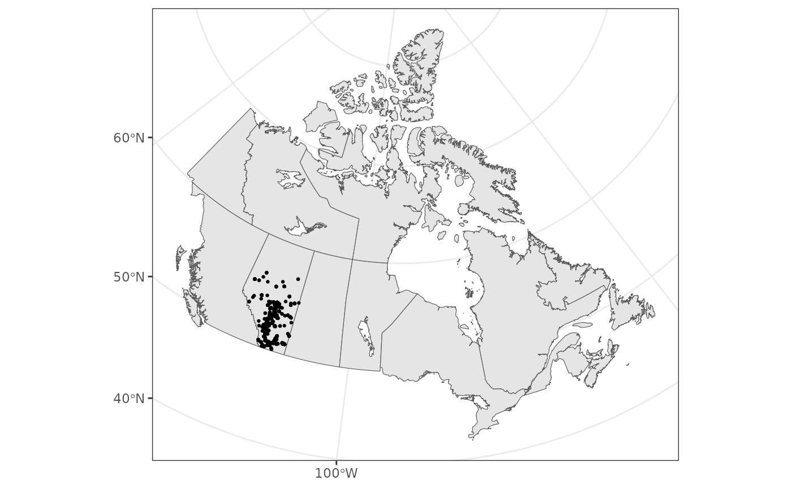
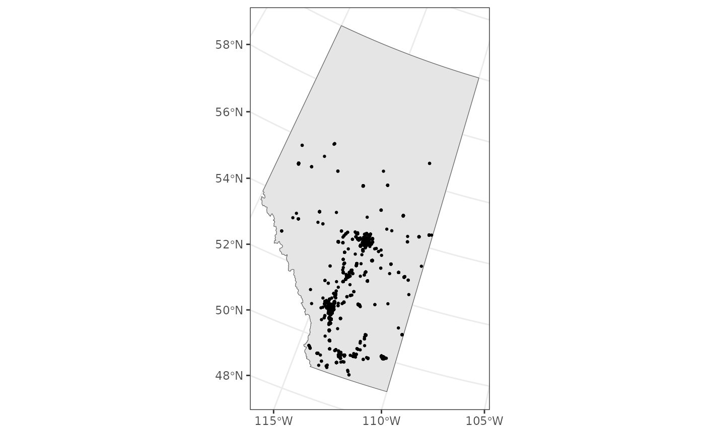
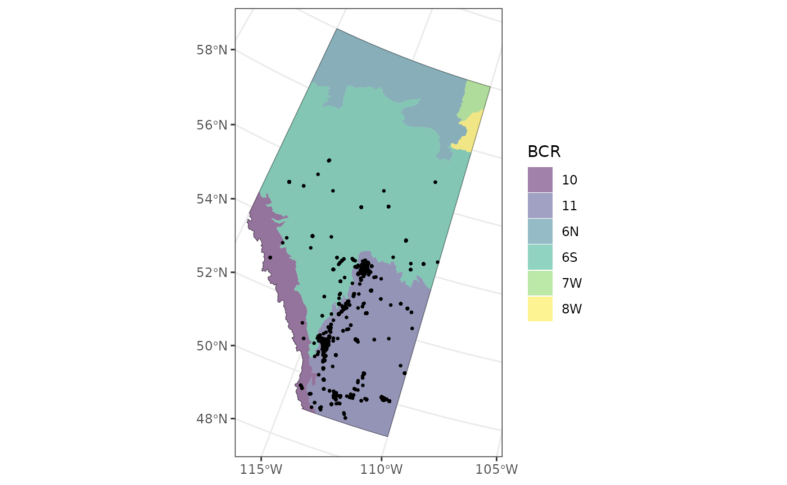
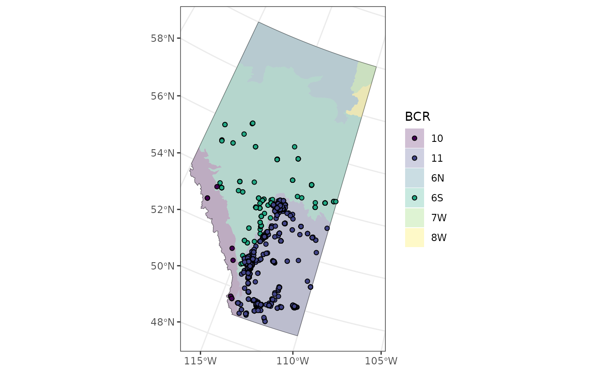
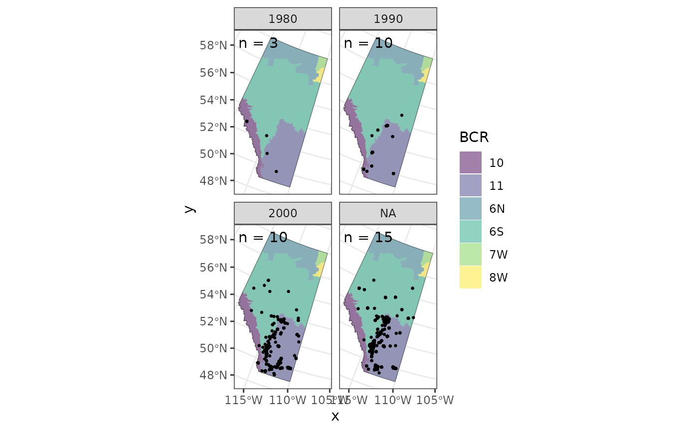
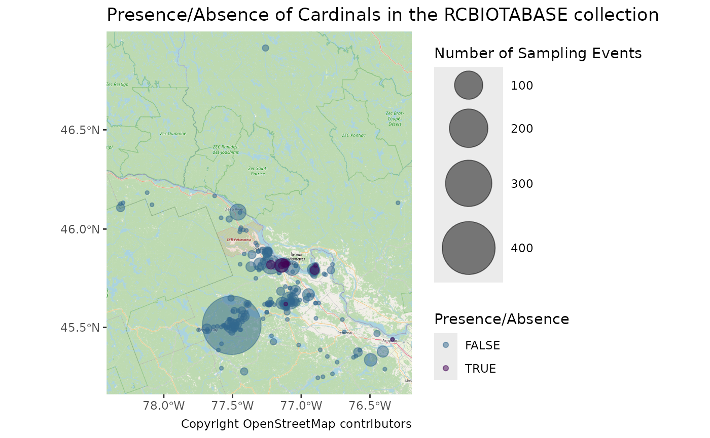

# Mapping Observations

In this article we’ll walk through how to create various types of maps
of the observations downloaded with `naturecounts` to get a sense of the
spatial distribution.

> The following examples use the “testuser” user which is not available
> to you. You can quickly [sign up for a free
> account](https://naturecounts.ca/nc/default/register.jsp) of your own
> to access and play around with these examples. Simply replace
> `testuser` with your own username.

## Setup

To do so we’re going to use the following packages:

``` r
library(naturecounts)
library(sf)
library(rnaturalearth)
library(ggplot2)
library(ggspatial)
library(dplyr)
library(tidyr)
library(mapview)
```

First we’ll use download some data:

``` r
house_finches <- nc_data_dl(
  species = 20350,
  region = list(statprov = "AB"),
  username = "testuser",
  info = "nc_tutorial"
)
```

    ## Using filters: species (20350); fields_set (BMDE2.00-ext); statprov (AB)

    ## Collecting available records...

    ##      collection nrecords
    ## 1      ABATLAS1        5
    ## 2      ABATLAS2      202
    ## 3    ABBIRDRECS        4
    ## 4 BBL-1990-1999       13
    ## 5 BBL-2000-2009      978
    ## 6 BBL-2010-2019     1299
    ## ...
    ## Total records: 9,506

    ## 
    ## Downloading records for each collection:

    ##   ABATLAS1

    ##     Records 1 to 5 / 5

    ##   ABATLAS2

    ##     Records 1 to 202 / 202

    ##   ABBIRDRECS

    ##     Records 1 to 4 / 4

    ##   BBL-1990-1999

    ##     Records 1 to 13 / 13

    ##   BBL-2000-2009

    ##     Records 1 to 978 / 978

    ##   BBL-2010-2019

    ##     Records 1 to 1299 / 1299

    ##   BBL-2020-2029

    ##     Records 1 to 51 / 51

    ##   BBS

    ##     Records 1 to 14 / 14

    ##   GBIF_50C9509D

    ##     Records 1 to 799 / 799

    ##   GBIF_6AC3F774

    ##     Records 1 to 1 / 1

    ##   GBIF_8A863029

    ##     Records 1 to 19 / 19

    ##   GBIF_B1047888

    ##     Records 1 to 2 / 2

    ##   PFW

    ##     Records 1 to 5000 / 6110

    ##     Records 5001 to 6110 / 6110

    ##   WILDTRAX1

    ##     Records 1 to 7 / 7

    ##   WILDTRAX19

    ##     Records 1 to 1 / 1

    ##   WILDTRAX41

    ##     Records 1 to 1 / 1

``` r
head(house_finches)
```

    ##   record_id collection project_id protocol_id protocol_type species_id
    ## 1 225655455   ABATLAS1       1048          NA            NA      20350
    ## 2 225665275   ABATLAS1       1048          NA            NA      20350
    ## 3 225690982   ABATLAS1       1048          NA            NA      20350
    ## 4 225691486   ABATLAS1       1048          NA            NA      20350
    ## 5 225691588   ABATLAS1       1048          NA            NA      20350
    ## 6 225102049   ABATLAS2       1048          NA            NA      20350
    ##   statprov_code country_code SiteCode latitude longitude bcr subnational2_code
    ## 1            AB           CA     4156 50.03028 -113.5828  11          CA.AB.03
    ## 2            AB           CA     5307 49.87333 -112.1828  11          CA.AB.02
    ## 3            AB           CA     1112 52.84139 -118.1128  10          CA.AB.15
    ## 4            AB           CA     1112 52.84139 -118.1128  10          CA.AB.15
    ## 5            AB           CA     1112 52.84139 -118.1128  10          CA.AB.15
    ## 6            AB           CA    11268 50.05764 -110.6520  11          CA.AB.01
    ##   iba_site utm_square survey_year survey_month survey_week survey_day
    ## 1      N/A    12UUA14        1990            8           2          9
    ## 2      N/A    12UVA12        1989            1           1          1
    ## 3      N/A    11UMU25        1988            5           2         14
    ## 4      N/A    11UMU25        1988            5           2         14
    ## 5      N/A    11UMU25        1988            6           4         27
    ## 6      N/A    12UWA24        2001           12           2         16
    ##   breeding_rank                GlobalUniqueIdentifier    DateLastModified
    ## 1             0 URN:NatureAlberta:ABATLAS1:A4101-HOFI Jun 23 2015  6:49PM
    ## 2             0 URN:NatureAlberta:ABATLAS1:B3021-HOFI Jun 23 2015  6:49PM
    ## 3            10 URN:NatureAlberta:ABATLAS1:F2021-HOFI Jun 23 2015  6:49PM
    ## 4            10 URN:NatureAlberta:ABATLAS1:F2066-HOFI Jun 23 2015  6:49PM
    ## 5            10 URN:NatureAlberta:ABATLAS1:F2055-HOFI Jun 23 2015  6:49PM
    ## 6             0  URN:NatureAlberta:ABATLAS2:3986-HOFI Jun 23 2015  4:00PM
    ##   BasisOfRecord InstitutionID InstitutionCode CollectionCode CatalogNumber
    ## 1   Observation            NA   NatureAlberta       ABATLAS1    A4101-HOFI
    ## 2   Observation            NA   NatureAlberta       ABATLAS1    B3021-HOFI
    ## 3   Observation            NA   NatureAlberta       ABATLAS1    F2021-HOFI
    ## 4   Observation            NA   NatureAlberta       ABATLAS1    F2066-HOFI
    ## 5   Observation            NA   NatureAlberta       ABATLAS1    F2055-HOFI
    ## 6   Observation            NA   NatureAlberta       ABATLAS2     3986-HOFI
    ##         ScientificName                                   HigherTaxon  Kingdom
    ## 1 Haemorhous mexicanus AnimaliaChordataAvesPasseriformesFringillidae Animalia
    ## 2 Haemorhous mexicanus AnimaliaChordataAvesPasseriformesFringillidae Animalia
    ## 3 Haemorhous mexicanus AnimaliaChordataAvesPasseriformesFringillidae Animalia
    ## 4 Haemorhous mexicanus AnimaliaChordataAvesPasseriformesFringillidae Animalia
    ## 5 Haemorhous mexicanus AnimaliaChordataAvesPasseriformesFringillidae Animalia
    ## 6 Haemorhous mexicanus AnimaliaChordataAvesPasseriformesFringillidae Animalia
    ##     Phylum Class    OrderTaxon       Family      Genus SpecificEpithet
    ## 1 Chordata  Aves Passeriformes Fringillidae Haemorhous       mexicanus
    ## 2 Chordata  Aves Passeriformes Fringillidae Haemorhous       mexicanus
    ## 3 Chordata  Aves Passeriformes Fringillidae Haemorhous       mexicanus
    ## 4 Chordata  Aves Passeriformes Fringillidae Haemorhous       mexicanus
    ## 5 Chordata  Aves Passeriformes Fringillidae Haemorhous       mexicanus
    ## 6 Chordata  Aves Passeriformes Fringillidae Haemorhous       mexicanus
    ##   InfraspecificRank InfraspecificEpithet ScientificNameAuthor
    ## 1        Subspecies                 <NA>                   NA
    ## 2        Subspecies                 <NA>                   NA
    ## 3        Subspecies                 <NA>                   NA
    ## 4        Subspecies                 <NA>                   NA
    ## 5        Subspecies                 <NA>                   NA
    ## 6        Subspecies                 <NA>                   NA
    ##   IdentificationQualifier HigherGeography    Continent WaterBody IslandGroup
    ## 1                      NA            <NA> NorthAmerica        NA          NA
    ## 2                      NA            <NA> NorthAmerica        NA          NA
    ## 3                      NA            <NA> NorthAmerica        NA          NA
    ## 4                      NA            <NA> NorthAmerica        NA          NA
    ## 5                      NA            <NA> NorthAmerica        NA          NA
    ## 6                      NA            <NA> NorthAmerica        NA          NA
    ##   Island Country StateProvince County                                Locality
    ## 1     NA      CA            AB     NA                                 12UUL14
    ## 2     NA      CA            AB     NA                                 12UVL12
    ## 3     NA      CA            AB     NA                                 11UMJ25
    ## 4     NA      CA            AB     NA                                 11UMJ25
    ## 5     NA      CA            AB     NA                                 11UMJ25
    ## 6     NA      CA            AB     NA City of Medicine Hat, WL 24, Kensington
    ##   MinimumElevationInMeters MaximumElevationInMeters MinimumDepthInMeters
    ## 1                       NA                       NA                   NA
    ## 2                       NA                       NA                   NA
    ## 3                       NA                       NA                   NA
    ## 4                       NA                       NA                   NA
    ## 5                       NA                       NA                   NA
    ## 6                       NA                       NA                   NA
    ##   MaximumDepthInMeters DecimalLatitude DecimalLongitude GeodeticDatum
    ## 1                   NA         50.0303         -113.583            NA
    ## 2                   NA         49.8733         -112.183            NA
    ## 3                   NA         52.8414         -118.113            NA
    ## 4                   NA         52.8414         -118.113            NA
    ## 5                   NA         52.8414         -118.113            NA
    ## 6                   NA         50.0576         -110.652            NA
    ##   CoordinateUncertaintyInMeters YearCollected MonthCollected DayCollected
    ## 1                          <NA>          1990              8            9
    ## 2                          <NA>          1989              1            1
    ## 3                          <NA>          1988              5           14
    ## 4                          <NA>          1988              5           14
    ## 5                          <NA>          1988              6           27
    ## 6                          <NA>          2001             12           16
    ##   TimeCollected JulianDay         Collector  Sex LifeStage ImageURL
    ## 1          <NA>      <NA>     Grace Norgard <NA>      <NA>       NA
    ## 2          <NA>      <NA>     Lloyd Bennett <NA>      <NA>       NA
    ## 3          <NA>      <NA>        Alex Mills <NA>      <NA>       NA
    ## 4          <NA>      <NA>   Gail Van tighem <NA>      <NA>       NA
    ## 5          <NA>      <NA>        Alex Mills <NA>      <NA>       NA
    ## 6          <NA>      <NA> Michael D. O'Shea <NA>      <NA>       NA
    ##   RelatedInformation CollectorNumber FieldNumber
    ## 1               <NA>            1128          NA
    ## 2               <NA>            1250          NA
    ## 3               <NA>            1642          NA
    ## 4               <NA>            1676          NA
    ## 5               <NA>            1642          NA
    ## 6               <NA>            6051          NA
    ##                                 FieldNotes OriginalCoordinatesSystem
    ## 1                                     <NA>                        NA
    ## 2                                     <NA>                        NA
    ## 3                                     <NA>                        NA
    ## 4                                     <NA>                        NA
    ## 5                                     <NA>                        NA
    ## 6 'Townsend''s Solitaire - smaller and sle                        NA
    ##   LatLongComments GeoreferenceMethod GeoreferenceReferences
    ## 1            <NA>                 NA                     NA
    ## 2            <NA>                 NA                     NA
    ## 3            <NA>                 NA                     NA
    ## 4            <NA>                 NA                     NA
    ## 5            <NA>                 NA                     NA
    ## 6            <NA>                 NA                     NA
    ##   GeoreferenceVerificationStatus Remarks FootprintWKT FootprintSRS ProjectCode
    ## 1                             NA    <NA>           NA           NA    ABATLAS1
    ## 2                             NA    <NA>           NA           NA    ABATLAS1
    ## 3                             NA    <NA>           NA           NA    ABATLAS1
    ## 4                             NA    <NA>           NA           NA    ABATLAS1
    ## 5                             NA    <NA>           NA           NA    ABATLAS1
    ## 6                             NA    <NA>           NA           NA    ABATLAS2
    ##              ProtocolType ProtocolCode ProtocolSpeciesTargeted
    ## 1     Breeding Bird Atlas         <NA>          Breeding birds
    ## 2     Breeding Bird Atlas         <NA>          Breeding birds
    ## 3     Breeding Bird Atlas         <NA>          Breeding birds
    ## 4     Breeding Bird Atlas         <NA>          Breeding birds
    ## 5     Breeding Bird Atlas         <NA>          Breeding birds
    ## 6 AT: Breeding Bird Atlas         <NA>               All birds
    ##   ProtocolReference ProtocolURL SurveyAreaIdentifier SurveyAreaSize
    ## 1                NA        <NA>                 4156             NA
    ## 2                NA        <NA>                 5307             NA
    ## 3                NA        <NA>                 1112             NA
    ## 4                NA        <NA>                 1112             NA
    ## 5                NA        <NA>                 1112             NA
    ## 6                NA        <NA>                11268             NA
    ##   SurveyAreaPercentageCovered SurveyAreaShape SurveyAreaLongAxisLength
    ## 1                          NA            <NA>                       NA
    ## 2                          NA            <NA>                       NA
    ## 3                          NA            <NA>                       NA
    ## 4                          NA            <NA>                       NA
    ## 5                          NA            <NA>                       NA
    ## 6                          NA            <NA>                       NA
    ##   SurveyAreaShortAxisLength SurveyAreaLongAxisOrientation CoordinatesScope
    ## 1                        NA                            NA               NA
    ## 2                        NA                            NA               NA
    ## 3                        NA                            NA               NA
    ## 4                        NA                            NA               NA
    ## 5                        NA                            NA               NA
    ## 6                        NA                            NA               NA
    ##   SamplingEventIdentifier SamplingEventStructure RouteIdentifier
    ## 1                   A4101                   <NA>            <NA>
    ## 2                   B3021                   <NA>            <NA>
    ## 3                   F2021                   <NA>            <NA>
    ## 4                   F2066                   <NA>            <NA>
    ## 5                   F2055                   <NA>            <NA>
    ## 6                    3986                   <NA>            <NA>
    ##   TimeObservationsStarted TimeObservationsEnded DurationInHours
    ## 1                    <NA>                  <NA>            <NA>
    ## 2                    <NA>                  <NA>            <NA>
    ## 3                    <NA>                  <NA>            <NA>
    ## 4                    <NA>                  <NA>            <NA>
    ## 5                    <NA>                  <NA>            <NA>
    ## 6                11:00:00                  <NA>               3
    ##   TimeIntervalStarted TimeIntervalEnded TimeIntervalsAdditive NumberOfObservers
    ## 1                <NA>              <NA>                    NA                 0
    ## 2                <NA>              <NA>                    NA                 0
    ## 3                <NA>              <NA>                    NA                 1
    ## 4                <NA>              <NA>                    NA                 0
    ## 5                <NA>              <NA>                    NA                 0
    ## 6                <NA>              <NA>                    NA                 3
    ##   EffortMeasurement1 EffortUnits1 EffortMeasurement2 EffortUnits2
    ## 1               <NA>         <NA>               <NA>         <NA>
    ## 2               <NA>         <NA>               <NA>         <NA>
    ## 3               <NA>         <NA>               <NA>         <NA>
    ## 4               <NA>         <NA>               <NA>         <NA>
    ## 5               <NA>         <NA>               <NA>         <NA>
    ## 6               <NA>         <NA>               <NA>         <NA>
    ##   EffortMeasurement3 EffortUnits3 EffortMeasurement4 EffortUnits4
    ## 1               <NA>         <NA>               <NA>         <NA>
    ## 2               <NA>         <NA>               <NA>         <NA>
    ## 3               <NA>         <NA>               <NA>         <NA>
    ## 4               <NA>         <NA>               <NA>         <NA>
    ## 5               <NA>         <NA>               <NA>         <NA>
    ## 6               <NA>         <NA>               <NA>         <NA>
    ##   EffortMeasurement5 EffortUnits5 EffortMeasurement6 EffortUnits6
    ## 1               <NA>         <NA>               <NA>         <NA>
    ## 2               <NA>         <NA>               <NA>         <NA>
    ## 3               <NA>         <NA>               <NA>         <NA>
    ## 4               <NA>         <NA>               <NA>         <NA>
    ## 5               <NA>         <NA>               <NA>         <NA>
    ## 6               <NA>         <NA>               <NA>         <NA>
    ##   EffortMeasurement7 EffortUnits7 EffortMeasurement8 EffortUnits8
    ## 1                 NA           NA                 NA           NA
    ## 2                 NA           NA                 NA           NA
    ## 3                 NA           NA                 NA           NA
    ## 4                 NA           NA                 NA           NA
    ## 5                 NA           NA                 NA           NA
    ## 6                 NA           NA                 NA           NA
    ##   EffortMeasurement9 EffortUnits9 EffortMeasurement10 EffortUnits10
    ## 1                 NA           NA                  NA            NA
    ## 2                 NA           NA                  NA            NA
    ## 3                 NA           NA                  NA            NA
    ## 4                 NA           NA                  NA            NA
    ## 5                 NA           NA                  NA            NA
    ## 6                 NA           NA                  NA            NA
    ##   EffortMeasurement11 EffortUnits11 EffortMeasurement12 EffortUnits12
    ## 1                  NA            NA                  NA            NA
    ## 2                  NA            NA                  NA            NA
    ## 3                  NA            NA                  NA            NA
    ## 4                  NA            NA                  NA            NA
    ## 5                  NA            NA                  NA            NA
    ## 6                  NA            NA                  NA            NA
    ##   EffortMeasurement13 EffortUnits13 EffortMeasurement14 EffortUnits14
    ## 1                  NA            NA                  NA            NA
    ## 2                  NA            NA                  NA            NA
    ## 3                  NA            NA                  NA            NA
    ## 4                  NA            NA                  NA            NA
    ## 5                  NA            NA                  NA            NA
    ## 6                  NA            NA                  NA            NA
    ##   EffortMeasurement15 EffortUnits15 EffortMeasurement16 EffortUnits16
    ## 1                  NA            NA                  NA            NA
    ## 2                  NA            NA                  NA            NA
    ## 3                  NA            NA                  NA            NA
    ## 4                  NA            NA                  NA            NA
    ## 5                  NA            NA                  NA            NA
    ## 6                  NA            NA                  NA            NA
    ##   EffortMeasurement17 EffortUnits17 EffortMeasurement18 EffortUnits18
    ## 1                  NA            NA                  NA            NA
    ## 2                  NA            NA                  NA            NA
    ## 3                  NA            NA                  NA            NA
    ## 4                  NA            NA                  NA            NA
    ## 5                  NA            NA                  NA            NA
    ## 6                  NA            NA                  NA            NA
    ##   NoObservations DistanceFromObserver DistanceFromObserverMin
    ## 1           <NA>                   NA                      NA
    ## 2           <NA>                   NA                      NA
    ## 3           <NA>                   NA                      NA
    ## 4           <NA>                   NA                      NA
    ## 5           <NA>                   NA                      NA
    ## 6           <NA>                   NA                      NA
    ##   DistanceFromObserverMax DistanceFromStart BearingInDegrees
    ## 1                      NA                NA               NA
    ## 2                      NA                NA               NA
    ## 3                      NA                NA               NA
    ## 4                      NA                NA               NA
    ## 5                      NA                NA               NA
    ## 6                      NA                NA               NA
    ##   SpecimenDecimalLatitude SpecimenDecimalLongitude SpecimenGeodeticDatum
    ## 1                      NA                       NA                    NA
    ## 2                      NA                       NA                    NA
    ## 3                      NA                       NA                    NA
    ## 4                      NA                       NA                    NA
    ## 5                      NA                       NA                    NA
    ## 6                      NA                       NA                    NA
    ##   SpecimenUTMZone SpecimenUTMNorthing SpecimenUTMEasting ObservationCount
    ## 1              NA                  NA                 NA             <NA>
    ## 2              NA                  NA                 NA             <NA>
    ## 3              NA                  NA                 NA             <NA>
    ## 4              NA                  NA                 NA             <NA>
    ## 5              NA                  NA                 NA             <NA>
    ## 6              NA                  NA                 NA                5
    ##   ObservationDescriptor ObservationCount2 ObservationDescriptor2
    ## 1                  <NA>              <NA>                   <NA>
    ## 2                  <NA>              <NA>                   <NA>
    ## 3                  <NA>              <NA>                   <NA>
    ## 4                  <NA>              <NA>                   <NA>
    ## 5                  <NA>              <NA>                   <NA>
    ## 6                  <NA>              <NA>                   <NA>
    ##   ObservationCount3 ObservationDescriptor3 ObservationCount4
    ## 1              <NA>                   <NA>              <NA>
    ## 2              <NA>                   <NA>              <NA>
    ## 3              <NA>                   <NA>              <NA>
    ## 4              <NA>                   <NA>              <NA>
    ## 5              <NA>                   <NA>              <NA>
    ## 6              <NA>                   <NA>              <NA>
    ##   ObservationDescriptor4 ObservationCount5 ObservationDescriptor5
    ## 1                   <NA>              <NA>                   <NA>
    ## 2                   <NA>              <NA>                   <NA>
    ## 3                   <NA>              <NA>                   <NA>
    ## 4                   <NA>              <NA>                   <NA>
    ## 5                   <NA>              <NA>                   <NA>
    ## 6                   <NA>              <NA>                   <NA>
    ##   ObservationCount6 ObservationDescriptor6 ObservationCount7
    ## 1              <NA>                   <NA>              <NA>
    ## 2              <NA>                   <NA>              <NA>
    ## 3              <NA>                   <NA>              <NA>
    ## 4              <NA>                   <NA>              <NA>
    ## 5              <NA>                   <NA>              <NA>
    ## 6              <NA>                   <NA>              <NA>
    ##   ObservationDescriptor7 ObservationCount8 ObservationDescriptor8
    ## 1                   <NA>              <NA>                   <NA>
    ## 2                   <NA>              <NA>                   <NA>
    ## 3                   <NA>              <NA>                   <NA>
    ## 4                   <NA>              <NA>                   <NA>
    ## 5                   <NA>              <NA>                   <NA>
    ## 6                   <NA>              <NA>                   <NA>
    ##   ObservationCount9 ObservationDescriptor9 ObservationCount10
    ## 1              <NA>                   <NA>                 NA
    ## 2              <NA>                   <NA>                 NA
    ## 3              <NA>                   <NA>                 NA
    ## 4              <NA>                   <NA>                 NA
    ## 5              <NA>                   <NA>                 NA
    ## 6              <NA>                   <NA>                 NA
    ##   ObservationDescriptor10 ObservationCount11 ObservationDescriptor11
    ## 1                    <NA>                 NA                    <NA>
    ## 2                    <NA>                 NA                    <NA>
    ## 3                    <NA>                 NA                    <NA>
    ## 4                    <NA>                 NA                    <NA>
    ## 5                    <NA>                 NA                    <NA>
    ## 6                    <NA>                 NA                    <NA>
    ##   ObservationCount12 ObservationDescriptor12 ObservationCount13
    ## 1                 NA                    <NA>                 NA
    ## 2                 NA                    <NA>                 NA
    ## 3                 NA                    <NA>                 NA
    ## 4                 NA                    <NA>                 NA
    ## 5                 NA                    <NA>                 NA
    ## 6                 NA                    <NA>                 NA
    ##   ObservationDescriptor13 ObservationCount14 ObservationDescriptor14
    ## 1                    <NA>                 NA                      NA
    ## 2                    <NA>                 NA                      NA
    ## 3                    <NA>                 NA                      NA
    ## 4                    <NA>                 NA                      NA
    ## 5                    <NA>                 NA                      NA
    ## 6                    <NA>                 NA                      NA
    ##   ObsCountAtLeast ObsCountAtMost           ObservationDate
    ## 1              NA             NA Aug  9 1990 -Aug  9 1990 
    ## 2              NA             NA Jan  1 1989 -Dec 31 1989 
    ## 3              NA             NA May 14 1988 -Jun 27 1988 
    ## 4              NA             NA May 14 1988 -Jun 14 1988 
    ## 5              NA             NA Jun 27 1988 -Jul 31 1988 
    ## 6              NA             NA       Dec 16 2001 12:00AM
    ##   DateUncertaintyInDays AllIndividualsReported AllSpeciesReported UTMZone
    ## 1                  <NA>                   <NA>            Unknown      NA
    ## 2                  <NA>                   <NA>            Unknown      NA
    ## 3                  <NA>                   <NA>            Unknown      NA
    ## 4                  <NA>                   <NA>            Unknown      NA
    ## 5                  <NA>                   <NA>            Unknown      NA
    ## 6                  <NA>                   <NA>            Unknown      NA
    ##   UTMNorthing UTMEasting CoordinatesUncertaintyInDecimalDegrees  CommonName
    ## 1          NA         NA                                     NA House Finch
    ## 2          NA         NA                                     NA House Finch
    ## 3          NA         NA                                     NA House Finch
    ## 4          NA         NA                                     NA House Finch
    ## 5          NA         NA                                     NA House Finch
    ## 6          NA         NA                                     NA House Finch
    ##   RecordPermissions MultiScientificName1 MultiScientificName2
    ## 1          5 public                   NA                   NA
    ## 2          5 public                   NA                   NA
    ## 3          5 public                   NA                   NA
    ## 4          5 public                   NA                   NA
    ## 5          5 public                   NA                   NA
    ## 6          5 public                   NA                   NA
    ##   MultiScientificName3 MultiScientificName4 MultiScientificName5
    ## 1                   NA                   NA                   NA
    ## 2                   NA                   NA                   NA
    ## 3                   NA                   NA                   NA
    ## 4                   NA                   NA                   NA
    ## 5                   NA                   NA                   NA
    ## 6                   NA                   NA                   NA
    ##   MultiScientificName6 TaxonomicAuthorityAuthors TaxonomicAuthorityVersion
    ## 1                   NA                  CLEMENTS                       6.9
    ## 2                   NA                  CLEMENTS                       6.9
    ## 3                   NA                  CLEMENTS                       6.9
    ## 4                   NA                  CLEMENTS                       6.9
    ## 5                   NA                  CLEMENTS                       6.9
    ## 6                   NA                  CLEMENTS                       6.9
    ##   TaxonomicAuthorityYear SpeciesCode TaxonConceptID BreedingBirdAtlasCode
    ## 1                   2014        <NA>           <NA>                     X
    ## 2                   2014        <NA>           <NA>                     X
    ## 3                   2014        <NA>           <NA>                     H
    ## 4                   2014        <NA>           <NA>                     H
    ## 5                   2014        <NA>           <NA>                     H
    ## 6                   2014        <NA>           <NA>                     X
    ##   HabitatDescription               Remarks2 DateIdentified IdentifiedBy
    ## 1                 NA                   <NA>             NA         <NA>
    ## 2                 NA                   <NA>             NA         <NA>
    ## 3                 NA                   <NA>             NA         <NA>
    ## 4                 NA                   <NA>             NA         <NA>
    ## 5                 NA                   <NA>             NA         <NA>
    ## 6                 NA Atlas Update 2000-2005             NA         <NA>
    ##   AssociatedOccurrences MeasurementType1 MeasurementValue1 MeasurementAccuracy1
    ## 1                    NA               NA                NA                   NA
    ## 2                    NA               NA                NA                   NA
    ## 3                    NA               NA                NA                   NA
    ## 4                    NA               NA                NA                   NA
    ## 5                    NA               NA                NA                   NA
    ## 6                    NA               NA                NA                   NA
    ##   MeasurementUnit1 MeasurementDeterminedBy1 MeasurementMethod1 MeasurementType2
    ## 1               NA                       NA                 NA               NA
    ## 2               NA                       NA                 NA               NA
    ## 3               NA                       NA                 NA               NA
    ## 4               NA                       NA                 NA               NA
    ## 5               NA                       NA                 NA               NA
    ## 6               NA                       NA                 NA               NA
    ##   MeasurementValue2 MeasurementAccuracy2 MeasurementUnit2
    ## 1                NA                   NA               NA
    ## 2                NA                   NA               NA
    ## 3                NA                   NA               NA
    ## 4                NA                   NA               NA
    ## 5                NA                   NA               NA
    ## 6                NA                   NA               NA
    ##   MeasurementDeterminedBy2 MeasurementMethod2 MeasurementType3
    ## 1                       NA                 NA               NA
    ## 2                       NA                 NA               NA
    ## 3                       NA                 NA               NA
    ## 4                       NA                 NA               NA
    ## 5                       NA                 NA               NA
    ## 6                       NA                 NA               NA
    ##   MeasurementValue3 MeasurementAccuracy3 MeasurementUnit3
    ## 1                NA                   NA               NA
    ## 2                NA                   NA               NA
    ## 3                NA                   NA               NA
    ## 4                NA                   NA               NA
    ## 5                NA                   NA               NA
    ## 6                NA                   NA               NA
    ##   MeasurementDeterminedBy3 MeasurementMethod3 MeasurementType4
    ## 1                       NA                 NA               NA
    ## 2                       NA                 NA               NA
    ## 3                       NA                 NA               NA
    ## 4                       NA                 NA               NA
    ## 5                       NA                 NA               NA
    ## 6                       NA                 NA               NA
    ##   MeasurementValue4 MeasurementAccuracy4 MeasurementUnit4
    ## 1                NA                   NA               NA
    ## 2                NA                   NA               NA
    ## 3                NA                   NA               NA
    ## 4                NA                   NA               NA
    ## 5                NA                   NA               NA
    ## 6                NA                   NA               NA
    ##   MeasurementDeterminedBy4 MeasurementMethod4 MeasurementType5
    ## 1                       NA                 NA               NA
    ## 2                       NA                 NA               NA
    ## 3                       NA                 NA               NA
    ## 4                       NA                 NA               NA
    ## 5                       NA                 NA               NA
    ## 6                       NA                 NA               NA
    ##   MeasurementValue5 MeasurementAccuracy5 MeasurementUnit5
    ## 1                NA                   NA               NA
    ## 2                NA                   NA               NA
    ## 3                NA                   NA               NA
    ## 4                NA                   NA               NA
    ## 5                NA                   NA               NA
    ## 6                NA                   NA               NA
    ##   MeasurementDeterminedBy5 MeasurementMethod5 MeasurementType6
    ## 1                       NA                 NA               NA
    ## 2                       NA                 NA               NA
    ## 3                       NA                 NA               NA
    ## 4                       NA                 NA               NA
    ## 5                       NA                 NA               NA
    ## 6                       NA                 NA               NA
    ##   MeasurementValue6 MeasurementAccuracy6 MeasurementUnit6
    ## 1                NA                   NA               NA
    ## 2                NA                   NA               NA
    ## 3                NA                   NA               NA
    ## 4                NA                   NA               NA
    ## 5                NA                   NA               NA
    ## 6                NA                   NA               NA
    ##   MeasurementDeterminedBy6 MeasurementMethod6 MeasurementType7
    ## 1                       NA                 NA               NA
    ## 2                       NA                 NA               NA
    ## 3                       NA                 NA               NA
    ## 4                       NA                 NA               NA
    ## 5                       NA                 NA               NA
    ## 6                       NA                 NA               NA
    ##   MeasurementValue7 MeasurementAccuracy7 MeasurementUnit7
    ## 1                NA                   NA               NA
    ## 2                NA                   NA               NA
    ## 3                NA                   NA               NA
    ## 4                NA                   NA               NA
    ## 5                NA                   NA               NA
    ## 6                NA                   NA               NA
    ##   MeasurementDeterminedBy7 MeasurementMethod7 MeasurementType8
    ## 1                       NA                 NA               NA
    ## 2                       NA                 NA               NA
    ## 3                       NA                 NA               NA
    ## 4                       NA                 NA               NA
    ## 5                       NA                 NA               NA
    ## 6                       NA                 NA               NA
    ##   MeasurementValue8 MeasurementAccuracy8 MeasurementUnit8
    ## 1                NA                   NA               NA
    ## 2                NA                   NA               NA
    ## 3                NA                   NA               NA
    ## 4                NA                   NA               NA
    ## 5                NA                   NA               NA
    ## 6                NA                   NA               NA
    ##   MeasurementDeterminedBy8 MeasurementMethod8 MeasurementType9
    ## 1                       NA                 NA               NA
    ## 2                       NA                 NA               NA
    ## 3                       NA                 NA               NA
    ## 4                       NA                 NA               NA
    ## 5                       NA                 NA               NA
    ## 6                       NA                 NA               NA
    ##   MeasurementValue9 MeasurementAccuracy9 MeasurementUnit9
    ## 1                NA                   NA               NA
    ## 2                NA                   NA               NA
    ## 3                NA                   NA               NA
    ## 4                NA                   NA               NA
    ## 5                NA                   NA               NA
    ## 6                NA                   NA               NA
    ##   MeasurementDeterminedBy9 MeasurementMethod9 MeasurementType10
    ## 1                       NA                 NA                NA
    ## 2                       NA                 NA                NA
    ## 3                       NA                 NA                NA
    ## 4                       NA                 NA                NA
    ## 5                       NA                 NA                NA
    ## 6                       NA                 NA                NA
    ##   MeasurementValue10 MeasurementAccuracy10 MeasurementUnit10
    ## 1                 NA                    NA                NA
    ## 2                 NA                    NA                NA
    ## 3                 NA                    NA                NA
    ## 4                 NA                    NA                NA
    ## 5                 NA                    NA                NA
    ## 6                 NA                    NA                NA
    ##   MeasurementDeterminedBy10 MeasurementMethod10 MeasurementType11
    ## 1                        NA                  NA                NA
    ## 2                        NA                  NA                NA
    ## 3                        NA                  NA                NA
    ## 4                        NA                  NA                NA
    ## 5                        NA                  NA                NA
    ## 6                        NA                  NA                NA
    ##   MeasurementValue11 MeasurementAccuracy11 MeasurementUnit11
    ## 1                 NA                    NA                NA
    ## 2                 NA                    NA                NA
    ## 3                 NA                    NA                NA
    ## 4                 NA                    NA                NA
    ## 5                 NA                    NA                NA
    ## 6                 NA                    NA                NA
    ##   MeasurementDeterminedBy11 MeasurementMethod11 MeasurementType12
    ## 1                        NA                  NA                NA
    ## 2                        NA                  NA                NA
    ## 3                        NA                  NA                NA
    ## 4                        NA                  NA                NA
    ## 5                        NA                  NA                NA
    ## 6                        NA                  NA                NA
    ##   MeasurementValue12 MeasurementAccuracy12 MeasurementUnit12
    ## 1                 NA                    NA                NA
    ## 2                 NA                    NA                NA
    ## 3                 NA                    NA                NA
    ## 4                 NA                    NA                NA
    ## 5                 NA                    NA                NA
    ## 6                 NA                    NA                NA
    ##   MeasurementDeterminedBy12 MeasurementMethod12 PrimaryMarkerType
    ## 1                        NA                  NA              <NA>
    ## 2                        NA                  NA              <NA>
    ## 3                        NA                  NA              <NA>
    ## 4                        NA                  NA              <NA>
    ## 5                        NA                  NA              <NA>
    ## 6                        NA                  NA              <NA>
    ##   PrimaryMarkerNumber AuxiliaryMarkerType AuxiliaryMarkerNumber
    ## 1                <NA>                <NA>                  <NA>
    ## 2                <NA>                <NA>                  <NA>
    ## 3                <NA>                <NA>                  <NA>
    ## 4                <NA>                <NA>                  <NA>
    ## 5                <NA>                <NA>                  <NA>
    ## 6                <NA>                <NA>                  <NA>
    ##   LastModifiedAction RecordReviewStatus
    ## 1                 NA               <NA>
    ## 2                 NA               <NA>
    ## 3                 NA               <NA>
    ## 4                 NA               <NA>
    ## 5                 NA               <NA>
    ## 6                 NA               <NA>

## Simple Maps

Here we’re going to take a quick look at the spatial distribution using
`ggplot2` and `ggspatial` to get some basemaps.

First let’s get an idea of how many distinct points there are (often
multiple observations are recorded for the same location).

``` r
nrow(house_finches)
```

    ## [1] 9506

``` r
select(house_finches, longitude, latitude) |>
  distinct() |>
  nrow()
```

    ## [1] 1256

So we have 1256 sites for 9506 observations.

Next let’s convert our data to spatial data so we can plot it spatially
(i.e. make a map!). Note that we’re using CRS EPSG code of 4326 because
that’s reflects unprojected, GPS data in lat/lon. First we omit `NA`s
because `sf` data frames cannot have missing locations.

``` r
house_finches <- drop_na(house_finches, "longitude", "latitude")
house_finches_sf <- st_as_sf(
  house_finches,
  coords = c("longitude", "latitude"),
  crs = 4326
)
```

Now we’re ready to make a map of the distribution of observations.

We’ll use a baselayer from OpenStreetMap and then add our observations.

``` r
ggplot() +
  annotation_map_tile(type = "osm", zoomin = 0) +
  geom_sf(data = house_finches_sf) +
  labs(caption = "Copyright OpenStreetMap contributors")
```

    ## Zoom: 6

    ## Fetching 12 missing tiles

    ##   |                                                                              |                                                                      |   0%  |                                                                              |======                                                                |   8%  |                                                                              |============                                                          |  17%  |                                                                              |==================                                                    |  25%  |                                                                              |=======================                                               |  33%  |                                                                              |=============================                                         |  42%  |                                                                              |===================================                                   |  50%  |                                                                              |=========================================                             |  58%  |                                                                              |===============================================                       |  67%  |                                                                              |====================================================                  |  75%  |                                                                              |==========================================================            |  83%  |                                                                              |================================================================      |  92%  |                                                                              |======================================================================| 100%

    ## ...complete!



Let’s count our observations for each site.

``` r
cnt <- house_finches_sf |>
  count(geometry)

ggplot() +
  annotation_map_tile(type = "osm", zoomin = 0) +
  geom_sf(data = cnt, aes(size = n)) +
  labs(caption = "Copyright OpenStreetMap contributors")
```

    ## Zoom: 6



## Interactive Maps

If we want to get fancy we can also create interactive maps using the
`mapview` packages (see also the [`leaflet` for R
package](https://rstudio.github.io/leaflet/)).

``` r
mapview(
  house_finches_sf,
  zcol = "survey_year",
  at = seq(1965, 2005, by = 10),
  map.types = "Esri.WorldImagery"
)
```

## More Complex Maps

For more complex, or detailed maps, we can use a variety of spatial data
files to layer our data over maps of the area.

For this we’ll get some outlines of Canada and it’s Provinces and
Territories from `rnaturalearth`.

``` r
canada <- ne_states(country = "canada", returnclass = "sf") |>
  st_transform(3347)

ggplot() +
  theme_bw() +
  geom_sf(data = canada)
```



Let’s add our observations (note that the data are transformed to match
the projection of the first layer, here the `canada` data).

``` r
ggplot() +
  theme_bw() +
  geom_sf(data = canada) +
  geom_sf(data = house_finches_sf, size = 0.5)
```



We can also focus on Alberta

``` r
ab <- filter(canada, name == "Alberta")

ggplot() +
  theme_bw() +
  geom_sf(data = ab) +
  geom_sf(data = house_finches_sf, size = 0.5)
```



Perhaps we should see how these observations are distributed among
Alberta’s Bird Conservation Regions (BCRs).

First we’ll grab the BCR shape file from [Birds
Canada](https://www.birdscanada.org/bird-science/nabci-bird-conservation-regions)[¹](#fn1).

We’ll download the zip file and extracted to a folder easier to work
with. Note that these spatial data are in the GDB format, so we’re
working with a folder named `XXX.gdb`.

``` r
download.file(
  "https://services1.arcgis.com/d5M16PKlQTMEVyua/arcgis/rest/services/BCR_terrestrial_master/FeatureServer/replicafilescache/BCR_terrestrial_master_-8688020410858769740.zip",
  "BCR_terrestrial_master.zip"
)
unzip(
  "BCR_terrestrial_master.zip",
  junkpaths = TRUE,
  exdir = "BCR_terrestrial_master.gdb"
)
```

``` r
bcr <- st_read("BCR_terrestrial_master.gdb") |>
  st_transform(3347) |>
  st_intersection(ab)
```

    ## Reading layer `BCR_Terrestrial_Master' from data source 
    ##   `/home/runner/work/naturecounts/naturecounts/vignettes/articles/BCR_terrestrial_master.gdb' 
    ##   using driver `OpenFileGDB'

    ## Warning in CPL_read_ogr(dsn, layer, query, as.character(options), quiet, : GDAL
    ## Message 1: organizePolygons() received a polygon with more than 100 parts.  The
    ## processing may be really slow.  You can skip the processing by setting
    ## METHOD=SKIP.

    ## Simple feature collection with 4414 features and 8 fields
    ## Geometry type: MULTIPOLYGON
    ## Dimension:     XY
    ## Bounding box:  xmin: -6653676 ymin: -2736345 xmax: 2978061 ymax: 5253189
    ## Projected CRS: North_America_Lambert_Conformal_Conic

    ## Warning: attribute variables are assumed to be spatially constant throughout
    ## all geometries

Add this layer to our plot.

``` r
ggplot() +
  theme_bw() +
  geom_sf(data = ab) +
  geom_sf(data = bcr, aes(fill = factor(bcr_label)), alpha = 0.5, colour = NA) +
  geom_sf(data = house_finches_sf, size = 0.5) +
  scale_fill_viridis_d(name = "BCR")
```



Some of the border cases are a bit hard to separate visually. To solve
this problem, we can merge our observations with the BCRs and plot the
observations by BCR as well.

First we’ll transform our observation data to match the CRS of `bcr`,
then we’ll join the BCR information to our observations, based on
whether the observations overlap a BCR polygon (by default this is a
left join). Now we have a BCR designation for each observation.

``` r
house_finches_sf <- house_finches_sf |>
  st_transform(st_crs(bcr)) |>
  st_join(bcr)
```

Those border cases are now resolved.

``` r
ggplot() +
  theme_bw() +
  geom_sf(data = ab) +
  geom_sf(
    data = bcr,
    aes(fill = factor(bcr_label)),
    alpha = 0.25,
    colour = NA
  ) +
  geom_sf(data = house_finches_sf, aes(fill = factor(bcr_label)), shape = 21) +
  scale_fill_viridis_d(name = "BCR")
```



We might also be interested in observations over time.

First we’ll bin our yearly observations

``` r
house_finches_sf <- mutate(
  house_finches_sf,
  years = cut(
    survey_year,
    breaks = seq(1960, 2010, 10),
    labels = seq(1960, 2000, 10),
    right = FALSE
  )
)
```

We’ll also want to see how many sample years there are per decade.

``` r
years <- house_finches_sf |>
  group_by(years) |>
  summarize(n = length(unique(survey_year)), .groups = "drop")
```

Now we can see how House Finch observations change over the years

``` r
ggplot() +
  theme_bw() +
  geom_sf(data = ab) +
  geom_sf(data = bcr, aes(fill = factor(bcr_label)), alpha = 0.5, colour = NA) +
  geom_sf(data = house_finches_sf, size = 0.5) +
  scale_fill_viridis_d(name = "BCR") +
  geom_sf_text(
    data = years,
    x = 4427134,
    y = 2965275,
    hjust = 0,
    vjust = 1,
    aes(label = paste0("n = ", n))
  ) +
  facet_wrap(~years)
```



## Presence/Absence

We can also use some of the `naturecounts` helper functions to create
presence/absence maps.

Here we download data from the `RCBIOTABASE` collection, make sure to
keep only observations where all species and the location were reported,
create a new `presence` column which is either TRUE, FALSE, or NA for
each sampling event. Finally we use the
[`format_zero_fill()`](https://birdscanada.github.io/naturecounts/dev/reference/format_zero_fill.md)
function to fill in sampling events where cardinals (`species_id` 19360)
were not detected (presence would then be 0).

``` r
cardinals <- nc_data_dl(
  collection = "RCBIOTABASE",
  username = "testuser",
  info = "nc_tutorial"
)
```

    ## Using filters: collections (RCBIOTABASE); fields_set (BMDE2.00-ext)

    ## Collecting available records...

    ##    collection nrecords
    ## 1 RCBIOTABASE    13115
    ## Total records: 13,115

    ## 
    ## Downloading records for each collection:

    ##   RCBIOTABASE

    ##     Records 1 to 5000 / 13115

    ##     Records 5001 to 10000 / 13115

    ##     Records 10001 to 13115 / 13115

``` r
cardinals_zf <- cardinals |>
  filter(AllSpeciesReported == "Yes", !is.na(latitude), !is.na(longitude)) |>
  group_by(species_id, AllSpeciesReported, SamplingEventIdentifier) |>
  summarize(
    presence = sum(as.numeric(ObservationCount)) > 0,
    .groups = "drop"
  ) |>
  format_zero_fill(
    species = 19360,
    by = "SamplingEventIdentifier",
    fill = "presence"
  )
```

A bit convoluted, but here we’ll grab coordinates for each Sampling
Event. This is only necessary if there are errors (worth reporting!)
where there are more than one lat/lon combo for each sampling event.

``` r
coords <- cardinals |>
  select("SamplingEventIdentifier", "latitude", "longitude") |>
  group_by(SamplingEventIdentifier, latitude, longitude) |>
  mutate(n = n()) |> # Count number of unique coordinates
  group_by(SamplingEventIdentifier) |>
  slice_max(n, with_ties = FALSE) |> # Grab the most common coordinates for each event
  select(-"n")

cardinals_zf <- left_join(cardinals_zf, coords, by = "SamplingEventIdentifier")

head(cardinals_zf)
```

    ##   SamplingEventIdentifier species_id presence latitude longitude
    ## 1     RCBIOTABASE-10000-1      19360    FALSE 45.58604 -77.48721
    ## 2     RCBIOTABASE-10001-1      19360    FALSE 45.51110 -77.50533
    ## 3     RCBIOTABASE-10002-1      19360    FALSE 45.50803 -77.50786
    ## 4     RCBIOTABASE-10003-1      19360    FALSE 45.51110 -77.50533
    ## 5     RCBIOTABASE-10004-1      19360    FALSE 45.51110 -77.50533
    ## 6     RCBIOTABASE-10005-1      19360    FALSE 45.51110 -77.50533

Now that we have our presence/absence data for cardinals, we can create
a map.

``` r
cnt <- st_as_sf(
  cardinals_zf,
  coords = c("longitude", "latitude"),
  crs = 4326
) |>
  group_by(presence) |>
  count(geometry)

ggplot() +
  annotation_map_tile(type = "osm", zoomin = 0) +
  geom_sf(data = cnt, aes(size = n, colour = factor(presence)), alpha = 0.5) +
  scale_colour_manual(
    name = "Presence/Absence",
    values = c("#31688E", "#440154"),
    labels = c("1" = "Present", "0" = "Absent")
  ) +
  scale_size_continuous(name = "Number of Sampling Events", range = c(1, 20)) +
  labs(
    caption = "Copyright OpenStreetMap contributors",
    title = "Presence/Absence of Cardinals in the RCBIOTABASE collection"
  )
```

    ## Zoom: 9

    ## Fetching 16 missing tiles

    ##   |                                                                              |                                                                      |   0%  |                                                                              |====                                                                  |   6%  |                                                                              |=========                                                             |  12%  |                                                                              |=============                                                         |  19%  |                                                                              |==================                                                    |  25%  |                                                                              |======================                                                |  31%  |                                                                              |==========================                                            |  38%  |                                                                              |===============================                                       |  44%  |                                                                              |===================================                                   |  50%  |                                                                              |=======================================                               |  56%  |                                                                              |============================================                          |  62%  |                                                                              |================================================                      |  69%  |                                                                              |====================================================                  |  75%  |                                                                              |=========================================================             |  81%  |                                                                              |=============================================================         |  88%  |                                                                              |==================================================================    |  94%  |                                                                              |======================================================================| 100%

    ## ...complete!



## Clean up the mapping files if you no longer need them

``` r
unlink("alberta_parks/", recursive = TRUE)
```

## See Also

- [Using spatial data to filter
  observations](https://birdscanada.github.io/naturecounts/dev/articles/region-spatial.md)
- [Exploring regional
  filters](https://birdscanada.github.io/naturecounts/dev/region-areas.md)

------------------------------------------------------------------------

1.  Bird Studies Canada and NABCI. 2014. Bird Conservation Regions.
    Published by Bird Studies Canada on behalf of the North American
    Bird Conservation Initiative.
    <https://birdscanada.org/bird-science/nabci-bird-conservation-regions>
    Accessed: 2025-11-19
