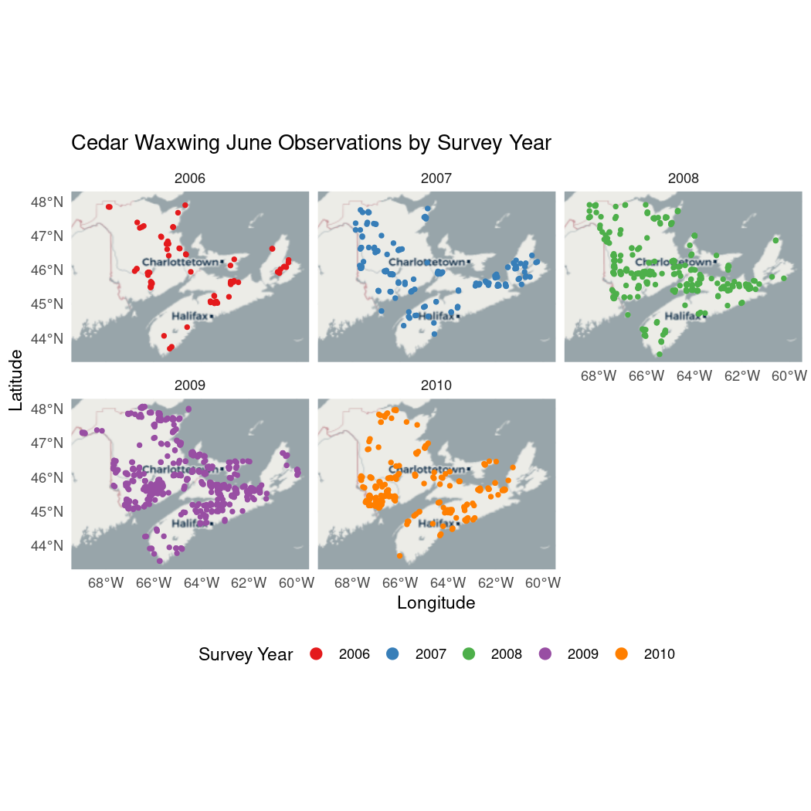
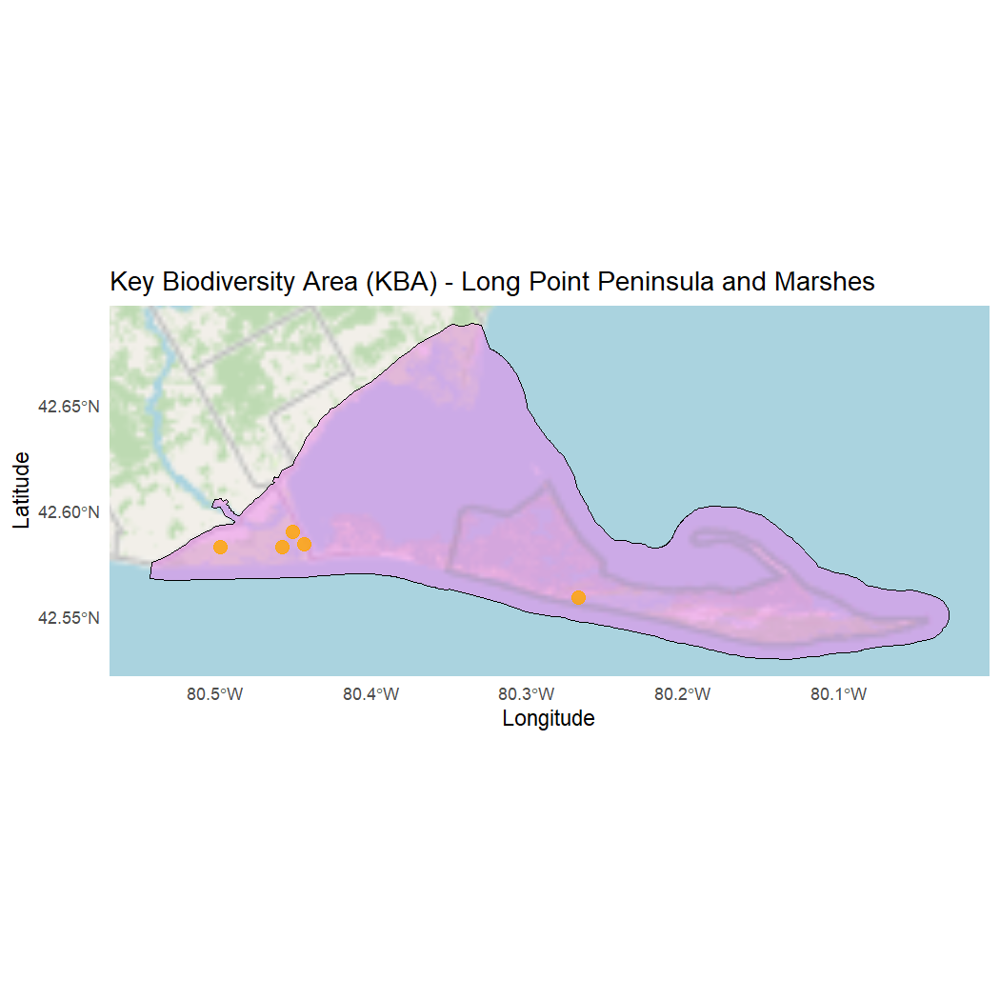

# Chapter 1: Manipulating Spatial Data

##### Author: Dimitrios Markou

Mapping the spatial distribution of avian and environmental data is critical to our understanding of ecological processes. Conservation actions are most effective when focused on areas of ecological importance. These areas typically host high levels of biodiversity, concentrations of rare species, or species at risk.

By integrating NatureCounts data with spatial and environmental layers, researchers can address key questions and prioritize future conservation strategies over broad spatial and temporal scales. The [NatureCounts_SpatialData_Tutorial](https://github.com/BirdsCanada/NatureCounts_SpatialData_Tutorial) serves as a guide on how to visualize and analyse NatureCounts, spatial, and environmental data in R to help users meet their conservation and research goals.

# 1.0 Learning Objectives

By the end of **Chapter 1 - Manipulating Spatial Data**, users will know how to:

-   Visualize NatureCounts data using spatio-temporal maps

-   Distinguish between types of spatial data (vector vs raster)

-   Read and preprocess spatial vector data in R

-   Apply basic geoprocessing functions to spatial objects

-   Visualize NatureCounts data within areas of significant conservation potential: [Key Biodiversity Areas (KBAs)](https://kbacanada.org/about/) and [Priority Places for Species at Risk](https://environmental-maps.canada.ca/CWS_Storylines/index-ca-en.html#/en/priority_places-lieux_prioritaires).

This R tutorial requires the following **packages**:


``` r
library(naturecounts)
library(sf)
library(terra)
library(tidyverse)
library(dplyr)
library(ggplot2)
library(ggspatial)
library(mapview)
library(leaflet)
library(leaflet.extras)
library(leaflet.providers)
```

# 1.1 Spatial Data

Spatial data is any type of vector or raster data that represents a feature or phenomena across geographic space.

| Vector data is used to represent features with points, lines and polygons. This may include individual bird observations, rivers, or conservation area boundaries.

| Raster data is used to represent spatially continuous data with a grid, where each cell has one value. This may include types of environmental data like elevation or temperature.

The most common format used to store vector data in a file on disk is the **ESRI Shapefile** format *(.shp)*. Shapefiles are always accompanied by files with *.dbf*, *.shx,* and *.prj* extensions.

Raster data files are typically stored with TIFF or GeoTIFF files with a *(.tif)* or *(.tiff)* extension. Raster data manipulation will be in covered in subsequent chapters (see 02-ClimateData and 03-EnvironmentalData).

The data used in this tutorial are downloaded from NatureCounts using R, the [KBA Canada Map Viewer](https://kbacanada.org/explore/map-viewer/), and the [Priority Places - Open Government Portal](https://open.canada.ca/data/en/dataset/91219d24-e877-4c8a-8bd2-b2b662e573e0).

# 1.2 Spatio-temporal mapping

To download NatureCounts data you need to [sign up](https://naturecounts.ca/nc/default/register.jsp) for a **free** account.

> The data download will not work unless you replace `"testuser"` with your actual user name. You will be prompted to enter your password.

*Example 1*: You would like to visualize the spatio-temporal distribution of Cedar Waxwing observations in June of each survey year using data from the Maritimes Breeding Bird Atlas (2006-2010).

The [NatureCounts Introductory R Tutorial](#link) is where you should start if you're new to the `naturecounts` R package. It explains how to view, filter, manipulate, and visualize NatureCounts data. We recommend reviewing this tutorial before proceeding.

Let's fetch the NatureCounts data.

First, we look to find the `collection` code for the Maritimes Breeding Bird Atlas.


``` r
collections <- meta_collections()
View(meta_collections())
```

Second, we look to find the numeric species id.


``` r
search_species("cedar waxwing")
```

Now we can download the data. Don't forget to change the `username`.


``` r
cedar_waxwing <- nc_data_dl(collections = "MBBA2PC", species = 16330, username = "testuser", info = "spatial_data_tutorial")
#> Using filters: collections (MBBA2PC); species (16330); fields_set (BMDE2.00-min)
#> Collecting available records...
#>   collection nrecords
#> 1    MBBA2PC     1659
#> Total records: 1,659
#> 
#> Downloading records for each collection:
#>   MBBA2PC
#>     Records 1 to 1659 / 1659
```

Use the `format_dates` function to create date and day-of-year (doy) columns.


``` r
cedar_waxwing <- format_dates(cedar_waxwing)
```

Filter the data to only include observations from the month of June.


``` r
cedar_waxwing_june <- cedar_waxwing %>%
  filter(survey_month == 6)
```

Convert the NatureCounts data to a spatial object using the point count coordinates.


``` r
cedar_waxwing_june_sf <- sf::st_as_sf(cedar_waxwing_june,
                        coords = c("longitude", "latitude"), crs = 4326)
```

Finally, use `ggplot2` to visualize the spatio-temporal distribution of Cedar Waxwing observations across the Maritime provinces by color-coding the data points by **survey_year** and creating a multi-panel plot based on this discrete variable:


``` r
ggplot(data = cedar_waxwing_june_sf) +
  # Select a basemap
  annotation_map_tile(type = "cartolight", zoom = NULL) +
  # Plot the points, color-coded by survey_year
  geom_sf(aes(color = as.factor(survey_year)), size = 1) +
  # Facet by survey_year to create the multi-paneled map
  facet_wrap(~ survey_year) +
  # Customize the color scale
  scale_color_brewer(palette = "Set1", name = "Survey Year") +
  # Add a theme with a minimal design and change the font styles, to your preference
  theme_minimal() +
  theme(legend.position = "bottom") +
  # To make the points in the legend larger without affecting map points
  guides(color = guide_legend(override.aes = list(size = 3))) +
  # Define the title and axis names
  labs(title = "Cedar Waxwing June Observations by Survey Year",
       x = "Longitude",
       y = "Latitude")
#> Zoom: 5
#> Zoom: 5
#> Zoom: 5
#> Zoom: 5
#> Zoom: 5
```



The map above provides a simple visualization of NatureCounts data over a broad spatial and temporal scale. However, mapping data in specific areas of ecological importance might also be relevant to your work. The following sections (**1.3** - **1.7**) work in sequence to help the user visualize NatureCounts data using [Key Biodiversity Areas (KBAs)](https://kbacanada.org/about/) and [Priority Places for Species at Risk](https://environmental-maps.canada.ca/CWS_Storylines/index-ca-en.html#/en/priority_places-lieux_prioritaires) maps.

# 1.3 Reading in spatial data

The `sf` package provides [simple feature](https://r-spatial.github.io/sf/) access in R. This package works best with spatial data (point, line, polygon, multipolygon, etc) associated with tabular attributes (e.g shapefiles). You may be familiar with the `sp` package that has similar functionality in a different format, however, this package is no longer in use as of 2023 and does not support integration with `tidyverse` which is very popular among data scientists in R.

*Example 2*: You want to assess the spatial distribution of Wood Ducks across the KBA's in Ontario using Ontario Breeding Bird Atlas data. Navigate to the [KBA Canada Map Viewer](https://kbacanada.org/explore/map-viewer/), search for all the KBA's in Ontario, and download the .shp and .csv file to your working directory.

To view your working directory.


``` r
getwd()
```

It helps if you assign these files a meaningful name! We can read in our KBA polygons using the `sf` package once it is in your working directory.


```
#> Error: Cannot open "misc/Data/kba/provontario_kba/ontario_kba.shp"; The file doesn't seem to exist.
```


``` r
ontario_kba <- sf::st_read("ontario_kba.shp")
```

`sf` objects are stored in R as a spatial dataframe which contains the attribute table of the vector along with the geometry type. When we examine the dataframe, it looks like there are many duplicate entries including duplicate geometries (vertices). To clean this up, we can apply the `st_make_valid()` and `distinct()` functions to our spatial dataframe:


``` r
ontario_kba <- ontario_kba %>% st_make_valid() %>% distinct()
```

Our spatial data is also accompanied by a CSV file that contains additional useful attributes (landcover, species, etc) concerning our KBAs. Let's read in the accompanying CSV file for our KBA layer.


``` r
kba_attributes <- read.csv("ontario_kba.csv")
```

Great! We can now join these dataframes using the handy `tidyverse` package. However, we'll want to select for specific columns first to avoid redundancies before performing our join:


``` r
kba_attributes <- kba_attributes %>%
  select("SiteCode",
         "DateAssessed",
         "PercentProtected",
         "BoundaryGeneralized",
         "Level",
         "CriteriaMet",
         "ConservationActions",
         "Landcover",
         "Province",
         "Species")
```

Both dataframes now contain unique columns, after our selection. We apply the `full_join()` function to hold all attributes within one dataframe.


``` r
ontario_kba <- full_join(ontario_kba, kba_attributes, by = "SiteCode")
```

# 1.4 Visualizing spatial data in R


``` r
ggplot() +
  # Select the basemap
  annotation_map_tile(type = "cartolight", zoom = NULL) +
  # Add the polygon data
  geom_sf(data = ontario_kba, fill = "red", color = "black", 
          size = 0.5, alpha = 0.5) +
  # Add the map components
  theme_minimal() + 
  labs(fill = "Ontario KBAs") +
  scale_fill_manual(values = c("red")) +
  theme(legend.position = "bottomright") +
  labs(title = "Key Biodiversity Areas (KBAs) of Ontario" ,
       x = "Longitude",
       y = "Latitude")
#> Zoom: 4
```


We can visualize the **ontario_kba** data with an interactive map, using the `leaflet` package.


``` r
leaflet(width = "100%") %>%
  addTiles() %>%
  addPolygons(data=ontario_kba,color = "black", weight = 2, smoothFactor = 1,opacity = 1.0, fillOpacity = 0.5, fillColor = "red") %>% addFullscreenControl() %>%
  addLegend(colors = c("red"),labels = c("Ontario KBAs"),position = "bottomright")
```

Similarly, the package `mapview` (based on leaflet) can also be used to make interactive plots. We can represent specific attributes like so:


``` r
mapview::mapview(ontario_kba, zcol = "PercentProtected")
```

In this example, were interested in all the KBA polygons of Ontario. However, if you were working with a larger data set, it is possible to filter your dataframe to retrieve only specific polygons that meet certain criteria relevant to your research. To do so, we can apply filters based on a variable condition. For example, say we only wanted KBA's greater than 100km\^2 in size:

> To execute this code chunk, remove the \#


``` r
# kba_name <- ontario_kba %>% 
  # dplyr::filter(Area > 100) 
```

# 1.5 Reading in NatureCounts data

Let's search NatureCounts for the Ontario Breeding Bird Atlas (OBBA2PC, 2001-2005) dataset to assess Wood Duck distribution across Ontario KBA's. The steps here are similar to those you used in the Cedar Waxwing example.


``` r
collections <- meta_collections()
View(meta_collections())
```


``` r
search_species("wood duck")
```

Then let's filter and download data specifically for the Wood Ducks in Ontario.


``` r
atlas_on <- nc_data_dl(collections = "OBBA2PC", species = 360, username = "testuser", info = "spatial_data_tutorial")
#> Using filters: collections (OBBA2PC); species (360); fields_set (BMDE2.00-min)
#> Collecting available records...
#>   collection nrecords
#> 1    OBBA2PC      290
#> Total records: 290
#> 
#> Downloading records for each collection:
#>   OBBA2PC
#>     Records 1 to 290 / 290
```

We can then convert our NatureCounts data into a spatial object. To do so, we deploy the `st_as_sf` function and specify the coordinate reference system (CRS).

The CRS of our KBA sf object can be returned with `st_crs()`.


``` r
sf::st_crs(ontario_kba)
#> Coordinate Reference System:
#>   User input: EPSG:4326 
#>   wkt:
#> GEOGCRS["WGS 84",
#>     ENSEMBLE["World Geodetic System 1984 ensemble",
#>         MEMBER["World Geodetic System 1984 (Transit)"],
#>         MEMBER["World Geodetic System 1984 (G730)"],
#>         MEMBER["World Geodetic System 1984 (G873)"],
#>         MEMBER["World Geodetic System 1984 (G1150)"],
#>         MEMBER["World Geodetic System 1984 (G1674)"],
#>         MEMBER["World Geodetic System 1984 (G1762)"],
#>         MEMBER["World Geodetic System 1984 (G2139)"],
#>         ELLIPSOID["WGS 84",6378137,298.257223563,
#>             LENGTHUNIT["metre",1]],
#>         ENSEMBLEACCURACY[2.0]],
#>     PRIMEM["Greenwich",0,
#>         ANGLEUNIT["degree",0.0174532925199433]],
#>     CS[ellipsoidal,2],
#>         AXIS["geodetic latitude (Lat)",north,
#>             ORDER[1],
#>             ANGLEUNIT["degree",0.0174532925199433]],
#>         AXIS["geodetic longitude (Lon)",east,
#>             ORDER[2],
#>             ANGLEUNIT["degree",0.0174532925199433]],
#>     USAGE[
#>         SCOPE["Horizontal component of 3D system."],
#>         AREA["World."],
#>         BBOX[-90,-180,90,180]],
#>     ID["EPSG",4326]]
```

Our KBA sf object is stored with World Geodetic System 1984 (WGS 84) coordinates, EPSG = 4326. Now we can convert our **atlas_on** dataframe to an sf object using the same CRS.


``` r
atlas_on_sf <- sf::st_as_sf(atlas_on,
                        coords = c("longitude", "latitude"), crs = 4326)
```

Now let's ensure that the conversion was successful. You'll notice a new geometry column where each observation is a point.


``` r
str(atlas_on_sf) # view the sf object
#> Classes 'sf' and 'data.frame':	290 obs. of  56 variables:
#>  $ record_id              : int  10339750 10340180 10342681 10343644 10344845 10351428 10353184 10354352 10355078 10357496 ...
#>  $ collection             : chr  "OBBA2PC" "OBBA2PC" "OBBA2PC" "OBBA2PC" ...
#>  $ project_id             : int  1007 1007 1007 1007 1007 1007 1007 1007 1007 1007 ...
#>  $ protocol_id            : logi  NA NA NA NA NA NA ...
#>  $ protocol_type          : int  1 1 1 1 1 1 1 1 1 1 ...
#>  $ species_id             : int  360 360 360 360 360 360 360 360 360 360 ...
#>  $ statprov_code          : chr  "ON" "ON" "ON" "ON" ...
#>  $ country_code           : chr  "CA" "CA" "CA" "CA" ...
#>  $ SiteCode               : chr  "17NJ64-14" "17MJ97-10" "17NH47-23" "17NJ31-6" ...
#>  $ bcr                    : int  13 13 13 13 13 13 13 12 13 13 ...
#>  $ subnational2_code      : chr  "CA.ON.WL" "CA.ON.BC" "CA.ON.BN" "CA.ON.WT" ...
#>  $ iba_site               : chr  "N/A" "N/A" "N/A" "N/A" ...
#>  $ utm_square             : chr  "17TNJ64" "17TMJ97" "17TNH47" "17TNJ31" ...
#>  $ survey_year            : int  2001 2001 2001 2001 2001 2001 2001 2001 2001 2001 ...
#>  $ survey_month           : int  6 5 5 6 6 6 6 6 6 6 ...
#>  $ survey_week            : int  3 4 4 3 1 4 4 1 4 2 ...
#>  $ survey_day             : int  21 31 31 24 4 28 28 2 27 15 ...
#>  $ breeding_rank          : logi  NA NA NA NA NA NA ...
#>  $ GlobalUniqueIdentifier : chr  "URN:catalog:BSC-EOC:OBBA2PC:850-WODU" "URN:catalog:BSC-EOC:OBBA2PC:392-WODU" "URN:catalog:BSC-EOC:OBBA2PC:269-WODU" "URN:catalog:BSC-EOC:OBBA2PC:961-WODU" ...
#>  $ CatalogNumber          : chr  "850-WODU" "392-WODU" "269-WODU" "961-WODU" ...
#>  $ Locality               : logi  NA NA NA NA NA NA ...
#>  $ TimeCollected          : chr  "5.7166667" "8.9333334" "7.1999998" "6.2833333" ...
#>  $ CollectorNumber        : chr  "356" "266" "1530" "1335" ...
#>  $ FieldNumber            : logi  NA NA NA NA NA NA ...
#>  $ Remarks                : logi  NA NA NA NA NA NA ...
#>  $ ProjectCode            : chr  "OBBA2" "OBBA2" "OBBA2" "OBBA2" ...
#>  $ ProtocolType           : chr  "Point Count" "Point Count" "Point Count" "Point Count" ...
#>  $ ProtocolCode           : chr  "PointCount" "PointCount" "PointCount" "PointCount" ...
#>  $ ProtocolURL            : chr  "http://www.bsc-eoc.org/norac/atlascont.htm" "http://www.bsc-eoc.org/norac/atlascont.htm" "http://www.bsc-eoc.org/norac/atlascont.htm" "http://www.bsc-eoc.org/norac/atlascont.htm" ...
#>  $ SurveyAreaIdentifier   : chr  "17NJ64-14" "17MJ97-10" "17NH47-23" "17NJ31-6" ...
#>  $ SamplingEventIdentifier: chr  "850" "392" "269" "961" ...
#>  $ SamplingEventStructure : logi  NA NA NA NA NA NA ...
#>  $ RouteIdentifier        : chr  "17NJ64" "17MJ97" "17NH47" "17NJ31" ...
#>  $ TimeObservationsStarted: logi  NA NA NA NA NA NA ...
#>  $ TimeObservationsEnded  : logi  NA NA NA NA NA NA ...
#>  $ DurationInHours        : chr  "0.08333333" "0.08333333" "0.08333333" "0.08333333" ...
#>  $ TimeIntervalStarted    : chr  "5.7166667" "8.9333334" "7.1999998" "6.2833333" ...
#>  $ TimeIntervalEnded      : logi  NA NA NA NA NA NA ...
#>  $ TimeIntervalsAdditive  : logi  NA NA NA NA NA NA ...
#>  $ NumberOfObservers      : logi  NA NA NA NA NA NA ...
#>  $ NoObservations         : logi  NA NA NA NA NA NA ...
#>  $ ObservationCount       : chr  "2" "1" "1" "3" ...
#>  $ ObservationDescriptor  : chr  "Total count" "Total count" "Total count" "Total count" ...
#>  $ ObservationCount2      : chr  NA "1" NA "3" ...
#>  $ ObservationDescriptor2 : chr  "0-100 m" "0-100 m" "0-100 m" "0-100 m" ...
#>  $ ObservationCount3      : chr  "2" NA "1" NA ...
#>  $ ObservationDescriptor3 : chr  ">100 m" ">100 m" ">100 m" ">100 m" ...
#>  $ ObservationCount4      : logi  NA NA NA NA NA NA ...
#>  $ ObservationDescriptor4 : logi  NA NA NA NA NA NA ...
#>  $ ObservationCount5      : logi  NA NA NA NA NA NA ...
#>  $ ObservationDescriptor5 : logi  NA NA NA NA NA NA ...
#>  $ ObservationCount6      : logi  NA NA NA NA NA NA ...
#>  $ ObservationDescriptor6 : logi  NA NA NA NA NA NA ...
#>  $ AllIndividualsReported : chr  "Yes" "Yes" "Yes" "Yes" ...
#>  $ AllSpeciesReported     : chr  "Yes" "Yes" "Yes" "Yes" ...
#>  $ geometry               :sfc_POINT of length 290; first list element:  'XY' num  -80.1 43.7
#>  - attr(*, "sf_column")= chr "geometry"
#>  - attr(*, "agr")= Factor w/ 3 levels "constant","aggregate",..: NA NA NA NA NA NA NA NA NA NA ...
#>   ..- attr(*, "names")= chr [1:55] "record_id" "collection" "project_id" "protocol_id" ...
```

There are a few other useful functions that may be applied to sf objects:

| `sf::st_transform()` - transforms the CRS of a specified CRS object
| `sf::st_drop_geometry()` - removes the geometry column of a sf object

For example, `st_transform()` can be applied to project our spatial object using a different CRS like NAD83 / UTM zone 16N (EPSG = 26916).


``` r
ontario_kba <- sf::st_transform(ontario_kba, crs = 26916) 
```

It can also be used to ensure that the CRS of our spatial objects match.


``` r
atlas_on_sf <- st_transform(atlas_on_sf, crs = st_crs(ontario_kba))
```

# 1.6 Geoprocessing functions

Geoprocessing functions allow us to manipulate or compute spatial objects based on interactions between their geometries. There are several useful functions integrated into the `sf` package including:

| `st_intersection(x, y)` - creates geometry of the shared portion of x and y
| `st_crop(x, y, ..., xmin, ymin, xmax, ymax)` - creates geometry of x that intersects a specified range
| `st_difference(x, y)` - creates geometry from x that does not intersect with y
| `st_area`, `st_length`, and `st_distance` can also be used to compute geometric measurements

More resources, including as `sf` package **cheatsheat** can be found [here](https://github.com/r-spatial/sf).

To identify Wood Ducks observed in Ontario KBA's, we can apply the `st_intersection()` function.


``` r
wood_ducks_kba <- sf::st_intersection(ontario_kba, atlas_on_sf)
#> Warning: attribute variables are assumed to be spatially constant throughout all geometries
```

You will get a `warning` message, which you can safely ignore.


``` r
# If need be, transform your spatial data back to EPSG:4326 to visualize with ggplot2 or leaflet
ontario_kba <- st_transform(ontario_kba, crs = 4326)
wood_ducks_kba <- st_transform(wood_ducks_kba, crs = 4326)
```

Use ggplot2 to visualize the polygon data and point data for the Long Point Peninsula and Marshes (SiteCode ON001):


``` r
# Filter the ontario_kba and wood_ducks_kba data by SiteCode 
ontario_kba_LP <- ontario_kba[ontario_kba$SiteCode == "ON001", ]
wood_ducks_kba_LP <- wood_ducks_kba[wood_ducks_kba$SiteCode == "ON001", ]

ggplot() +
  # Select a basemap
  annotation_map_tile(type = "osm", zoom = NULL) +
  # Plot the filtered KBA polygon (ON001)
  geom_sf(data = ontario_kba_LP, aes(fill = "Ontario KBA"), color = "black", size = 0.5, alpha = 0.5) +
  # Plot the Wood Duck observations that are within the KBA
  geom_sf(data = wood_ducks_kba_LP, aes(color = "Wood Duck Observations"), size = 3, alpha = 0.8) +
  # Custom fill and color for the legend
  scale_fill_manual(values = c("Ontario KBA" = "violet"), name = "Legend") +
  scale_color_manual(values = c("Wood Duck Observations" = "orange"), name = "Legend") +
  # Automatically zoom to the extent of the ON001 polygon
  coord_sf() +
  # Map components
  theme_minimal() +
  theme(legend.position = "bottomright") +
  labs(title = "Key Biodiversity Area (KBA) - Long Point Peninsula and Marshes",
       x = "Longitude",
       y = "Latitude")
#> Zoom: 9
```



Or use leaflet, this time using the `addCircleMarkers` argument.


``` r
leaflet(width = "100%") %>%
  addTiles() %>%
  addPolygons(data = ontario_kba, color = "black", weight = 2, smoothFactor = 1, 
  opacity = 1.0, fillOpacity = 0.5, fillColor = "violet") %>%
  addCircleMarkers(data = wood_ducks_kba, radius = 3, color = "orange", 
                   stroke = FALSE, fillOpacity = 0.8) %>%
  addFullscreenControl() %>%
  addLegend(colors = c("violet", "orange"), labels = c("Ontario KBA", "Wood Duck Observations"), position = "bottomright")
```

After geoprocessing our data in R, we can write out any sf objects to Shapefiles on a disk, where the argument delete_layer = TRUE is used to overwrite a file.


``` r
# st_write(wood_ducks_kba,"wood_ducks_kba.shp", driver = "ESRI Shapefile", delete_layer = TRUE)
```

# 1.7 Priority Places Example

*Example 3*: You want to assess Wood Duck distribution across the Long Point Walsingham Forest Priority Place. Data for this section may be downloaded from the [Priority Places - Open Government Portal](https://open.canada.ca/data/en/dataset/91219d24-e877-4c8a-8bd2-b2b662e573e0).

First, lets create a path to our downloaded Priority Place file.


``` r
gdb_path <- "priorityplaces.gdb"
```

Then, let's inspect the spatial data.


``` r
gdb_layers <- st_layers(gdb_path)
#> Cannot open data source C:/Users/dimit/Birds Canada/Data/priority_places/priorityplaces.gdb
#> Error in eval(expr, envir, enclos): Open failed.
```

``` r
print(gdb_layers)
#> Error in eval(expr, envir, enclos): object 'gdb_layers' not found
```

To read in our spatial data object, we apply the `st_read` function and specify our desired data layer.


``` r
priori_place_polygons <- st_read(dsn = gdb_path, layer = "PriorityPlacesBoundary")
#> Error: Cannot open "C:/Users/dimit/Birds Canada/Data/priority_places/priorityplaces.gdb"; The file doesn't seem to exist.
```

Were interested in Wood Duck distribution across the Long Point Walsingham Forest Priority Place. We'll use `dplyr` to filter based on a variable condition.


``` r
long_point_polygon <- priori_place_polygons %>%
  dplyr::filter(Name == "Long Point Walsingham Forest") # filters based on multipolygon name 
#> Error in eval(expr, envir, enclos): object 'priori_place_polygons' not found
```

Then reproject the Wood Duck data to match our Priority Place using `st_transform`.


``` r
atlas_on_sf <- st_transform(atlas_on_sf, crs = st_crs(long_point_polygon))
#> Error in eval(expr, envir, enclos): object 'long_point_polygon' not found
```

Next, we'll apply our geoprocessing function to find the Wood Duck observations that intersect with our chosen Priority Place.


``` r
wood_ducks_longpoint <- sf::st_intersection(long_point_polygon, atlas_on_sf)
#> Error in eval(expr, envir, enclos): object 'long_point_polygon' not found
```

Finally, we'll transform our spatial objects one more time before visualizing them.


``` r
long_point_polygon <- st_transform(long_point_polygon, crs = 4326)
#> Error in eval(expr, envir, enclos): object 'long_point_polygon' not found
```


``` r
wood_ducks_longpoint <- st_transform(wood_ducks_longpoint, crs = 4326)
#> Error in eval(expr, envir, enclos): object 'wood_ducks_longpoint' not found
```

with `ggplot2`:


``` r
ggplot() +
  # Select a basemap
  annotation_map_tile(type = "cartolight", zoom = NULL) +
  # Plot the Long Point polygon
  geom_sf(data = long_point_polygon, aes(fill = "Long Point Walsingham Forest"), 
          color = "black", size = 0.5, alpha = 0.5) +
  # Plot the Wood Duck observations
  geom_sf(data = wood_ducks_longpoint, aes(color = "Wood Duck Observations"), 
          size = 3, alpha = 0.8) +
  # Custom fill and color for the legend
  scale_fill_manual(values = c("Long Point Walsingham Forest" = "red"), name = "Legend") +
  scale_color_manual(values = c("Wood Duck Observations" = "green"), name = "Legend") +
  # Automatically zoom to the extent of the Long Point polygon
  coord_sf() +
  # Map components
  theme_minimal() +
  theme(legend.position = "bottomright") +
  labs(title = "Wood Duck Observations within Long Point Walsingham",
       x = "Longitude",
       y = "Latitude")
#> Error in eval(expr, envir, enclos): object 'long_point_polygon' not found
```

With `leaflet`:


``` r
leaflet(width = "100%") %>%
  addTiles() %>%
  addPolygons(data = long_point_polygon, color = "black", weight = 2, smoothFactor = 1, 
  opacity = 1.0, fillOpacity = 0.5, fillColor = "red") %>%
  addCircleMarkers(data = wood_ducks_longpoint, radius = 5, color = "green", 
                   stroke = FALSE, fillOpacity = 0.8) %>%
  addFullscreenControl() %>%
  addLegend(colors = c("red", "green"), labels = c("Long Point Walsingham Forest", "Wood Duck Observations"), position = "bottomright")
```

**Congratulations**! You've completed **Chapter 1 - Manipulating Spatial Data (Part 1)**. Here, you've successfully filtered and visualized NatureCounts data using spatio-temporal, KBA, and Priority Place maps. In [Chapter 2](02-ManipSpatialData_Part2.Rmd), you will explore more spatial data visualization while linking climate data to NatureCounts observations.
