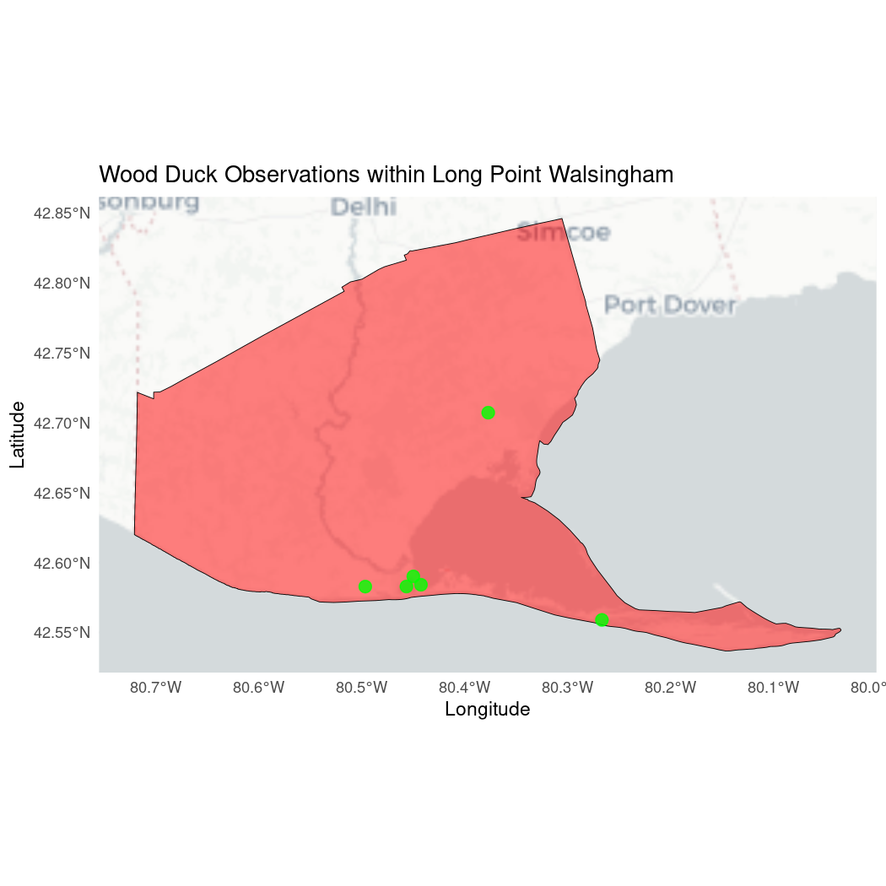

# Module 2: Conservation Areas: KBA's and Priority Places

##### Author: Dimitrios Markou

The [NatureCounts_SpatialData_Tutorial](https://github.com/BirdsCanada/NatureCounts_SpatialData_Tutorial) modules aim to help users integrate NatureCounts data with spatial and environmental layers in R and meet their conservation and research goals. In [**Module 1: Spatial Data Exploration**](01-SpatialDataExploration.Rmd), you distinguished between spatial data types (vector and raster) and explored NatureCounts data using a spatio-temporal map.

Mapping the spatial distribution of avian and environmental data is critical to our understanding of ecological processes. Conservation actions are most effective when focused on areas of ecological importance. These areas typically host high levels of biodiversity, concentrations of rare species, or species at risk. In this way, analyzing NatureCounts data within specific boundaries might be relevant to your work.

# 2.0 Learning Objectives

By the end of **Module 2 - Conservation Areas**, users will know how to:

-   Apply basic geoprocessing functions to spatial objects.

<!-- -->

-   Read, process, and visualize spatial vector data in R within areas of significant conservation potential: [Key Biodiversity Areas (KBAs)](https://kbacanada.org/about/) and [Priority Places for Species at Risk](https://environmental-maps.canada.ca/CWS_Storylines/index-ca-en.html#/en/priority_places-lieux_prioritaires).

The data used in this tutorial are downloaded from NatureCounts using R, the [KBA Canada Map Viewer](https://kbacanada.org/explore/map-viewer/), and the [Priority Places - Open Government Portal](https://open.canada.ca/data/en/dataset/91219d24-e877-4c8a-8bd2-b2b662e573e0).

This R tutorial requires the following **packages**:


``` r
library(naturecounts)
library(sf)
library(terra)
library(tidyverse)
library(dplyr)
library(ggplot2)
library(ggspatial)
library(mapview)
library(leaflet)
library(leaflet.extras)
library(leaflet.providers)
```

# 2.1 Key Biodiversity Areas

#### *Example 2a* - You want to assess the spatial distribution of Wood Ducks (Ontario Breeding Bird Atlas data) across the KBAs found within the province.

To view your working directory.


``` r
getwd()
```

It helps if you assign these files a meaningful name! We can read in our KBA polygons using the `sf` package once it is in your working directory.


```
## Reading layer `ontario_kba' from data source `C:\Users\dimit\Birds Canada\Data\kba\provontario_kba\ontario_kba.shp' using driver `ESRI Shapefile'
## Simple feature collection with 198 features and 8 fields
## Geometry type: POLYGON
## Dimension:     XY
## Bounding box:  xmin: -94.52593 ymin: 42.22596 xmax: -75.79267 ymax: 51.95705
## Geodetic CRS:  WGS 84
```


``` r
ontario_kba <- sf::st_read("ontario_kba.shp")
```

`sf` objects are stored in R as a spatial dataframe which contains the attribute table of the vector along with the geometry type. When we examine the dataframe, it looks like there are many duplicate entries including duplicate geometries (vertices). To clean this up, we can apply the `st_make_valid()` and `distinct()` functions to our spatial dataframe:


``` r
ontario_kba <- ontario_kba %>% st_make_valid() %>% distinct()
```

Our spatial data is also accompanied by a CSV file that contains additional useful attributes (landcover, species, etc) concerning our KBAs. Let's read in the accompanying CSV file for our KBA layer.


``` r
kba_attributes <- read.csv("ontario_kba.csv")
```

Great! We can now join these dataframes using the handy `tidyverse` package. However, we'll want to select for specific columns first to avoid redundancies before performing our join:


``` r
kba_attributes <- kba_attributes %>%
  select("SiteCode",
         "DateAssessed",
         "PercentProtected",
         "BoundaryGeneralized",
         "Level",
         "CriteriaMet",
         "ConservationActions",
         "Landcover",
         "Province",
         "Species")
```

Both dataframes now contain unique columns, after our selection. We apply the `full_join()` function to hold all attributes within one dataframe.


``` r
ontario_kba <- full_join(ontario_kba, kba_attributes, by = "SiteCode")
```

To visualize the **ontario_kba** data we can use `ggplot()`.


``` r
ggplot() +
  # Select the basemap
  annotation_map_tile(type = "cartolight", zoom = NULL) +
  # Add the polygon data
  geom_sf(data = ontario_kba, fill = "red", color = "black", 
          size = 0.5, alpha = 0.5) +
  # Add the map components
  theme_minimal() + 
  labs(fill = "Ontario KBAs") +
  scale_fill_manual(values = c("red")) +
  theme(legend.position = "bottomright") +
  labs(title = "Key Biodiversity Areas (KBAs) of Ontario" ,
       x = "Longitude",
       y = "Latitude")
```

```
## Zoom: 4
```

```
## Fetching 2 missing tiles
```

```


  addLegend(colors = c("red"),labels = c("Ontario KBAs"),position = "bottomright")
```

Similarly, the package `mapview` (based on leaflet) can also be used to make interactive plots. We can represent specific attributes like so:


``` r
mapview::mapview(ontario_kba, zcol = "PercentProtected")
```

In this example, were interested in all the KBA polygons of Ontario. However, if you were working with a larger data set, it is possible to filter your dataframe to retrieve only specific polygons that meet certain criteria relevant to your research. To do so, we can apply filters based on a variable condition. For example, say we only wanted KBA's greater than 100km\^2 in size:

> To execute this code chunk, remove the \#


``` r
# kba_name <- ontario_kba %>% 
  # dplyr::filter(Area > 100) 
```

Let's search NatureCounts for the Ontario Breeding Bird Atlas point count dataset using `meta_collections()` and the Wood Duck species ID using `search_species()`.


``` r
collections <- meta_collections()
View(meta_collections())
```


``` r
search_species("wood duck")
```

Then let's filter and download the NatureCounts data.


``` r
atlas_on <- nc_data_dl(collections = "ONATLAS3PC", species = 360, username = "testuser", info = "spatial_data_tutorial")
```

```
## Using filters: collections (ONATLAS3PC); species (360); fields_set (BMDE2.00-min)
```

```
## Collecting available records...
```

```
## Error: You do not have permission to access these collections (ONATLAS3PC)
```

We can then convert our NatureCounts data into a spatial object. To do so, we deploy the `st_as_sf` function and specify the coordinate reference system (CRS).

The CRS of our KBA sf object can be returned with `st_crs()`.


``` r
sf::st_crs(ontario_kba)
```

```
## Coordinate Reference System:
##   User input: WGS 84 
##   wkt:
## GEOGCRS["WGS 84",
##     DATUM["World Geodetic System 1984",
##         ELLIPSOID["WGS 84",6378137,298.257223563,
##             LENGTHUNIT["metre",1]]],
##     PRIMEM["Greenwich",0,
##         ANGLEUNIT["degree",0.0174532925199433]],
##     CS[ellipsoidal,2],
##         AXIS["latitude",north,
##             ORDER[1],
##             ANGLEUNIT["degree",0.0174532925199433]],
##         AXIS["longitude",east,
##             ORDER[2],
##             ANGLEUNIT["degree",0.0174532925199433]],
##     ID["EPSG",4326]]
```

Our KBA sf object is stored with World Geodetic System 1984 (WGS 84) coordinates, EPSG = 4326. Now we can convert our **atlas_on** dataframe to an sf object using the same CRS.


``` r
atlas_on_sf <- sf::st_as_sf(atlas_on,
                        coords = c("longitude", "latitude"), crs = 4326)
```

```
## Error in eval(expr, envir, enclos): object 'atlas_on' not found
```

Now let's ensure that the conversion was successful. You'll notice a new geometry column where each observation is a point.


``` r
str(atlas_on_sf) # view the sf object
```

The `st_transform()` function can be applied to project our spatial object using a different CRS like NAD83 / UTM zone 16N (EPSG = 26916).


``` r
ontario_kba <- sf::st_transform(ontario_kba, crs = 26916) 
```

It can also be used to ensure that the CRS of our spatial objects match.


``` r
atlas_on_sf <- st_transform(atlas_on_sf, crs = st_crs(ontario_kba))
```

```
## Error in eval(expr, envir, enclos): object 'atlas_on_sf' not found
```

To identify Wood Ducks observed across Ontario KBA's, we can apply the `st_intersection()` function.


``` r
wood_ducks_kba <- sf::st_intersection(ontario_kba, atlas_on_sf)
```

```
## Error in eval(expr, envir, enclos): object 'atlas_on_sf' not found
```

You will get a `warning` message, which you can safely ignore.


``` r
# If need be, transform your spatial data back to EPSG:4326 to visualize with leaflet
ontario_kba <- st_transform(ontario_kba, crs = 4326)
wood_ducks_kba <- st_transform(wood_ducks_kba, crs = 4326)
```

```
## Error in eval(expr, envir, enclos): object 'wood_ducks_kba' not found
```

Using `ggplot`, we can visualize the polygon data and point data.


``` r
ggplot() +
  # Select a basemap
  annotation_map_tile(type = "osm", zoom = NULL) +
  # Plot the filtered KBA polygon (ON001)
  geom_sf(data = ontario_kba_LP, aes(fill = "Ontario KBA"), color = "black", size = 0.5, alpha = 0.5) +
  # Plot the Wood Duck observations that are within the KBA
  geom_sf(data = wood_ducks_kba_LP, aes(color = "Wood Duck Observations"), size = 3, alpha = 0.8) +
  # Custom fill and color for the legend
  scale_fill_manual(values = c("Ontario KBA" = "violet"), name = "Legend") +
  scale_color_manual(values = c("Wood Duck Observations" = "orange"), name = "Legend") +
  # Automatically zoom to the extent of the ON001 polygon
  coord_sf() +
  # Map components
  theme_minimal() +
  theme(legend.position = "bottomright") +
  labs(title = "Key Biodiversity Area (KBA) - Long Point Peninsula and Marshes",
       x = "Longitude",
       y = "Latitude")
```

```
## Error in eval(expr, envir, enclos): object 'ontario_kba_LP' not found
```


You can also apply `leaflet` to create an interactive map, using the `addPolygons()` `addCircleMarkers()` arguments.


``` r
leaflet(width = "100%") %>%
  addTiles() %>%
  addPolygons(data = ontario_kba, color = "black", weight = 2, smoothFactor = 1, 
  opacity = 1.0, fillOpacity = 0.5, fillColor = "violet") %>%
  addCircleMarkers(data = wood_ducks_kba, radius = 3, color = "orange", 
                   stroke = FALSE, fillOpacity = 0.8) %>%
  addFullscreenControl() %>%
  addLegend(colors = c("violet", "orange"), labels = c("Ontario KBA", "Wood Duck Observations"), position = "bottomright")
```

After geoprocessing our data in R, we can write out any sf objects to Shapefiles on a disk, where the argument delete_layer = TRUE is used to overwrite a file.


``` r
# st_write(wood_ducks_kba,"wood_ducks_kba.shp", driver = "ESRI Shapefile", delete_layer = TRUE)
```

# 2.2 Priority Places

#### *Example 2b* - You want to assess the spatial distribution of Wood Ducks (Ontario Breeding Bird Atlas data) across the Long Point Walsingham Forest Priority Place.

First, lets create a path to our downloaded Priority Place file.


``` r
gdb_path <- "PriorityPlaces.gdb"
```

Then, let's inspect the spatial data.


``` r
gdb_layers <- st_layers(gdb_path)
print(gdb_layers)
```

```
## Driver: OpenFileGDB 
## Available layers:
##               layer_name geometry_type features fields                     crs_name
## 1 PriorityPlacesBoundary Multi Polygon       11     11 NAD83 / Canada Atlas Lambert
## 2  PriorityPlacesProject   Multi Point       89     13 NAD83 / Canada Atlas Lambert
```

To read in our spatial data object, we apply the `st_read` function and specify our desired data layer.


``` r
priori_place_polygons <- st_read(dsn = gdb_path, layer = "PriorityPlacesBoundary")
```

```
## Reading layer `PriorityPlacesBoundary' from data source `C:\Users\dimit\Birds Canada\Data\priority_places\priorityplaces.gdb' using driver `OpenFileGDB'
## Simple feature collection with 11 features and 11 fields
## Geometry type: MULTIPOLYGON
## Dimension:     XY
## Bounding box:  xmin: -2135754 ymin: -586679 xmax: 2450963 ymax: 2554209
## Projected CRS: NAD83 / Canada Atlas Lambert
```

Were interested in the spatial distribution of Wood Ducks across the Long Point Walsingham Forest Priority Place. We'll use `dplyr` to filter based on a variable condition.


``` r
long_point_polygon <- priori_place_polygons %>%
  dplyr::filter(Name == "Long Point Walsingham Forest") # filters based on multipolygon name 
```

Then reproject the Wood Duck data to match our Priority Place using `st_transform`.


``` r
atlas_on_sf <- st_transform(atlas_on_sf, crs = st_crs(long_point_polygon))
```

```
## Error in eval(expr, envir, enclos): object 'atlas_on_sf' not found
```

Next, we'll apply our geoprocessing function to find the Wood Duck observations that intersect with our chosen Priority Place.


``` r
wood_ducks_longpoint <- sf::st_intersection(long_point_polygon, atlas_on_sf)
```

```
## Error in eval(expr, envir, enclos): object 'atlas_on_sf' not found
```

Finally, we'll transform our spatial objects one more time before visualizing them.


``` r
long_point_polygon <- st_transform(long_point_polygon, crs = 4326)
```


``` r
wood_ducks_longpoint <- st_transform(wood_ducks_longpoint, crs = 4326)
```

```
## Error in eval(expr, envir, enclos): object 'wood_ducks_longpoint' not found
```

Use `ggplot` to visualize the polygon and point data.


``` r
ggplot() +
  # Select a basemap
  annotation_map_tile(type = "cartolight", zoom = NULL) +
  # Plot the Long Point polygon
  geom_sf(data = long_point_polygon, aes(fill = "Long Point Walsingham Forest"), 
          color = "black", size = 0.5, alpha = 0.5) +
  # Plot the Wood Duck observations
  geom_sf(data = wood_ducks_longpoint, aes(color = "Wood Duck Observations"), 
          size = 3, alpha = 0.8) +
  # Custom fill and color for the legend
  scale_fill_manual(values = c("Long Point Walsingham Forest" = "red"), name = "Legend") +
  scale_color_manual(values = c("Wood Duck Observations" = "green"), name = "Legend") +
  # Automatically zoom to the extent of the Long Point polygon
  coord_sf() +
  # Map components
  theme_minimal() +
  theme(legend.position = "bottomright") +
  labs(title = "Wood Duck Observations within Long Point Walsingham",
       x = "Longitude",
       y = "Latitude")
```

```
## Error in eval(expr, envir, enclos): object 'wood_ducks_longpoint' not found
```



After geoprocessing our data in R, we can write out any sf objects to Shapefiles on a disk, where the argument delete_layer = TRUE is used to overwrite a file.


``` r
# st_write(wood_ducks_longpoint,"wood_ducks_longpoint.shp", driver = "ESRI Shapefile", delete_layer = TRUE)
```

**Congratulations**! You completed **Module 2 - Spatial Data Manipulation: KBA's and Priority Places**. Here, you successfully filtered and visualized NatureCounts data using spatio-temporal, KBA, and Priority Place maps. In [Module 3](03-ClimateData.Rmd), you can explore more spatial data visualization while linking climate data to NatureCounts observations.
