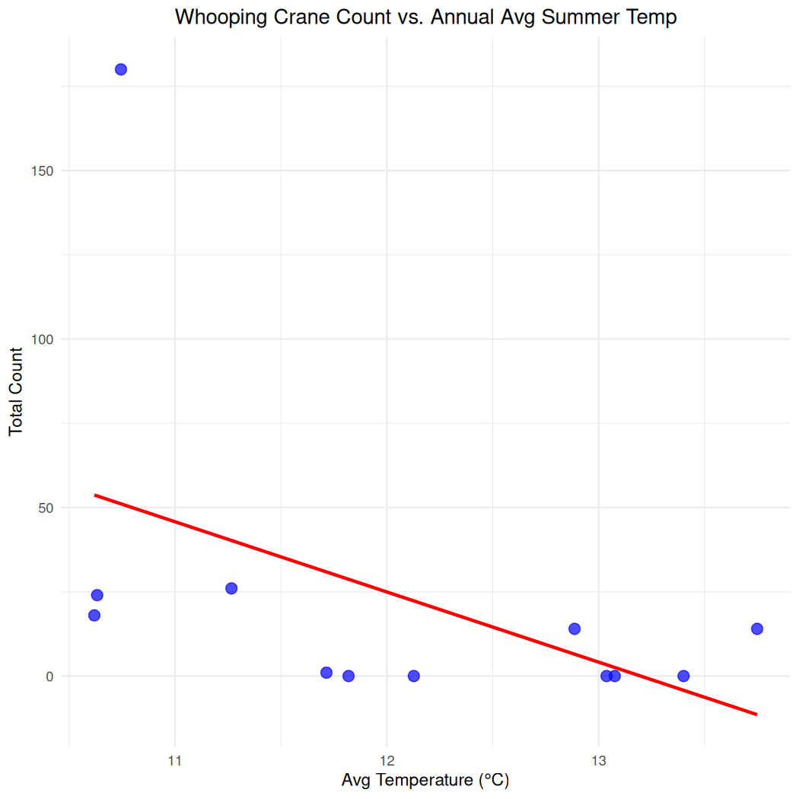

# Chapter 3: Climate Data

##### Authors: Dimitrios Markou, Danielle Ethier

| In [Chapter 2](02-SpatialSubsets.Rmd), you applied geoprocessing functions to spatial (vector) objects, and filtered and visualized NatureCounts data within KBAs and Priority Places. Now you are ready to explore your NatureCounts data in relation to environmental covariates. In this tutorial, you will use NatureCounts and climate data to explore possible patterns in Whooping Crane observations, annual mean temperature, and annual mean precipitation within the Wood Buffalo National Park, the province of Alberta, and beyond.

# 3.0 Learning Objectives

By the end of **Chapter 3 - Climate Data**, users will know how to:

-   Download and preprocess vector and raster climate data
-   Combine NatureCounts observations with climate data
-   Visualize NatureCounts and climate data using plots and spatio-temporal maps

This tutorial utilizes the following bird occurrence, spatial, and climate data sources:

| Data | Description |
|------------------------------------|------------------------------------|
| [eBird Canada (Prairies)](https://naturecounts.ca/nc/default/datasets.jsp?code=EBIRD-CA-PR) | NatureCounts, EBIRD-CA-PR (1800-2024) |
| Alberta Breeding Bird Atlas | NatureCounts, ABATLAS1 ([1987-1992](https://naturecounts.ca/nc/default/datasets.jsp?code=ABATLAS1)) and ABATLAS2 ([2000-2005](https://naturecounts.ca/nc/default/datasets.jsp?code=ABATLAS2)) |
| [Alberta Bird Records](https://naturecounts.ca/nc/default/datasets.jsp?code=ABBIRDRECS) | NatureCounts, ABIRDRECS (1941-2006) |
| [Whooping Crane Nesting Area and Summer Range](https://kbacanada.org/site/?SiteCode=NT002) | Key Biodiversity Area boundary (**.shp**) and site attributes |
| [Environment and Climate Change Canada](https://climate.weather.gc.ca/historical_data/search_historic_data_e.html) | Historical (vector) weather data, accessed through the `weathercan` R package |
| [WorldClim](https://www.worldclim.org/data/bioclim.html) | Historical (raster) climate data. Includes nineteen bioclimatic variables representing the 1970-2000 average |

This tutorial requires the following **packages**:


``` r
library(naturecounts)
library(sf)
library(lubridate)
library(dplyr)
library(ggplot2)
library(terra)
library(leaflet)

# weathercan is in the R-Universe rather than on CRAN, 
# so we install the package a little differently
#
# install.packages("weathercan",
#                  repos = c("https://ropensci.r-universe.dev",
#                            "https://cloud.r-project.org"))

library(weathercan)
```

# 3.1 Data Setup


``` r
collections <- meta_collections() 
View(meta_collections())
```


``` r
search_species("whooping crane")
View(search_species("whooping crane"))
```

To download the NatureCounts data, you can specify the collection and species code relevant to your research. Replace `testuser` with your user name.

> The data download will not work unless you replace `"testuser"` with your actual user name. You will be prompted to enter your password.


``` r
whooping_crane_data <- nc_data_dl(
  collections = c("ABATLAS1", "ABATLAS2", "ABBIRDRECS"), species = 4030, 
  username = "testuser", info = "spatial_data_tutorial")
```

eBird has the greatest number of Whooping Crane records, however, this collection comprise data of Access Level 4. If you wish to access this collection you must sign up for a free account and make a [data request](https://naturecounts.ca/nc/default/explore.jsp#table). Otherwise, you can carry forward with the tutorial without these data and skip this code chunk.


``` r
whooping_crane_data <- nc_data_dl(
  collections = c("ABATLAS1", "ABATLAS2", "ABBIRDRECS","EBIRD-CA-PR"), species = 4030, 
  username = "testuser", info = "spatial_data_tutorial")
```

Grouping the NatureCounts data might provide more meaningful insight on species occurrences at each site and how they might vary across time and space. You can achieve this by summarizing species occurrence by SiteCode and survey year, while keeping the coordinate information for each site using the `group_by` and `summarise` functions:


``` r
species_occurrence_summary <- whooping_crane_data %>%
  format_dates() %>% 
  group_by(SiteCode, survey_year, longitude, latitude) %>%
  summarise(total_count = sum(as.numeric(ObservationCount), na.rm = TRUE)) %>%
  ungroup()
#> `summarise()` has grouped output by 'SiteCode', 'survey_year', 'longitude'. You can override using the `.groups` argument.
```

Lastly, you can summarize the NatureCounts data once more to get the annual total counts of Whooping Cranes, say between 1985 and 2011. To do so, we can 1) produce a regular dataframe called **cranes_summary** by dropping the geometry column (`st_drop_geometry`) 2) calculate the **annual_count** by using the `summarise` and `sum` functions and 3) filter for NA values and by **year:**


``` r
cranes_summary <- species_occurrence_summary %>%
  st_drop_geometry() %>%
  group_by(survey_year) %>%
  summarize(annual_count = sum(total_count, na.rm = TRUE)) %>%
  filter(!is.na(survey_year)) %>%
  filter(survey_year >= 1985 & survey_year <= 2011)
cranes_summary
#> # A tibble: 12 × 2
#>    survey_year annual_count
#>          <int>        <dbl>
#>  1        1987            0
#>  2        1988            0
#>  3        1989            0
#>  4        1990            0
#>  5        1991            0
#>  6        1996            1
#>  7        2000           24
#>  8        2001           14
#>  9        2002           26
#> 10        2003           14
#> 11        2004           18
#> 12        2005          180
```

# 3.2 Weathercan (Vector) Data

`weathercan` is an R package designed to help access historical weather data from ECCC. Steffi LaZerte's [online documentation](https://docs.ropensci.org/weathercan/articles/weathercan.html), provides more details on how to download, filter, and visualize weather data in R.

First, let's take a look at the built in **stations** dataset:


``` r
stations()
#> The stations data frame hasn't been updated in over 4 weeks. Consider running `stations_dl()` to check for updates and make sure you have the most recent stations list available
#> # A tibble: 26,382 × 17
#>    prov  station_name        station_id climate_id WMO_id TC_id   lat   lon  elev tz     interval start   end normals normals_1991_2020
#>    <chr> <chr>                    <dbl> <chr>       <dbl> <chr> <dbl> <dbl> <dbl> <chr>  <chr>    <dbl> <dbl> <lgl>   <lgl>            
#>  1 AB    DAYSLAND                  1795 301AR54        NA <NA>   52.9 -112.  689. Etc/G… day       1908  1922 FALSE   FALSE            
#>  2 AB    DAYSLAND                  1795 301AR54        NA <NA>   52.9 -112.  689. Etc/G… hour        NA    NA FALSE   FALSE            
#>  3 AB    DAYSLAND                  1795 301AR54        NA <NA>   52.9 -112.  689. Etc/G… month     1908  1922 FALSE   FALSE            
#>  4 AB    EDMONTON CORONATION       1796 301BK03        NA <NA>   53.6 -114.  671. Etc/G… day       1978  1979 FALSE   FALSE            
#>  5 AB    EDMONTON CORONATION       1796 301BK03        NA <NA>   53.6 -114.  671. Etc/G… hour        NA    NA FALSE   FALSE            
#>  6 AB    EDMONTON CORONATION       1796 301BK03        NA <NA>   53.6 -114.  671. Etc/G… month     1978  1979 FALSE   FALSE            
#>  7 AB    FLEET                     1797 301B6L0        NA <NA>   52.2 -112.  838. Etc/G… day       1987  1990 FALSE   FALSE            
#>  8 AB    FLEET                     1797 301B6L0        NA <NA>   52.2 -112.  838. Etc/G… hour        NA    NA FALSE   FALSE            
#>  9 AB    FLEET                     1797 301B6L0        NA <NA>   52.2 -112.  838. Etc/G… month     1987  1990 FALSE   FALSE            
#> 10 AB    GOLDEN VALLEY             1798 301B8LR        NA <NA>   53.2 -110.  640  Etc/G… day       1987  1998 FALSE   FALSE            
#> # ℹ 26,372 more rows
#> # ℹ 2 more variables: normals_1981_2010 <lgl>, normals_1971_2000 <lgl>
```

You are ready to download weather data! For the purpose of this tutorial, let's perform a smaller weather data download by specifying specific station IDs. The weather stations closest to Wood Buffalo National Park are BIRCH MOUNTAIN LO (station_id = 2481) and BUCKTON LO (station_id = 2486). These stations were identified using the the ECCC [search option](https://climate.weather.gc.ca/historical_data/search_historic_data_stations_e.html?searchType=stnProx&timeframe=1&txtRadius=25&selCity=&optProxType=park&selPark=57%7C39%7C112%7C0%7CWood+Buffalo+National+Park&txtCentralLatDeg=&txtCentralLatMin=&txtCentralLatSec=&txtCentralLongDeg=&txtCentralLongMin=&txtCentralLongSec=&txtLatDecDeg=&txtLongDecDeg=&optLimit=yearRange&StartYear=1840&EndYear=2024&Year=2024&Month=10&Day=1&selRowPerPage=25) which helps you search for historical weather data based on proximity to a city, coordinate, or National Park.


``` r
birch_station <- stations_search(name = "BIRCH MOUNTAIN LO", interval = "day")
buckton_station <- stations_search(name = "BUCKTON LO", interval = "day")
wood_buff_stations <- rbind(birch_station, buckton_station) # combine 
```

Now you can perform the weather data download (give it a few minutes).


``` r
weather <- weather_dl(station_ids = wood_buff_stations$station_id,
                      start = "1985-01-01",
                      end = "2011-12-31",
                      interval = "day", quiet = TRUE)
```

NOTE - Larger data downloads can be performed based on filtered stations datasets as well as start, end, and interval specifications. Large historical weather downloads can take a while!

Here is an example where we filtered based on province, interval, station operation period, and elevation to exclude extreme measurements in the weather data download:

> To execute this code chunk, remove the \#


``` r
#prov_stations <- stations %>%
#  filter(prov %in% c("AB"),
#         interval == "day",
#         start >= 1960,
#         end <= 2023,
#         elev < 1000)
```

> To execute this code chunk, remove the \#


``` r
# weather <- weather_dl(station_ids = prov_stations$station_id,
#                       start = "2000-01-01",
#                       end = "2023-12-31",
#                       interval = "day", quiet = TRUE)
```

Finally, to summarize the weather data by calculating the annual mean summer temperature and precipitation we can use the familiar `filter`, `group_by`, and `summarise` functions:


``` r
yearly_climate <- weather %>%
  filter(month(date) %in% 5:8) %>%  # Filter for summer months May (5) through August (8)
  group_by(survey_year = year(date)) %>%   # Group by year
  summarize(
    yearly_avg_temp = mean(mean_temp, na.rm = TRUE),
    yearly_avg_precip = mean(total_precip, na.rm = TRUE)
  )
yearly_climate
#> # A tibble: 27 × 3
#>    survey_year yearly_avg_temp yearly_avg_precip
#>          <dbl>           <dbl>             <dbl>
#>  1        1985            11.6              1.14
#>  2        1986            11.7              2.96
#>  3        1987            11.8              2.71
#>  4        1988            12.1              3.40
#>  5        1989            13.0              1.85
#>  6        1990            13.1              2.44
#>  7        1991            13.4              3.40
#>  8        1992            11.2              2.40
#>  9        1993            10.7              3.00
#> 10        1994            13.2              3.39
#> # ℹ 17 more rows
```

Now that you have prepared the NatureCounts and weathercan climate data you can combine the data together for analysis.


``` r
cranes_climate_summary <- left_join(cranes_summary, yearly_climate, by = "survey_year")
cranes_climate_summary
#> # A tibble: 12 × 4
#>    survey_year annual_count yearly_avg_temp yearly_avg_precip
#>          <dbl>        <dbl>           <dbl>             <dbl>
#>  1        1987            0            11.8              2.71
#>  2        1988            0            12.1              3.40
#>  3        1989            0            13.0              1.85
#>  4        1990            0            13.1              2.44
#>  5        1991            0            13.4              3.40
#>  6        1996            1            11.7              3.37
#>  7        2000           24            10.6              3.83
#>  8        2001           14            13.7              2.76
#>  9        2002           26            11.3              3.18
#> 10        2003           14            12.9              2.72
#> 11        2004           18            10.6              2.08
#> 12        2005          180            10.7              2.89
```

To visualize average annual summer temperature and total count, you can use a scatterplot.


``` r
ggplot(cranes_climate_summary, aes(x = yearly_avg_temp, y = annual_count)) +
  geom_point(color = "blue", size = 3, alpha = 0.7) +  # Simple blue points
  geom_smooth(method = "lm", se = FALSE, color = "red") +  # Add linear regression line
  theme_minimal() +
  labs(x = "Avg Temperature (°C)", 
       y = "Total Count", 
       title = "Whooping Crane Count vs. Annual Avg Summer Temp") +
  theme(plot.title = element_text(hjust = 0.5))  # Center the title
#> `geom_smooth()` using formula = 'y ~ x'
```



And do the same for annual summer precipitation:


``` r
ggplot(cranes_climate_summary, aes(x = yearly_avg_precip, y = annual_count)) +
  geom_point(color = "blue", size = 3, alpha = 0.7) +  # Simple blue points
  geom_smooth(method = "lm", se = FALSE, color = "red") +  # Add linear regression line
  theme_minimal() +
  labs(x = "Avg Precipitation", 
       y = "Total Count", 
       title = "Whooping Crane Count vs. Annual Avg Summer Precip") +
  theme(plot.title = element_text(hjust = 0.5))  # Center the title
#> `geom_smooth()` using formula = 'y ~ x'
```


# 3.3 WorldClim (Raster) Data

[WorldClim](https://www.worldclim.org/data/index.html) provides high spatial resolution global weather and climate data. Their data is in raster GeoTiff (.tif) file format and comprises a variety of variables including 19 [bioclimatic](https://www.worldclim.org/data/bioclim.html) variables representing annual trends, seasonality, and extreme environmental factors.

Download the bioclimatic data on [this webpage](https://www.worldclim.org/data/worldclim21.html). The data are available at the four spatial resolutions, between 30 seconds (\~1 km2) to 10 minutes (\~340 km2). Each download is a "zip" file containing 19 GeoTiff (.tif) files, one for each month of the variables. For this tutorial, we recommend you download the 10 minute resolution.

After dowloading the WorldClim data to your working directory, list all the files in the raster stack by specifying the path to your folder (use `list.files` function) and read them into R using the `rast` function.

This code will get the path to your working directory.


``` r
getwd()
```

Now point the `list.file` to this directory using the sample code below.


``` r
worldclim_list <- list.files(path = "YOUR/PATH/HERE", pattern = "\\.tif$", full.names = TRUE)

# Read and stack the raster files
worldclim_stack <- rast(worldclim_list)

# Print information about the stack
worldclim_stack
```

```
#> class       : SpatRaster 
#> dimensions  : 1080, 2160, 19  (nrow, ncol, nlyr)
#> resolution  : 0.1666667, 0.1666667  (x, y)
#> extent      : -180, 180, -90, 90  (xmin, xmax, ymin, ymax)
#> coord. ref. : lon/lat WGS 84 (EPSG:4326) 
#> sources     : wc2.1_10m_bio_1.tif  
#>               wc2.1_10m_bio_10.tif  
#>               wc2.1_10m_bio_11.tif  
#>               ... and 16 more sources
#> names       : wc2.1~bio_1, wc2.1~io_10, wc2.1~io_11, wc2.1~io_12, wc2.1~io_13, wc2.1~io_14, ... 
#> min values  :   -54.72435,   -37.78142,   -66.31125,           0,           0,           0, ... 
#> max values  :    30.98764,    38.21617,    29.15299,       11191,        2381,         484, ...
```

Great! The raster stack which includes the 19 bio-climatic variables has been read into R successfully. We can simplify the layer names which represent each variable, respectively:


``` r
names(worldclim_stack) <- paste0("bio", 1:19)
```

Let's take a look at the first layer 'bio1' which is Annual Mean Temperature. To do so, you can subset the layers of the SpatRaster with \$ or two sets of square brackets [ [ ] ].


``` r
# Plot the first bio-climatic layer (e.g., bio1: Annual Mean Temperature)
plot(worldclim_stack[["bio1"]], main = "Annual Mean Temperature (bio1)")
```


``` r

# Summary statistics for each layer
summary(worldclim_stack)
#> Warning: [summary] used a sample
#>       bio1             bio2             bio3             bio4             bio5             bio6             bio7       
#>  Min.   :-54.72   Min.   :-37.72   Min.   :-66.19   Min.   :   0.0   Min.   :   0.0   Min.   :  0.00   Min.   :  0.00  
#>  1st Qu.:-22.81   1st Qu.:-10.58   1st Qu.:-34.22   1st Qu.: 110.0   1st Qu.:  28.0   1st Qu.:  0.00   1st Qu.: 41.41  
#>  Median : -0.53   Median : 13.82   Median :-15.20   Median : 337.0   Median :  60.0   Median :  5.00   Median : 64.80  
#>  Mean   : -4.05   Mean   :  7.19   Mean   :-13.90   Mean   : 550.3   Mean   :  93.5   Mean   : 15.39   Mean   : 74.63  
#>  3rd Qu.: 19.02   3rd Qu.: 24.80   3rd Qu.: 12.13   3rd Qu.: 690.0   3rd Qu.: 112.0   3rd Qu.: 18.00   3rd Qu.:100.13  
#>  Max.   : 30.71   Max.   : 38.18   Max.   : 28.62   Max.   :7011.0   Max.   :1965.0   Max.   :471.00   Max.   :228.88  
#>  NA's   :65591    NA's   :65591    NA's   :65591    NA's   :65591    NA's   :65591    NA's   :65591    NA's   :65591   
#>       bio8             bio9             bio10            bio11            bio12           bio13            bio14       
#>  Min.   :   0.0   Min.   :   0.00   Min.   :   0.0   Min.   :   0.0   Min.   : 1.00   Min.   :  9.65   Min.   :   0.0  
#>  1st Qu.:  56.0   1st Qu.:   2.00   1st Qu.:   7.0   1st Qu.:  17.0   1st Qu.: 7.38   1st Qu.: 20.97   1st Qu.: 569.8  
#>  Median : 152.0   Median :  23.00   Median : 107.0   Median :  47.0   Median : 9.34   Median : 26.57   Median : 897.1  
#>  Mean   : 241.8   Mean   :  55.47   Mean   : 156.5   Mean   : 108.8   Mean   : 9.94   Mean   : 34.54   Mean   : 880.0  
#>  3rd Qu.: 298.0   3rd Qu.:  66.00   3rd Qu.: 225.0   3rd Qu.: 109.0   3rd Qu.:12.36   3rd Qu.: 45.35   3rd Qu.:1206.6  
#>  Max.   :4503.0   Max.   :1477.00   Max.   :3159.0   Max.   :3849.0   Max.   :20.28   Max.   :100.00   Max.   :2342.4  
#>  NA's   :65591    NA's   :65591     NA's   :65591    NA's   :65591    NA's   :65591   NA's   :65591    NA's   :65591   
#>      bio15            bio16            bio17           bio18            bio19       
#>  Min.   :-29.60   Min.   :-72.40   Min.   : 1.00   Min.   :-66.19   Min.   :-54.26  
#>  1st Qu.: -6.01   1st Qu.:-39.30   1st Qu.:26.11   1st Qu.:-26.12   1st Qu.:-24.25  
#>  Median : 21.53   Median :-21.61   Median :33.38   Median : 10.69   Median : -9.26  
#>  Mean   : 13.93   Mean   :-19.80   Mean   :33.72   Mean   : -0.93   Mean   : -5.38  
#>  3rd Qu.: 31.35   3rd Qu.:  4.63   3rd Qu.:41.31   3rd Qu.: 21.46   3rd Qu.: 18.52  
#>  Max.   : 47.95   Max.   : 26.20   Max.   :71.58   Max.   : 37.70   Max.   : 37.04  
#>  NA's   :65591    NA's   :65591    NA's   :65591   NA's   :65591    NA's   :65591
```

Convert the **species_occurences_summary**, which summarizes species occurrence by SiteCode, into a spatial object using the `st_as_sf` function:


``` r
cranes_sf <- st_as_sf(species_occurrence_summary,
                      coords = c("longitude", "latitude"), crs = 4326)
```

Extract the bio-climatic variable values for each bird observation site, respectively.


``` r
bioclim_values <- terra::extract(worldclim_stack, cranes_sf)
```

Then combine the bio-climatic values with the NatureCounts data.


``` r
bioclim_data <- cbind(cranes_sf, bioclim_values, 
                      longitude = species_occurrence_summary$longitude, 
                      latitude =  species_occurrence_summary$latitude)
```

Filter the data to only include observations made post 1970 to match the temporal resolution of the climate dataset:


``` r
bioclim_data <- bioclim_data %>%
  filter(survey_year >= "1970")
summary(bioclim_data)
#>    SiteCode          survey_year    total_count            ID            bio1              bio2            bio3        
#>  Length:67          Min.   :1987   Min.   :  0.000   Min.   : 1.0   Min.   :-2.7267   Min.   :14.11   Min.   :-21.910  
#>  Class :character   1st Qu.:2000   1st Qu.:  1.000   1st Qu.:17.5   1st Qu.:-2.4017   1st Qu.:14.73   1st Qu.:-21.183  
#>  Mode  :character   Median :2002   Median :  1.000   Median :34.0   Median :-2.3429   Median :14.80   Median :-20.766  
#>                     Mean   :2000   Mean   :  4.134   Mean   :34.0   Mean   :-0.6792   Mean   :14.99   Mean   :-17.939  
#>                     3rd Qu.:2003   3rd Qu.:  2.000   3rd Qu.:50.5   3rd Qu.: 1.3970   3rd Qu.:15.31   3rd Qu.:-14.532  
#>                     Max.   :2005   Max.   :160.000   Max.   :67.0   Max.   : 4.0880   Max.   :15.83   Max.   : -7.527  
#>       bio4            bio5            bio6            bio7            bio8            bio9           bio10           bio11      
#>  Min.   :346.0   Min.   : 52.0   Min.   :10.00   Min.   :42.27   Min.   :135.0   Min.   :34.00   Min.   :134.0   Min.   :34.00  
#>  1st Qu.:352.0   1st Qu.: 56.0   1st Qu.:14.00   1st Qu.:46.05   1st Qu.:145.0   1st Qu.:44.00   1st Qu.:145.0   1st Qu.:51.50  
#>  Median :354.0   Median : 56.0   Median :14.00   Median :46.59   Median :147.0   Median :44.00   Median :147.0   Median :53.00  
#>  Mean   :390.0   Mean   : 67.9   Mean   :13.88   Mean   :54.81   Mean   :178.3   Mean   :46.51   Mean   :178.3   Mean   :52.15  
#>  3rd Qu.:425.5   3rd Qu.: 80.5   3rd Qu.:14.00   3rd Qu.:65.93   3rd Qu.:215.0   3rd Qu.:49.50   3rd Qu.:215.0   3rd Qu.:53.00  
#>  Max.   :543.0   Max.   :104.0   Max.   :17.00   Max.   :74.12   Max.   :270.0   Max.   :56.00   Max.   :270.0   Max.   :61.00  
#>      bio12           bio13           bio14            bio15           bio16            bio17           bio18           bio19       
#>  Min.   :10.98   Min.   :21.53   Min.   : 940.5   Min.   :21.38   Min.   :-29.17   Min.   :39.16   Min.   :12.90   Min.   :-13.17  
#>  1st Qu.:11.82   1st Qu.:23.42   1st Qu.:1214.9   1st Qu.:22.73   1st Qu.:-28.41   1st Qu.:44.32   1st Qu.:14.73   1st Qu.:-11.26  
#>  Median :12.06   Median :23.86   Median :1443.2   Median :22.96   Median :-27.86   Median :50.79   Median :14.80   Median :-10.89  
#>  Mean   :11.99   Mean   :25.17   Mean   :1342.1   Mean   :22.83   Mean   :-25.21   Mean   :48.04   Mean   :14.96   Mean   :-10.78  
#>  3rd Qu.:12.07   3rd Qu.:26.12   3rd Qu.:1465.4   3rd Qu.:23.06   3rd Qu.:-21.73   3rd Qu.:51.47   3rd Qu.:15.31   3rd Qu.:-10.72  
#>  Max.   :13.89   Max.   :33.67   Max.   :1499.5   Max.   :24.50   Max.   :-15.46   Max.   :51.83   Max.   :15.83   Max.   : -3.01  
#>    longitude         latitude              geometry 
#>  Min.   :-117.1   Min.   :51.05   POINT        :67  
#>  1st Qu.:-113.3   1st Qu.:54.24   epsg:4326    : 0  
#>  Median :-113.0   Median :59.90   +proj=long...: 0  
#>  Mean   :-112.7   Mean   :57.49                     
#>  3rd Qu.:-111.7   3rd Qu.:59.97                     
#>  Max.   :-110.2   Max.   :60.21
```

Visualize the distribution of **bio1** compared to **total_count**:


``` r
# Scatter plot of bird observations against a bioclimatic variable (bio1 = Annual Mean Temperature)
ggplot(data = bioclim_data, aes(x = bio1, y = total_count)) +
  geom_point(alpha = 0.6) +
  labs(title = "Bird Observations vs. Bioclimatic Variable (bio1)",
       x = "Annual Mean Temperature",
       y = "ObservationCount") +
  theme_minimal()
```


Map the NatureCounts data by grouping it by **SiteCode**, sizing the points by **total_count** and colorizing them by a bio-climatic variable (**bio1**):


``` r
bioclim_data <- st_transform(bioclim_data, crs = 4326)
```

To make an interactive map of total counts per site.


``` r
# Group by SiteCode and summarize total_count
bioclim_data <- bioclim_data %>%
  group_by(SiteCode) %>%
  summarize(total_count = sum(total_count, na.rm = TRUE),
            bio1 = mean(bio1, na.rm = TRUE),
            latitude = first(latitude),
            longitude = first(longitude))

# Define color palette for bio1
pal <- colorNumeric(palette = "YlOrRd", domain = bioclim_data$bio1)

# Define a scaling factor for total_count
scaling_factor <- 2  # Adjust this to scale the circle size

# Plot using leaflet
leaflet(bioclim_data) %>%
  addTiles() %>%
  addCircleMarkers(
    ~longitude, ~latitude,
    radius = ~pmin(pmax(sqrt(total_count) * scaling_factor, 3), 15),  # Scale and limit radius
    fillColor = ~pal(bio1),      # Color points by bio1
    color = "black", stroke = TRUE, fillOpacity = 0.8,
    popup = ~paste0("<strong>SiteCode:</strong> ", SiteCode, "<br>", 
                    "<strong>Total Count:</strong> ", total_count, "<br>",      
                    "<strong>Bio1:</strong> ", bio1) # creates info popup labels
  ) %>%
  addLegend(pal = pal, values = ~bio1, title = "Bio1", position = "bottomright") %>%
  addScaleBar(position = "bottomleft", options = scaleBarOptions(imperial = FALSE))
```

**Congratulations**! You've completed **Chapter 3 - Climate Data**. Here, you successfully combined NatureCounts data with vector and raster climate data in R. In [Chapter 4](04-ElevationData.Rmd) you can explore how-to link NatureCounts observations with elevation data.
