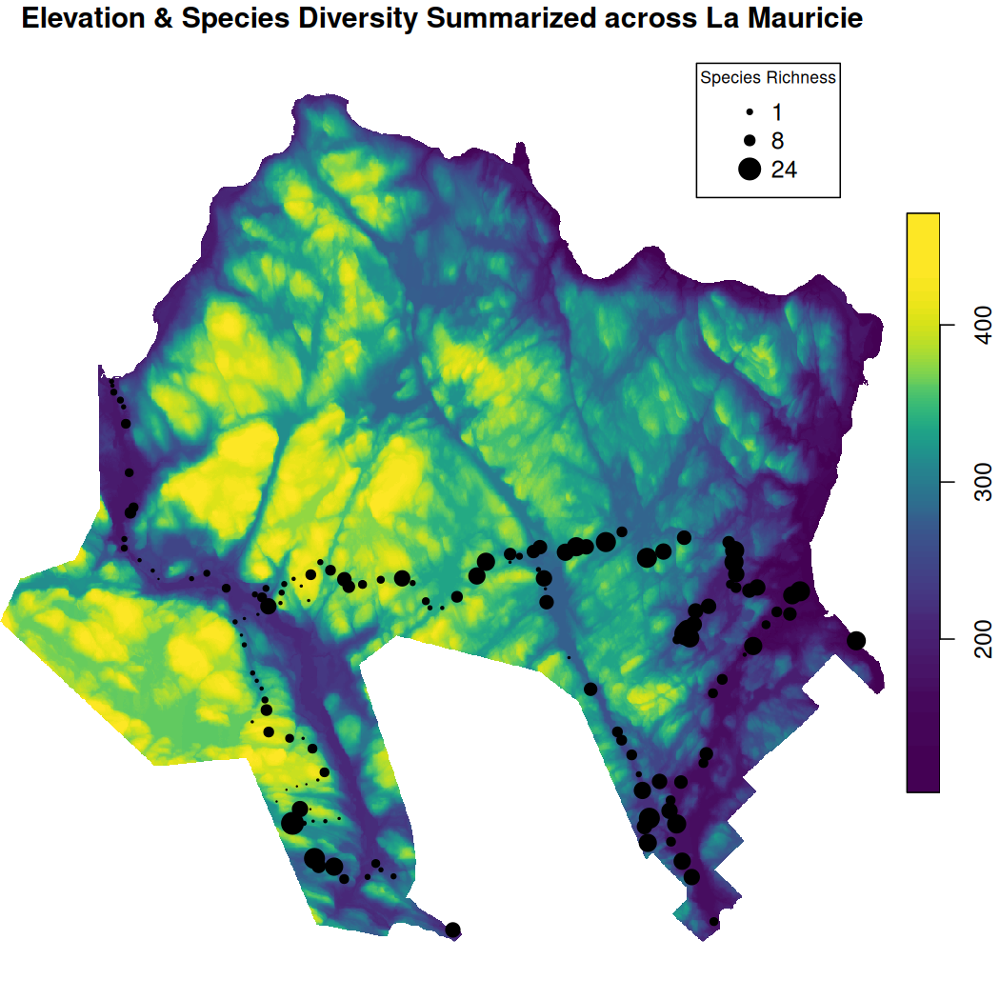
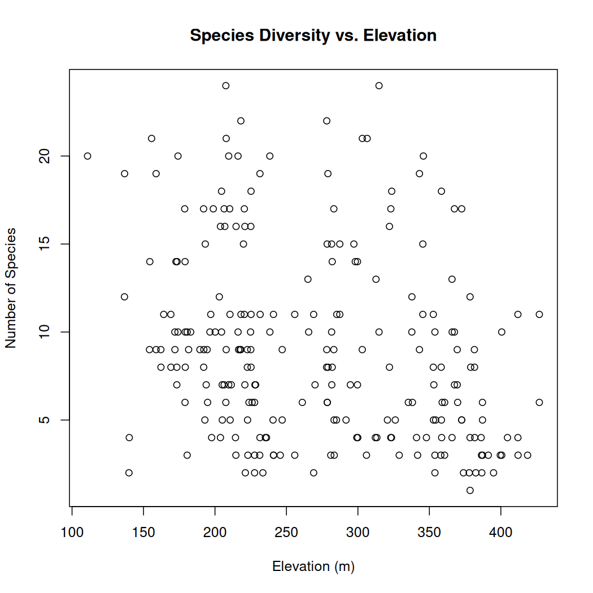

# Chapter 4: Digital Elevation Data

##### Authors: Dimitrios Markou, Danielle Ethier

> In [Chapter 3](03-ClimateData.Rmd), you processed vector and raster climate data, combined them with NatureCounts observations, and visualized them using plots and spatiotemporal maps. In this tutorial, you will process **LiDAR**-derived Digital Terrain Models, apply cropping and masking procedures, and extract elevation values to combine with NatureCounts data. Your focus will be on the NatureCounts and spatial data within [La Mauricie National Park](https://parks.canada.ca/pn-np/qc/mauricie/nature).

La Mauricie National Park is situated in the Laurentian mountains and covers 536 km2 within the Eastern Canadian Temperate-Boreal Forest transition ecoregion. The environment is characterized by mixed forests, lakes, rivers, and hills that range from from 150 m to over 500 m in elevation. The park provides suitable habitat for a variety of wildlife including at least 215 bird species.

Light Detection and Ranging (**LiDAR**) is an active remote sensing technology. It is performed using laser scanners that emit pulses of light and determine the position of target 3D objects by measuring the amount of time between pulses being emitted and received. It is a revolutionary technology that helps in the acquisition of extremely accurate digital elevation data over wide spatial and temporal scales. For more info and examples of LiDAR data resources specific to your province, see [LiDAR Data Resources](#4.5LiDAR) at the end of this Chapter.

# 4.0 Learning Objectives {#4.0LearningObjectives}

By the end of **Chapter 4 - Elevation Data**, users will know how to:

-   Distinguish between different types of digital elevation datasets: [Elevation Models](#4.2ElevationModels)
-   Process Digital Terrain Models (DTMs), including cropping and masking: [Spatial Extents - Crop and Mask](#4.3Crop-Mask)
-   Extract elevation data (raster values) at observation sites (vector points): [Map & Extract Digital Elevation Data](#4.4Map-Extract)
-   Know how to access LiDAR-derived data products: [LiDAR Data Resources](#4.5LiDAR) and [Manual Data Download](#4.6LiDAR)

Load the necessary packages:


``` r
library(naturecounts)
library(sf)
library(terra)
library(tidyverse)
```

This tutorial uses the following spatial data.

1.  [Places administered by Parks Canada](https://open.canada.ca/data/en/dataset/e1f0c975-f40c-4313-9be2-beb951e35f4e/resource/0744186a-449b-4f1f-9f1e-952a94c6d5ca) - Boundary shapefiles

2.  [Quebec Breeding Bird Atlas (2010 - 2014)](https://naturecounts.ca/nc/default/datasets.jsp?code=QCATLAS2PC&sec=bmdr) - NatureCounts bird observations

3.  [Forêt ouverte (lidar-derived products)](https://www.donneesquebec.ca/recherche/fr/dataset/produits-derives-de-base-du-lidar) - Digital Terrain Models (DTMs)

# 4.1 Data Setup {#4.1DataSetup}

To read the National Park polygons into R, navigate to [Places administered by Parks Canada](https://open.canada.ca/data/en/dataset/e1f0c975-f40c-4313-9be2-beb951e35f4e/resource/0744186a-449b-4f1f-9f1e-952a94c6d5ca), click "Go to Resource" to download. If you haven't already, return to the [Chapter 2](02-SpatialSubsets) Learning Objectives to view (`getwd()`) and set (`setwd()`) your working directory and create a folder within this directory called `data`. This is where you will store all data used in this tutorial series.

Create a subdirectory called `nationalparks` to neatly store the parks spatial data.


``` r
dir.create("data/nationalparks", recursive = TRUE)
```

Move the files from your Downloads to the `nationalparks` subdirectory before applying the `st_read()` function.


``` r
# specify the path to your shapefile
national_parks <- st_read("path/to/your/shapefile.shp")
```

Filter the **national_parks** dataset for La Mauricie National Park.


``` r
View(national_parks) # to find the correct object ID

mauricie_boundary <- national_parks %>%
  filter(OBJECTID == "21")

# Drop the Z-dimension (3D component) to make it 2D
mauricie_boundary <- st_zm(mauricie_boundary, drop = TRUE, what = "ZM")
```

OPTIONAL: To save the boundary as a shapefile to your working directory, use the `st_write()` function. **The boundary files are used again in subsequent chapters**. We have uploaded them to the [**Google Drive data folder**](https://drive.google.com/drive/folders/1gLUC6fROl4kNBvTGselhZif-arPexZbY?usp=sharing) for your convenience.

Create a subdirectory called `boundary` to neatly store the boundary files.


``` r
dir.create("data/boundary", recursive = TRUE)
```

> To execute this code chunk, remove the \#


``` r
# st_write(mauricie_boundary, "data/boundary/mauricie_boundary.shp") 

# st_write(mauricie_boundary, "data/boundary/mauricie_boundary.kml", driver="KML")
```

To assess the species distribution within the National Park, download data from the [Quebec Breeding Bird Atlas (2010 - 2014)](https://naturecounts.ca/nc/default/datasets.jsp?code=QCATLAS2PC&sec=bmdr) which is a 5 year census that collects data on the distribution and abundance of all species breeding in the province.

Don't forget to replace `testuser` with your NatureCounts username. You will be prompted for your password.

Download NatureCounts data:


``` r
quebec_atlas <- nc_data_dl(collections = "QCATLAS2PC", username = "testuser", info = "spatial_data_tutorial", timeout = 1000)
```

Read in the list of species names from NatureCounts which can be linked to the species id:


``` r
species_names <- search_species()
```

To create date and doy columns and ensure that the ObservationCount column is in the correct numeric format we can apply the `format_dates()` and `mutate()` functions. We will also filter the dataset to exclude rows with missing coordinates.


``` r
quebec_atlas <- quebec_atlas %>%
  format_dates() %>%  # create the date and doy columns 
  mutate(ObservationCount = as.numeric(ObservationCount)) %>%  # convert to numeric format
  filter(!is.na(longitude) & !is.na(latitude))  # remove rows with missing coordinates
```

To convert the NatureCounts data to a spatial object and transform its coordinate reference system (CRS) to match the National Park boundary we can use the `st_as_sf()` and `st_transform()` functions, respectively.


``` r
quebec_atlas_sf <- sf::st_as_sf(quebec_atlas,
                        coords = c("longitude", "latitude"), crs = 4326) # converts the quebec_atlas data to an sf object, crs = 4326 is WGS84 which corresponds to the NatureCounts data

mauricie_boundary <- st_transform(mauricie_boundary, crs = st_crs(quebec_atlas_sf)) # match the CRS between the polygon and point data
```

Clip the NatureCounts point data to the National Park boundary using `st_intersection()`.


``` r
mauricie_birds_sf <- sf::st_intersection(quebec_atlas_sf, mauricie_boundary)
```

Append the species names to the clipped NatureCounts dataset based on `species_id` code.


``` r
mauricie_birds_sf <- mauricie_birds_sf %>%
  left_join(species_names, by = "species_id")
```

Tidyverse functions can help us summarize our data in a variety of ways. For example, we can determine the annual total count of birds for each year across all sites. To do this we use the `group_by()` function to group the observations by year, and `summarise()` to calculate and create the **annual_count** column.


``` r
mauricie_birds_summary <- mauricie_birds_sf %>%
  group_by(survey_year) %>%
  summarise(annual_count = sum(ObservationCount, na.rm = TRUE)) %>% # calculates the annual_count
  filter(!is.na(survey_year))  # remove rows with missing year

mauricie_birds_summary
#> Simple feature collection with 4 features and 2 fields
#> Geometry type: MULTIPOINT
#> Dimension:     XY
#> Bounding box:  xmin: -73.12685 ymin: 46.65015 xmax: -72.77968 ymax: 46.82687
#> Geodetic CRS:  WGS 84
#> # A tibble: 4 × 3
#>   survey_year annual_count                                                                                  geometry
#> *       <int>        <dbl>                                                                          <MULTIPOINT [°]>
#> 1        2011          909 ((-72.83548 46.76367), (-72.83824 46.76044), (-72.84852 46.75341), (-72.85742 46.74331...
#> 2        2012          578 ((-72.77968 46.74193), (-72.80576 46.75797), (-72.80941 46.75672), (-72.83613 46.77124...
#> 3        2013          517 ((-72.80942 46.75671), (-72.83614 46.77124), (-72.84853 46.75341), (-72.82786 46.74054...
#> 4        2014         1396 ((-72.77968 46.74193), (-72.80576 46.75797), (-72.80941 46.75672), (-72.83613 46.77124...
```

If you wanted to summarize total count for each species at each Atlas Block you could adjust the pipe using `pivot_wider()`.


``` r
mauricie_species_summary <- mauricie_birds_sf %>%
  st_drop_geometry() %>%  # drop the geometry column
  group_by(english_name, Locality) %>%
  summarise(total_count = sum(ObservationCount, na.rm = TRUE)) %>% # calculates the total_count column
  pivot_wider(names_from = english_name, # populates the column names with each species common name
              values_from = total_count, # populates each cell with total_count
              values_fill = list(total_count = 0)) # missing values are zero-filled
#> `summarise()` has grouped output by 'english_name'. You can override using the `.groups` argument.
 
View(mauricie_species_summary)
```

Drop the geometry column and convert the filtered NatureCounts data back to a regular dataframe. Select key attributes to reduce the dataframe.


``` r
mauricie_birds_df <- mauricie_birds_sf %>%
  st_drop_geometry() %>%  # Drops the geometry column
  bind_cols(
    st_coordinates(mauricie_birds_sf) %>%  # Extract coordinates
      as.data.frame()  # Convert the coordinates to a data.frame
  ) %>%
  rename(longitude = X, latitude = Y)

mauricie_birds_df <- mauricie_birds_df %>% dplyr::select(record_id, species_id, english_name, SiteCode, survey_year, survey_month, survey_day, ObservationCount, longitude, latitude) # reduce the dataframe to the columns needed for your analysis
```

OPTIONAL: To save the NatureCounts data as a *.csv* to your disk, use the `write.csv()` function, specify the name of your .csv file, and use the row.names = FALSE argument to exclude row numbers from the output. **The filtered NatureCounts dataset will be used again in subsequent chapters**. We have uploaded this file to the [**Google Drive data folder**](https://drive.google.com/drive/folders/1gLUC6fROl4kNBvTGselhZif-arPexZbY?usp=sharing) for your convenience.

> To execute this code chunk, remove the \#


``` r
# write.csv(mauricie_birds_df, "data/mauricie_birds_df.csv", row.names = FALSE)
```

# 4.2 Elevation Models {#4.2ElevationModels}

Digital elevation datasets store topographic information like elevation or slope and are often used in landscape ecology. These datasets, i.e., Digital Elevation Models (DEMs), Digital Surface Models (DSMs), and Digital Terrain Models (DTMs) are derived through a variety of remote sensing and spatial interpolation techniques and all help describe land features.

**Digital Elevation Model** - represents the bare-Earth surface and [excludes]{.underline} all terrain vector features (i.e., streams, breaklines, and ridges), and all ground objects (power lines, buildings, trees, and vegetation).

**Digital Surface Model** - represents the heights of the Earth's surface and [includes]{.underline} all natural and artificial features or ground objects.

**Digital Terrain Model** - represents the bare-Earth surface topography and includes all terrain vector features. It does not include natural or artificial ground objects. In other words, it is a DEM that is augmented by the presence of streams, breaklines, and ridges.

For quick-access to the elevation data, download the .tif files from their URL using the hyperlinks below. If you wish to gain experience in how-to access LiDAR data yourself, follow the steps [at the end of this Chapter](#4.6LiDAR).

**Click the following hyperlinks to download the LiDAR-derived elevation data for tiles [31I14NE](https://diffusion.mffp.gouv.qc.ca/Diffusion/DonneeGratuite/Foret/IMAGERIE/Produits_derives_LiDAR/31I/31I14NE/MNT_31I14NE.tif), [31I15NO](https://diffusion.mffp.gouv.qc.ca/Diffusion/DonneeGratuite/Foret/IMAGERIE/Produits_derives_LiDAR/31I/31I15NO/MNT_31I15NO.tif), [31I14SE](https://diffusion.mffp.gouv.qc.ca/Diffusion/DonneeGratuite/Foret/IMAGERIE/Produits_derives_LiDAR/31I/31I14SE/MNT_31I14SE.tif), [31I15SO](https://diffusion.mffp.gouv.qc.ca/Diffusion/DonneeGratuite/Foret/IMAGERIE/Produits_derives_LiDAR/31I/31I15SO/MNT_31I15SO.tif), [31I11NE](https://diffusion.mffp.gouv.qc.ca/Diffusion/DonneeGratuite/Foret/IMAGERIE/Produits_derives_LiDAR/31I/31I11NE/MNT_31I11NE.tif), and [31I10NO](https://diffusion.mffp.gouv.qc.ca/Diffusion/DonneeGratuite/Foret/IMAGERIE/Produits_derives_LiDAR/31I/31I10NO/MNT_31I10NO.tif), respectively and then move them to their own folder named `dtm` stored in your `data` subdirectory.**

Create a subdirectory called `dtm` to neatly store your downloaded TIF files. Move them from your Downloads to the `dtm` folder.


``` r
dir.create("data/dtm", recursive = TRUE)
```

Set the path to your TIF file subdirectory.


Create a mosaic of the adjacent DTM rasters.

**Reminder: You should store the DTM's in their own folder after download. The code below will produce an error if there are other .tif files in your subdirectory (like the ones you downloaded in Chapter 3).**


``` r
# list all the TIFF files in your directory
dtm_files <- list.files(output_dir, pattern = "\\.tif$", full.names = TRUE) 

# Read into a list of SpatRaster objects
dtm_list <- lapply(dtm_files, rast)

# Combine into a single SpatRaster object
dtm_mosaic <- do.call(mosaic, dtm_list)
#> 
|---------|---------|---------|---------|
=========================================
                                          

# Print information about the stack
print(dtm_mosaic)
#> class       : SpatRaster 
#> dimensions  : 41933, 38429, 1  (nrow, ncol, nlyr)
#> resolution  : 1, 1  (x, y)
#> extent      : 323809, 362238, 5165069, 5207002  (xmin, xmax, ymin, ymax)
#> coord. ref. : NAD83(CSRS) / MTM zone 8 (EPSG:2950) 
#> source      : spat_7de810865d68_32232.tif 
#> varname     : MNT_31I10NO 
#> name        :  Band_1 
#> min value   : 102.277 
#> max value   : 542.817
```

Let's check if the DTM and National Park boundary have the same crs by using the `st_crs()` function and equality operator (**==**) which will generate either TRUE or FALSE.


``` r
st_crs(dtm_mosaic) == st_crs(mauricie_boundary)
#> [1] FALSE
```

To reproject the spatial data with the same CRS, we can use the `st_transform()` function.


``` r
mauricie_boundary <- st_transform(mauricie_boundary, crs = st_crs(dtm_mosaic))
```

# 4.3 Spatial Extents: Crop & Mask {#4.3Crop-Mask}

**Cropping** reduces the extent of a raster to the extent of another raster or vector.

To crop a raster we can apply the `crop()` function from the `terra` package which uses the SpatVector format. Here, we crop the extent of the raster while converting the National Park Boundary to a SpatVector using `vect()`.


``` r
dtm_crop <- crop(dtm_mosaic, vect(mauricie_boundary))
#> 
|---------|---------|---------|---------|
=========================================
                                          
```

**Masking** assigns NA values to cells of a raster not covered by a vector extent.

To mask a raster to a vector extent we can apply the `mask()` function from the `terra` package which also uses the SpatVector format.


``` r
dtm_mask <- mask(dtm_mosaic, vect(mauricie_boundary))
#> 
|---------|---------|---------|---------|
=========================================
                                          
```

OPTIONAL: To write the masked raster to your disk, you can use the `writeRaster()` function from `terra`. **This raster will be used in** [Chapter 7: Summary Tools](07-SummaryTools.Rmd). We have uploaded this file to the [**Google Drive data folder**](https://drive.google.com/drive/folders/1gLUC6fROl4kNBvTGselhZif-arPexZbY?usp=sharing) for your convenience.

> To execute this code chunk, remove the \#


``` r
# output_dir <- "path/to/your/subdirectory/data/dtm_mask.tif" # include the masked raster name and '.tif' argument 

# writeRaster(dtm_mask, output_dir, overwrite = TRUE)
```

**Note: Make sure to include the '.tif' argument when specifying the `output_dir` and name of your masked raster file. This specifies the file type while using `writeRaster()` which will, otherwise, produce an error.**

# 4.4 Map and Extract Digital Elevation Data {#4.4Map-Extract}

Visualize the regional and masked DTM's with a two-panel plot.


``` r
# Set up a 1x2 plotting layout
par(mfrow = c(1, 2))

# Plot dtm_mosaic
plot(dtm_mosaic, main = "regional DTM")

# Overlay the National Park boundary on the first plot
plot(mauricie_boundary, add = TRUE, border = "red", col = NA, lwd = 2)
#> Warning in plot.sf(mauricie_boundary, add = TRUE, border = "red", col = NA, : ignoring all but the first attribute

# Plot dtm_mask
plot(dtm_mask, main = "masked DTM")

# Overlay the National Park boundary on the second plot
plot(mauricie_boundary, add = TRUE, border = "red", col = NA, lwd = 2)
#> Warning in plot.sf(mauricie_boundary, add = TRUE, border = "red", col = NA, : ignoring all but the first attribute
```


Summarize the NatureCounts data for mapping. Here we will determine the number of species observed at each site.


``` r
# Group by SiteCode and summarize mean annual count across all species
mauricie_site_summary <- mauricie_birds_sf %>%
  group_by(SiteCode, geometry) %>% 
  summarise(n_species = n_distinct(english_name)) # count the number of unique species
#> `summarise()` has grouped output by 'SiteCode'. You can override using the `.groups` argument.
```

Now we can map the NatureCounts summary output with the DTM data.


``` r
# Match the CRS
mauricie_site_summary <- st_transform(mauricie_site_summary, crs = st_crs(dtm_mask))

# Plot the dtm_mask raster
plot(dtm_mask, main = "Elevation with Species Diversity Summary Points across La Mauricie")

# Overlay the National Park boundary in red
plot(st_geometry(mauricie_boundary), col = NA, border = "red", add = TRUE, lwd = 2)

#scale the n_species column to range from 0-5 for plotting
mauricie_site_summary$n_species_scale <- scales::rescale(mauricie_site_summary$n_species, to = c(0, 2))

# Overlay mauricie_site_summary points
plot(st_geometry(mauricie_site_summary), 
     add = TRUE, 
     pch = 19,       # Solid circle
     col = "black",   # Point color
     cex = mauricie_site_summary$n_species_scale)      # Point size based on total

# Define legend values for the point size scale
legend_values <- c(min(mauricie_site_summary$n_species, na.rm = TRUE), 
                   median(mauricie_site_summary$n_species, na.rm = TRUE), 
                   max(mauricie_site_summary$n_species, na.rm = TRUE))
legend_sizes <- scales::rescale(legend_values, to = c(0.5, 2))

# Add legend for the point size scale beside elevation scale
legend("topright",                     # Position
       inset = c(-0.10, 0),            # Moves the legend outside the map extent
       legend = legend_values, 
       pch = 19, col = "black", 
       pt.cex = legend_sizes, 
       title = "Species Richness",
       title.cex = 0.7,                # Adjust legend title size
       bty = "y",                      # Place box around legend
       xpd = TRUE)                     # Allows placing legend outside the plot
```



Rename the elevation raster layer.


``` r
names(dtm_mask) <- "elevation"
```

Extract elevation values for each bird observation record and append it to `mauricie_birds`. First, make sure the CRS of both spatial data match and then use `terra::extract()`.


``` r
# Match the CRS
mauricie_birds_sf <- st_transform(mauricie_birds_sf, crs = st_crs(dtm_mask))

# Extract the elevation values for each site
elevation_values_sv <- terra::extract(dtm_mask, vect(mauricie_birds_sf), bind = TRUE)
```

Convert the SpatVector containing the elevation values to an `sf` object.


``` r
elevation_values_sf <- elevation_values_sv %>%
  st_as_sf() %>% # converts to sf object
  dplyr::select(SiteCode, elevation, geometry) # select relevant columns
  
```

Assign a point id identifier to each location based on its unique geometry and return the result as a dataframe.


``` r
elevation_values_df <- elevation_values_sf %>% 
  group_by(SiteCode, geometry) %>%
  mutate(point_id = cur_group_id()) %>% 
  select(point_id, elevation) %>% 
  distinct() %>%
  ungroup() %>%
  sf::st_drop_geometry() %>%  # drop the geometry column
  as.data.frame()  # convert to a regular dataframe
#> Error in h(simpleError(msg, call)): error in evaluating the argument 'x' in selecting a method for function 'as.data.frame': unused arguments (point_id, elevation)


# Note that usually the SiteCode is the unique identifier for each observation site. However, this was not the case for the Quebec Breeding Bird Atlas data. We therefore use the geometry to create a unique identifier for each point.
```

OPTIONAL: To save the elevation data as a *.csv* to your disk, use the `write.csv()` function, specify the name of your .csv file, and use the row.names = FALSE argument to exclude row numbers from the output. **The extracted elevation values will be required to complete [Chapter 7: Summary Tools](07-SummaryTools.Rmd)**. We have uploaded this file to the [**Google Drive data folder**](https://drive.google.com/drive/folders/1gLUC6fROl4kNBvTGselhZif-arPexZbY?usp=sharing) for your convenience.

Create a subdirectory called `env_covariates` to neatly store the output environmental data.


``` r
dir.create("data/env_covariates", recursive = TRUE)
```

> To execute this code chunk, remove the \#


``` r
# write.csv(elevation_values_df, "data/env_covariates/elevation_values_df.csv", row.names = FALSE)
```

Now, let's combine the elevation dataframe with the NatureCounts summary data you previously created in order to assess how elevation influences your metric of species diversity.


``` r
mauricie_site_summary <- st_transform(mauricie_site_summary, crs = st_crs(dtm_mask))

# Extract the elevation values for each site
elevation_sitesum_sf <- terra::extract(dtm_mask, vect(mauricie_site_summary), bind = TRUE)

# Plot the relationship between elevation and species diversity 
plot(elevation_sitesum_sf$elevation, elevation_sitesum_sf$n_species, 
     xlab = "Elevation (m)", ylab = "Number of Species", 
     main = "Species Diversity vs. Elevation")
```



There does not appear to be a clear relationship between species diversity and elevation in La Mauricie National Park.

------------------------------------------------------------------------

**Congratulations!** You completed **Chapter 4 - Digital Elevation Data**. In this chapter, you successfully 1) processed raster DTM's 2) performed cropping and masking procedures and 3) extracted elevation data over vector data points. In [Chapter 5](05-LandcoverData.Rmd), you will explore how to extract unique pixel values from landcover data and link it to NatureCounts data. 

Below are some additional resources you may find useful to further your understanding of LiDAR data.

# 4.5 LiDAR Data Resources {#4.5LiDAR}

[LiDAR](https://natural-resources.canada.ca/sites/nrcan/files/mapstoolspublications/lidar-Nov-2023-EN.pdf) systems help produce extremely accurate measurements of surface elevation to digital terrain and elevation models across landscapes. These systems use instruments (sensors) that are commonly flown on aircraft and incorporate laser ranging for distance, GPS for geographic position and height, and aircraft altitude for the orientation of the instrument. The accuracy of LiDAR measurements depends on the strength of point returns, instrument precision & accuracy, and terrain characteristics, among other factors.


Conceptual figure depicts an airborne LiDAR system (‘LiDAR-i lend’, [Marek9134 (2012)](https://commons.wikimedia.org/wiki/File:LiDAR-i_lend.gif) CC-BY-SA-3.0).

As of June 2022, Natural Resources Canada has produced their largest release of LiDAR-derived data made publicly available on [Open Maps](https://search.open.canada.ca/openmap/957782bf-847c-4644-a757-e383c0057995). This data is complementary to previous CanElevation Series products: the [HRDEM](https://open.canada.ca/data/en/dataset/957782bf-847c-4644-a757-e383c0057995) and [HRDEM Mosaic](https://open.canada.ca/data/en/dataset/0fe65119-e96e-4a57-8bfe-9d9245fba06b). The HRDEM download procedure can be found [here](https://ftp.maps.canada.ca/pub/elevation/dem_mne/highresolution_hauteresolution/HRDEM_Download_Instructions.pdf). Some notable open LiDAR data resources on the provincial-level include [LidarBC](https://lidar.gov.bc.ca/) - British Columbia and [Forêt ouverte](https://www.donneesquebec.ca/recherche/dataset/produits-derives-de-base-du-lidar) - Québec.

The USGS provides LiDAR and its derived products through the [LidarExplorer](https://www.usgs.gov/tools/lidarexplorer) online application. [The National Map](https://www.usgs.gov/programs/national-geospatial-program/national-map) also represents the primary repository for geospatial data in the U.S.

# 4.6 Manual Data Download {#4.6LiDAR}

If you wish to access LiDAR data for La Mauricie National Park yourself to gain experience with the process, follow the steps below. The data are available on the [Forêt ouverte](https://www.donneesquebec.ca/recherche/dataset/produits-derives-de-base-du-lidar) platform.

**Step 1**: Navigate to the Lidar data site. Under **Données et ressources** \> **Carte interactive** \> **Forêt ouverte** select (**Explorer \> Accéder**) next to the **Téléchargement** option to explore the Lidar tiles on an interactive map .


**Step 2**: Using the search bar, search for **Parc national de la Mauricie**. Under Layers, toggle on **Parc nationaux du Canada** to visualize the park boundary.


Alternatively, you can import your own **.shp** or **.kml** file using the **Import and Export** tab.


Specify the coordinate reference system (WGS84), click **Import**, and select your **.shp** or **.kml** file to display on the map.


**Step 3**: Download the Modèle num. terrain (MNT) (Résolution spatiale 1 m) for each of the six Lidar tiles that intersect with the park (14NE, 15NO, 14SE, 15SO, 11NE, 10NO).

First, navigate to the **Map** tab and toggle on the visibility for the boundary and Lidar MNT layers by clicking on the eye symbol, if necessary. Hovering over this icon will display either the **Show Layer** or **Hide layer** option.


Your interactive map should now look something like this:


One by one, click and download the terrain data for each of the 6 Lidar tiles that intersect with the park boundary. Click your target tile, expand the **Téléchargement** window and click **Accéder** next to the MNT (1 m spatial resolution) data to download. Repeat for each tile.


This will open a webpage directory displaying a list of spatial data files available for the selected tile. Choose the MNT (.tif) file that includes the tile code in its name. For instance, for the first tile covering northern tip of the national park), select "MNT_31I14NE.tif." Repeat this process for each respective tile.


Save these files in your working directory for easy access during this tutorial.


``` r
getwd()
```
