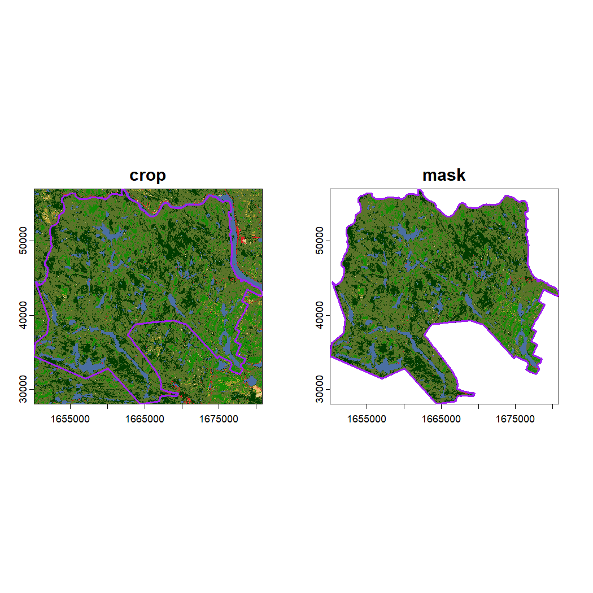
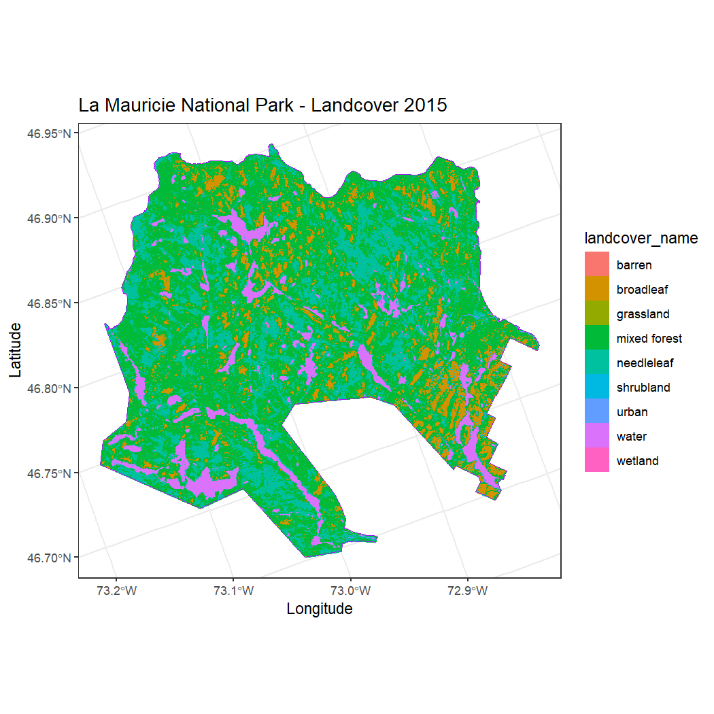
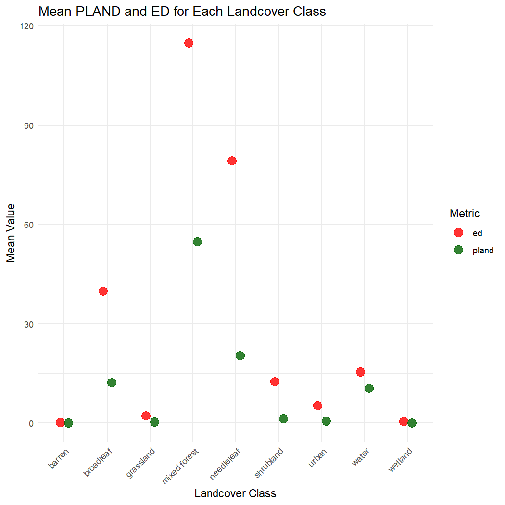
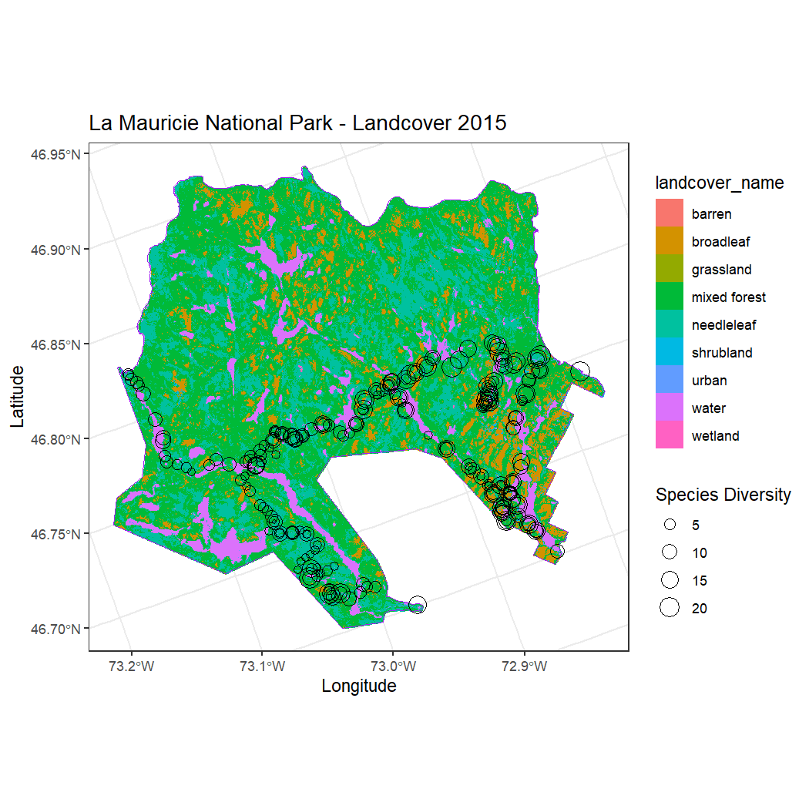
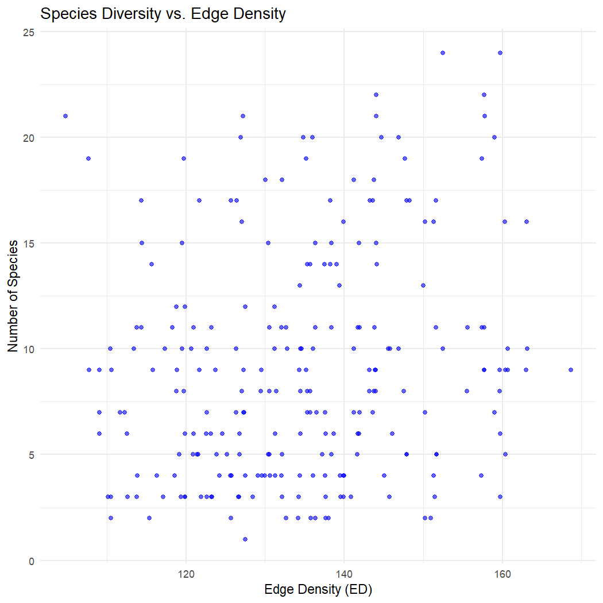
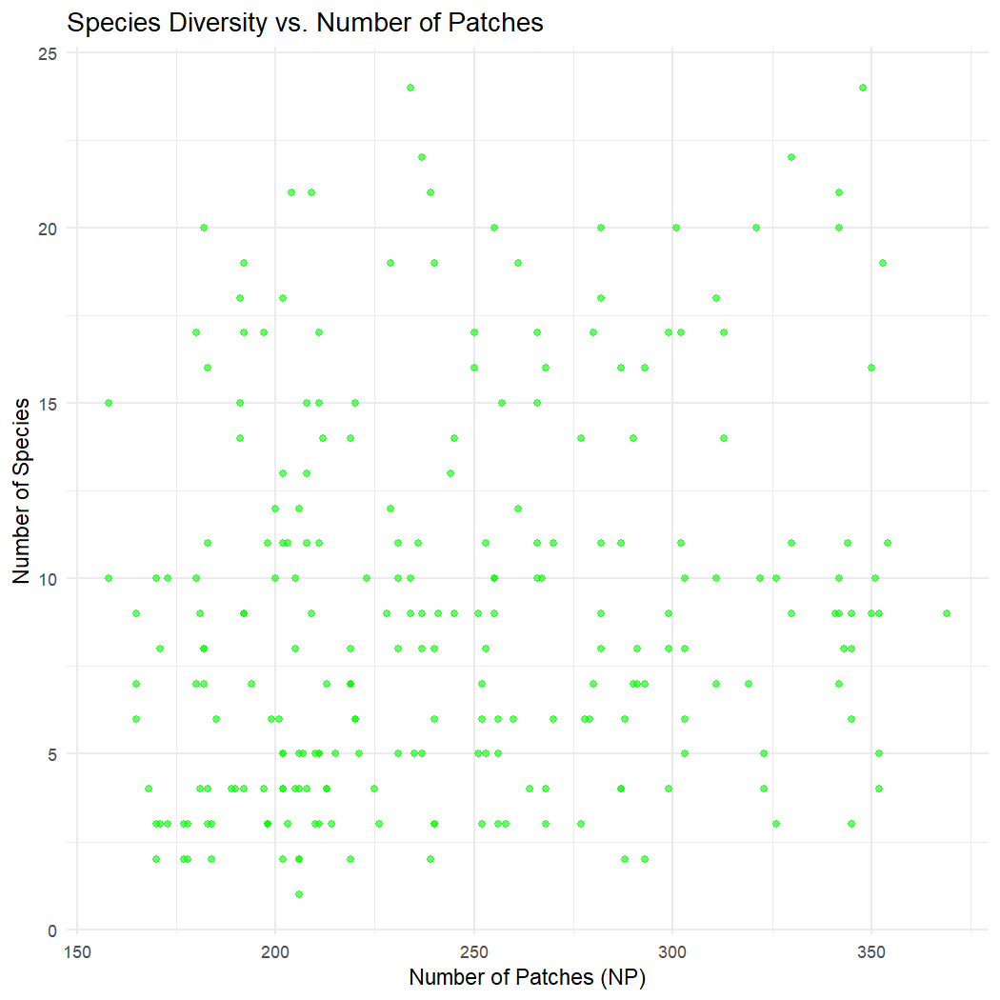

# Chapter 5: Land Cover Data

##### Authors: Dimitrios Markou, Danielle Ethier

> In [Chapter 4](04-ElevationData.Rmd), you processed Digital Terrain Models, applied crop and mask procedures, and extracted elevation values to combine with NatureCounts data. This chapter will build on these skills by extracting land cover data over [La Mauricie National Park](https://parks.canada.ca/pn-np/qc/mauricie/nature) and combine these values to NatureCounts data from the [Quebec Breeding Bird Atlas (2010 - 2014)](https://naturecounts.ca/nc/default/datasets.jsp?code=QCATLAS2PC&sec=bmdr).

**Land cover** describes the surface cover on the ground like vegetation, urban, water, and bare soil while **land use** describes the purpose that the land serves like recreation, wildlife habitat, and agriculture. See [Land Cover & Land Use](https://natural-resources.canada.ca/maps-tools-and-publications/satellite-imagery-elevation-data-and-air-photos/tutorial-fundamentals-remote-sensing/educational-resources-applications/land-cover-land-use/land-cover-land-use/9373) from Natural Resources Canada for more information.

**To proceed with this chapter, complete section 4.1 Data Setup from [Chapter 4: Elevation Data](04-ElevationData.Rmd)**. **This Chapter will guide you through how to download the National Park boundary and NatureCounts data which are used in this lesson. Alternatively, you can access these files on [Google Drive data folder](https://drive.google.com/drive/folders/1gLUC6fROl4kNBvTGselhZif-arPexZbY?usp=sharing).**

# 5.0 Learning Objectives {#5.0LearningObjectives}

By the end of **Chapter 5 - Land Cover Data**, users will know how to:

-   Cropping and masking land cover data: [Spatial Extents: Crop and Mask](#5.1Crop-Mask)
-   Assign land cover class labels and create a custom plot: [Class Labels](#5.2ClassLabels)
-   Create buffers around observation sites (points): [Point Buffers](#5.3PointBuffers)
-   Calculate landscape metrics, including Percent Land Cover (PLAND), Number of Patches (NP), and Edge Density (ED): [Landscape Metrics](#5.4LandscapeMetrics)
-   Combine NatureCounts data with land cover data for analysis: [Spatial Join](#5.5Map-Extract)

Load the required packages:


``` r
library(naturecounts)
library(sf)
library(terra)
library(tidyverse)
library(lubridate)
library(readr)
library(leaflet)
library(leaflet.extras)
library(landscapemetrics)
library(units)
```

This tutorial uses the following spatial data:

1.  [Places administered by Parks Canada](https://open.canada.ca/data/en/dataset/e1f0c975-f40c-4313-9be2-beb951e35f4e/resource/0744186a-449b-4f1f-9f1e-952a94c6d5ca) - Boundary shapefiles

2.  [Quebec Breeding Bird Atlas (2010 - 2014)](https://naturecounts.ca/nc/default/datasets.jsp?code=QCATLAS2PC&sec=bmdr) - NatureCounts bird observations

    These data are available for download via Section 4.1: Data Setup in [Chapter 4](04-ElevationData.Rmd), or on [Google Drive](https://drive.google.com/drive/folders/1gLUC6fROl4kNBvTGselhZif-arPexZbY?usp=sharing)

3.  [2015 Land Cover of Canada](https://open.canada.ca/data/en/dataset/4e615eae-b90c-420b-adee-2ca35896caf6) - Land Cover map (30 m resolution)

# 5.1 Data Setup {#5.1DataSetup}

Read in the National Park boundary you saved or downloaded from [Chapter 4: Elevation Data](04-ElevationData.Rmd).


``` r
mauricie_boundary <- st_read("path/to/your/mauricie_boundary.shp")
```

To read in the land cover dataset, navigate to [2015 Land Cover of Canada](https://open.canada.ca/data/en/dataset/4e615eae-b90c-420b-adee-2ca35896caf6), scroll down to **Data and Resources** and select the TIFF file to download by clicking "Go to resource". Extract the data download and save the file to your `data` subdirectory before applying `terra::rast()`.


``` r
# set the path to your landcover data
landcover <- rast("path/to/your/landcover-2015-classification.tif")
```

``` r
print(landcover)
#> class       : SpatRaster 
#> dimensions  : 160001, 190001, 1  (nrow, ncol, nlyr)
#> resolution  : 30, 30  (x, y)
#> extent      : -2600010, 3100020, -885090, 3914940  (xmin, xmax, ymin, ymax)
#> coord. ref. : NAD83(CSRS) / Canada Atlas Lambert (EPSG:3979) 
#> source      : landcover-2015-classification.tif 
#> color table : 1 
#> name        : Canada2015
```

Transform the coordinate reference system (crs) of the National Park boundary to match that of the land cover dataset.


``` r
mauricie_boundary <- st_transform(mauricie_boundary, crs = st_crs(landcover))
```

# 5.2 Spatial Extents: Crop & Mask

**Cropping** reduces the extent of a raster to the extent of another raster or vector.

To crop a raster we can apply the `crop()` function from the `terra` package which uses the SpatVector format. Here, we crop the extent of the land cover raster to the extent of the National Park. To do this we need to convert the National Park Boundary to a SpatVector using `vect()`.


``` r
landcover_crop <- crop(landcover, vect(mauricie_boundary))
print(landcover_crop)
#> class       : SpatRaster 
#> dimensions  : 967, 1027, 1  (nrow, ncol, nlyr)
#> resolution  : 30, 30  (x, y)
#> extent      : 1650060, 1680870, 28020, 57030  (xmin, xmax, ymin, ymax)
#> coord. ref. : NAD83(CSRS) / Canada Atlas Lambert (EPSG:3979) 
#> source(s)   : memory
#> color table : 1 
#> varname     : landcover-2015-classification 
#> name        : Canada2015 
#> min value   :          1 
#> max value   :         18
```

**Masking** assigns NA values to cells of a raster not covered by a vector.

To mask the landcover raster to the National Parks vector extent we can apply the `mask()` function from the `terra` package which also uses the SpatVector format. This will apply NA values to all cells outside the extent of the National Park.


``` r
landcover_mask <- mask(landcover_crop, vect(mauricie_boundary))
print(landcover_mask)
#> class       : SpatRaster 
#> dimensions  : 967, 1027, 1  (nrow, ncol, nlyr)
#> resolution  : 30, 30  (x, y)
#> extent      : 1650060, 1680870, 28020, 57030  (xmin, xmax, ymin, ymax)
#> coord. ref. : NAD83(CSRS) / Canada Atlas Lambert (EPSG:3979) 
#> source(s)   : memory
#> color table : 1 
#> varname     : landcover-2015-classification 
#> name        : Canada2015 
#> min value   :          1 
#> max value   :         18
```

Visualize the cropped and masked land cover rasters with a two-panel plot.


``` r
# Set up the plot area for 1 row and 2 columns
par(mfrow = c(1, 2))

# Plot the cropped land cover raster
plot(landcover_crop, main = "crop")

# Add National Park boundary
plot(st_geometry(mauricie_boundary), col = NA, border ="purple", lwd = 2, add = TRUE)

# Plot the masked land cover raster 
plot(landcover_mask, main = "mask")

# Add National Park boundary
plot(st_geometry(mauricie_boundary), col = NA, border ="purple", lwd = 2, add = TRUE)
```



``` r

# Reset plotting layout to default
par(mfrow = c(1, 1))
```

OPTIONAL: To write the masked raster to your disk, you can use the writeRaster() function from terra. **This raster will be used in [Chapter 7: Summary Tools](07-SummaryTools.Rmd)**. We have uploaded this file to the [**Google Drive data folder**](https://drive.google.com/drive/folders/1gLUC6fROl4kNBvTGselhZif-arPexZbY?usp=sharing) for your convenience in the subfolder labeled **mauricie**.

To execute this code chunk, remove the \# and make sure to specify the file format (.tif) in the output path


``` r
# output_dir <- "path/to/your/subdirectory/data/landcover_mask.tif" # include the masked raster name and '.tif' argument 

# writeRaster(landcover_mask, output_dir, overwrite = TRUE)
```

Note: Make sure to include the '.tif' argument when specifying the output_dir and name of your masked raster file. This specifies the file type while using writeRaster() which will, otherwise, produce an error.

# 5.2 Class Labels {#5.2ClassLabels}

To assign the appropriate labels to each land cover class, refer to the [Class Index](<https://open.canada.ca/data/en/dataset/ee1580ab-a23d-4f86-a09b-79763677eb47/resource/b8411562-49b7-4cf6-ac61-dbb893b182cc>[)](https://open.canada.ca/data/en/dataset/ee1580ab-a23d-4f86-a09b-79763677eb47/resource/b8411562-49b7-4cf6-ac61-dbb893b182cc)) and use the `case_when()` function.


``` r
landcover_mask_df <- as.data.frame(landcover_mask, xy = TRUE, cells = TRUE)

list(unique(landcover_mask_df$Canada2015)) # determine unique land cover class values in the cropped dataset
#> [[1]]
#> [1]  5  8  6  1 18 17 10 14 16

land_cover_data <- landcover_mask_df %>%
  arrange(Canada2015) %>%  # Sort by land_cover_value
  mutate(landcover_name = case_when(
    Canada2015 == 1 ~ "needleleaf",
    Canada2015 == 5 ~ "broadleaf",
    Canada2015 == 6 ~ "mixed forest",
    Canada2015 == 8 ~ "shrubland",
    Canada2015 == 10 ~ "grassland",
    Canada2015 == 14 ~ "wetland",
    Canada2015 == 16 ~ "barren",
    Canada2015 == 17 ~ "urban",
    Canada2015 == 18 ~ "water",
    TRUE ~ NA_character_  # Handle any unexpected values
  ))
```

Now we can plot the cropped land cover raster with meaningful names using `ggplot()`.


``` r
ggplot() +
  geom_raster(data = land_cover_data, aes(x = x, y = y, fill = landcover_name)) +
  labs(
    title = "La Mauricie National Park - Landcover 2015",
    x = "Longitude",
    y = "Latitude"
  ) +
  theme_bw() +
  coord_fixed() +
  geom_sf(data = mauricie_boundary, fill = NA, color = "purple", size = 1.5)
#> Coordinate system already present. Adding new coordinate system, which will replace the existing one.
```



# 5.3 Point Buffers {#5.3PointBuffers}

Buffers allow us to generate polygons at a specified distance around points, lines or other polygons. Because birds use their habitat at the landscape-level and not at a single observation point, buffers allow us to summarize land cover and habitat information within the local neighborhood.

Read in the NatureCounts data you saved from [Chapter 4: Elevation Data](04-ElevationData.Rmd) or downloaded from the [**Google Drive data folder**](https://drive.google.com/drive/folders/1gLUC6fROl4kNBvTGselhZif-arPexZbY?usp=sharing).


``` r
mauricie_birds_df <- read.csv("path/to/your/mauricie_birds_df.csv")
```

**Note: The land cover data (2015) represents a static environmental variable in this scenario. Here, we assume that land cover within the National Park did not change drastically across the survey years (2011 - 2014).**

Create an `sf` object from the NatureCounts data that represents the unique point count locations.


``` r
mauricie_birds_local <- mauricie_birds_df %>% 
  st_as_sf(coords = c("longitude", "latitude"), crs = 4326) 
```

Assign a point id identifier to each location based on its unique geometry.


``` r
mauricie_birds_local <- mauricie_birds_local %>% 
  group_by(SiteCode, geometry) %>%
  mutate(point_id = cur_group_id()) %>% 
  dplyr::select(geometry, point_id) %>% 
  distinct() %>% ungroup()

#Note that usually the SiteCode is the unique identifier for each observation site. However, this was not the case for the Quebec Breeding Bird Atlas data. We therefore use the geometry to create a unique identifier for each point.
```

Use the `st_buffer` function to generate 3 km diameter circular neighborhoods (or 1.5 km radius) centered at each observation location.


``` r
mauricie_birds_buffer <- mauricie_birds_local %>%
  st_buffer(dist = set_units(1.5, "km"))
```

# 5.4 Landscape Metrics {#5.4LandscapeMetrics}

In landscape ecology, the composition and configuration of land types tells us what habitat is available and how its distributed spatially. **Landscape metrics** help us characterize these spatial patterns across landscapes or within specific areas like point buffers.

The `landscapemetrics` package can be used to calculate some common metrics that quantify habitat composition and configuration:

-   Percent landcover (PLAND) - percent of landscape of a given class

-   Edge density (ED) - total boundary length of all patches of a given class per unit area

-   Number of patches (NP) - number of unique contiguous units

-   Largest patch index (LPI) - percent of the landscape comprised of the single largest patch

-   Mean core area index (CAI_MN) - percent of the patch that is comprised of core area which is a compound measure of shape, area, and edge depth.

-   Patch cohesion index (COHESION) - area-weighted mean perimeter-area ratio that helps assess connectivity

> A "patch" is an intuitive concept that describes a contiguous group of cells of the same land cover category. Patches can be defined using the 4-neighbour or 8-neighbour rules.

For each point buffer, crop and mask the land cover data and calculate the class-level PLAND and ED. We will do this using a `for` loop and store the result in a dataframe.


``` r
lsm <- list()

for (i in seq_len(nrow(mauricie_birds_buffer))) {
  buffer_i <- st_transform(mauricie_birds_buffer[i, ], crs = crs(landcover))  # Match the CRS between the buffer zones and land cover
  
  # Crop and mask the landcover data with the buffer areas
  lsm[[i]] <- crop(landcover, buffer_i) %>% 
    mask(buffer_i) %>%  
    # Calculate landscape metrics
    calculate_lsm(level = "class", metric = c("pland", "ed")) %>% 
    # Add identifying variables
    mutate(point_id= buffer_i$point_id) %>%  
    dplyr::select(point_id, level, class, metric, value)
}

# Combine results into a single dataframe
lsm <- bind_rows(lsm)
```

Add land cover class labels to the dataframe containing the calculated landscape metrics. Ensure that both columns are the same data type (factor).


``` r
# Define the land cover class labels 
lc_classes <- land_cover_data %>% dplyr::select(Canada2015, landcover_name) %>% distinct()

lc_classes <-lc_classes %>% mutate(class = as.factor(Canada2015))
lsm<-lsm %>% mutate(class = as.factor(class))

lsm <- inner_join(lc_classes, lsm, by = "class")
```

Create a PLAND column for each land cover type, associated with each `point_id`.


``` r
pland_values <- lsm %>%
  filter(metric == "pland") %>%                      # Filter for 'pland' metric
  dplyr::select(point_id, landcover_name, value) %>%        # Keep relevant columns
  pivot_wider(
    names_from = landcover_name,                     # Create columns for each landcover class
    values_from = value,                             # Fill columns with 'pland' values
    names_prefix = "pland_"                          # Prefix column names with "pland_"
  )
```

**Note: Not every land cover type is represented within each point buffer, hence why some rows might be populated with NA values.**

Calculate the mean class-level PLAND and ED across all point buffers.


``` r
lsm_mean <- lsm %>%
  group_by(landcover_name, metric) %>% 
  summarise(mean_value = mean(value, na.rm = TRUE), .groups = "drop") 

# View the resulting dataframe
print(lsm_mean)
#> # A tibble: 18 × 3
#>    landcover_name metric mean_value
#>    <chr>          <chr>       <dbl>
#>  1 barren         ed         0.167 
#>  2 barren         pland      0.0130
#>  3 broadleaf      ed        39.8   
#>  4 broadleaf      pland     12.2   
#>  5 grassland      ed         2.16  
#>  6 grassland      pland      0.248 
#>  7 mixed forest   ed       115.    
#>  8 mixed forest   pland     54.8   
#>  9 needleleaf     ed        79.2   
#> 10 needleleaf     pland     20.4   
#> 11 shrubland      ed        12.5   
#> 12 shrubland      pland      1.32  
#> 13 urban          ed         5.24  
#> 14 urban          pland      0.561 
#> 15 water          ed        15.5   
#> 16 water          pland     10.5   
#> 17 wetland        ed         0.400 
#> 18 wetland        pland      0.0362
```

Compare the mean class-level PLAND and ED values.


``` r
# Plot mean PLAND and ED for each landcover class
ggplot(lsm_mean, aes(x = landcover_name, y = mean_value, color = metric)) +
  geom_point(size = 4, alpha = 0.8, position = position_dodge(width = 0.4)) +
  labs(title = "Mean PLAND and ED for Each Landcover Class",
       x = "Landcover Class",
       y = "Mean Value",
       color = "Metric") +
  theme_minimal() +
  theme(axis.text.x = element_text(angle = 45, hjust = 1)) +
  scale_color_manual(values = c("ed" = "red", "pland" = "darkgreen"))
```



> It appears like 'mixed forest' is the dominant land cover type across all point buffers. This class also has the highest edge density.

Calculate the landscape-level ED and NP for each point buffer. Store the result in a dataframe.


``` r
lsm_landscape <- list()

for (i in seq_len(nrow(mauricie_birds_buffer))) {
  buffer_i <- st_transform(mauricie_birds_buffer[i, ], crs = crs(landcover))  # Match the CRS between the buffer zones and land cover
  
  # Crop and mask the landcover data with the buffer areas
  lsm_landscape[[i]] <- crop(landcover, buffer_i) %>% 
    mask(buffer_i) %>%  
    # Calculate landscape metrics
    calculate_lsm(level = "landscape", metric = c("np", "ed")) %>% 
    # Add identifying variables
    mutate(point_id= buffer_i$point_id, 
           survey_year = buffer_i$survey_year) %>%  
    dplyr::select(point_id, level, metric, value)
}

# Combine results into a single dataframe and convert to wide format
lsm_landscape <- lsm_landscape %>%
  bind_rows() %>%
  pivot_wider(names_from = "metric",
              values_from = "value")
```

**Note: Landscape pattern analysis requires careful consideration for the classification scheme, spatial extent, and choice of landscape metric - all of which should depend on the objectives of your study. How you group values also matters as it will influence how you interpret results.**

# 5.5 Spatial Join {#5.5Map-Extract}

Create a spatial dataframe from the NatureCounts data and join the unique point_id from the buffer geometry to the NatureCounts data by latitude and longitude using `st_join`.


``` r
mauricie_birds_sf <- sf::st_as_sf(mauricie_birds_df, 
                        coords = c("longitude", "latitude"), crs = 4326)    # convert to sf object

mauricie_birds_sf <- st_join(mauricie_birds_sf, mauricie_birds_local, join = st_intersects)
```

Transform the CRS of the National Park boundary to match the NatureCounts data.


``` r
mauricie_boundary <- st_transform(mauricie_boundary, crs = st_crs(mauricie_birds_sf)) # match the CRS
```

Summarize the NatureCounts data for mapping. Here we will determine the number of species observed at each site.


``` r
# Group by point_id and summarize total_count
mauricie_site_summary <- mauricie_birds_sf %>%
  group_by(point_id) %>% filter(!is.na(point_id)) %>% # Filter out NA values
  summarise(n_species = n_distinct(english_name))
```

Next we can map both the NatureCounts and land cover data.


``` r
# Match the CRS
mauricie_boundary <- st_transform(mauricie_boundary, crs = st_crs(landcover)) 

# Plot
ggplot() +
  # Add the raster layer
  geom_raster(data = land_cover_data, aes(x = x, y = y, fill = landcover_name)) +
  
  # Add the National Park boundary in red
  geom_sf(data = mauricie_boundary, fill = NA, color = "purple", size = 0.9) +
  
  # Add the multipoints from the site summary, sized by total_count
  geom_sf(data = mauricie_site_summary, aes(size = n_species), color = "black", shape = 21) +
  
  # Adjust the size scale for points
  scale_size_continuous(name = "Species Diversity", range = c(1, 6)) +  # Adjust the range for better visibility
  
  # Add labels and theme
  labs(
    title = "La Mauricie National Park - Landcover 2015",
    x = "Longitude",
    y = "Latitude"
  ) +
  theme_bw() +
  
  # Use coord_sf for compatibility with sf layers
  coord_sf()
```



Convert the NatureCounts data back to a regular dataframe called `landscape_metrics_df`, now labeled by point_id, and append the landscape-level metrics we calculated in the [previous section](#5.4LandscapeMetrics).


``` r
landscape_metrics_df <- mauricie_birds_sf %>%
  st_drop_geometry() %>%
  distinct(point_id, .keep_all = TRUE) %>%  # Ensure no duplicates based on point_id, but keep all columns
  left_join(lsm_landscape, by = "point_id") %>%
  dplyr::select(point_id, ed, np)  # Keep point_id, ed, and np columns
```

Append the class level PLAND metric values and keep the `point_id` column.


``` r
landscape_metrics_df <- landscape_metrics_df %>%
  left_join(pland_values, by = "point_id")
```

OPTIONAL: To save the landscape metrics data as a *.csv* to your disk, use the `write.csv()` function, specify the name of your .*csv* file, and use the row.names = FALSE argument to exclude row numbers from the output. **The extracted landcover values will be used to complete [Chapter 7: Summary Tools](07-SummaryTools.Rmd)**. We have uploaded this file to the [**Google Drive data folder**](https://drive.google.com/drive/folders/1gLUC6fROl4kNBvTGselhZif-arPexZbY?usp=sharing) for your convenience.

> To execute this code chunk, remove the \#


``` r
# write.csv(landscape_metrics_df , "data/env_covariates/landscape_metrics_df.csv", row.names = FALSE)
```

Now let's combine the landscape-level metrics you derived with the NatureCounts summary data to assess how the landscape composition and configuration might influence species diversity.


``` r
# Join the landscape metrics with the NatureCounts summary data
lsm_sitesum_df <- left_join(mauricie_site_summary, landscape_metrics_df, by = "point_id")

# Plot the relationship between species diversity and edge density and the number of patches, respectively

# n_species vs. edge density (ED)
ggplot(lsm_sitesum_df, aes(x = ed, y = n_species)) +
  geom_point(color = "blue", alpha = 0.6) +
  labs(title = "Species Diversity vs. Edge Density",
       x = "Edge Density (ED)",
       y = "Number of Species") +
  theme_minimal()
```



``` r

# n_species vs. number of patches (NP)
ggplot(lsm_sitesum_df, aes(x = np, y = n_species)) +
  geom_point(color = "green", alpha = 0.6) +
  labs(title = "Species Diversity vs. Number of Patches",
       x = "Number of Patches (NP)",
       y = "Number of Species") +
  theme_minimal()
```



There does not appear to be a clear relationship between species diversity, edge density, or the number of patches across observation sites in La Mauricie National Park.

------------------------------------------------------------------------

**Congratulations**! You completed **Chapter 5 - Land Cover Data**. In this chapter, you successfully plotted land cover (raster) data and combined NatureCounts data with landscape metrics derived from land cover data. In [Chapter 6](06-SatelliteImagery.Rmd), you will explore how to download satellite imagery and calculate spectral indices to combine with NatureCounts data.
