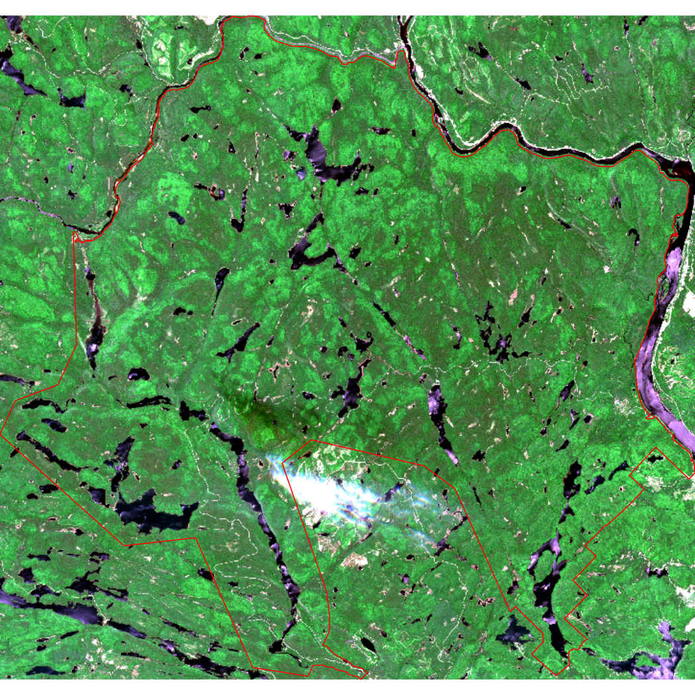
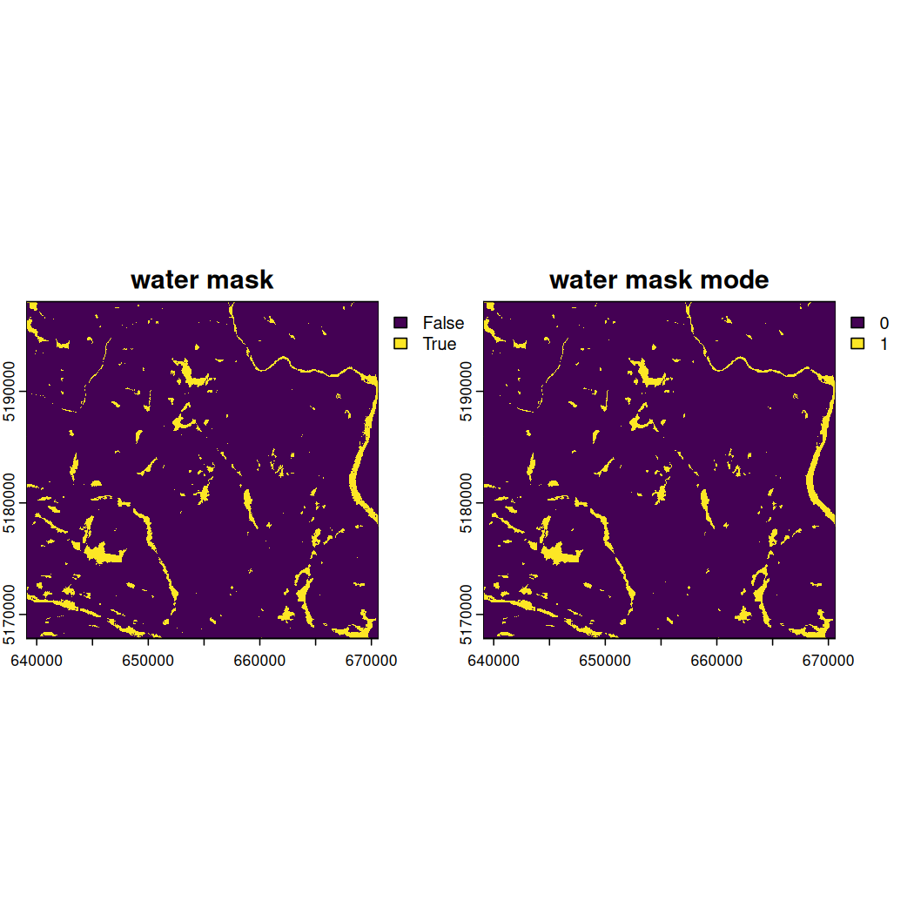

# Chapter 6: Satellite Imagery

##### Authors: Dimitrios Markou, Danielle Ethier

> In [Chapter 5](05-LandcoverData.Rmd), you processed land cover (raster) data, calculated landscape metrics derived from land cover, and combined them with NatureCounts data. In this tutorial, you will use satellite imagery from the Copernicus Sentinel-2 mission to calculate spectral index values (NDVI, NDWI) over [La Mauricie National Park](https://parks.canada.ca/pn-np/qc/mauricie/nature) and combine these values to NatureCounts data from the [Quebec Breeding Bird Atlas (2010 - 2014)](https://naturecounts.ca/nc/default/datasets.jsp?code=QCATLAS2PC&sec=bmdr).

The Copernicus Sentinel-2 mission comprises twin satellites flying in polar sun-synchronous orbit phased at 180° to each other. The satellites carry multispectral sensors with 13 spectral bands and have a revisit frequency of 5 days and orbital swath width of 290 km. Their high resolution products support a variety of services and applications including land management, agriculture, forestry, disaster control, humanitarian relief operations, risk mapping, and security concerns.

**For this tutorial, complete section 4.1 Data Setup from [Chapter 4: Elevation Data](04-ElevationData.Rmd). It helps you download the National Park boundary and NatureCounts data which are used in this chapter. Alternatively, you can access these files in the [Google Drive data folder](https://drive.google.com/drive/folders/1gLUC6fROl4kNBvTGselhZif-arPexZbY?usp=sharing).**

# 6.0 Learning Objectives {#6.0LearningObjectives}

By the end of **Chapter 6 - Satellite Imagery**, users will know how to:

-   Plot true and false color composites of satellite imagery: [Color Composite Images](#6.1ColorComposites)
-   Create digital water masks and calculate NDWI and NDVI indices: [Calculate Spectral Indices](#6.2SpectralIndices)
-   Combine NatureCounts data with spectral index values for analysis: [Map & Extract Spectral Indices](#6.3Map-Extract)
-   Explore and download satellite imagery data: [Copernicus Data Download](#6.4CopernicusDataDownload)

Load the necessary packages:


``` r
library(naturecounts)
library(sf)
library(terra)
library(tidyverse)
```

This tutorial uses the following spatial data.

1.  [Places administered by Parks Canada](https://open.canada.ca/data/en/dataset/e1f0c975-f40c-4313-9be2-beb951e35f4e/resource/0744186a-449b-4f1f-9f1e-952a94c6d5ca) - Boundary shapefiles

2.  [Quebec Breeding Bird Atlas (2010 - 2014)](https://naturecounts.ca/nc/default/datasets.jsp?code=QCATLAS2PC&sec=bmdr) - NatureCounts bird observations

3.  [Copernicus](https://www.copernicus.eu/en) Satellite Data - SENTINEL2 imagery

Quick access to the Copernicus satellite data is also available through [Google Drive](https://drive.google.com/drive/folders/1gLUC6fROl4kNBvTGselhZif-arPexZbY?usp=sharing). Download and extract the **copernicus_R10m** (.*zip)* file to your directory. If you wish to gain experience in how-to access Copernicus satellite imagery yourself, follow the steps [at the end of this Chapter](#6.1CopernicusDataDownload).

# 6.1 Color Composite Images {#6.1ColorComposites}

Multispectral sensors measure the amount of light energy reflected off surface features. How this reflection occurs depends on factors like the surface roughness of the object (relative to the wavelength of energy) or the incidence angle at which the energy strikes. Every surface material will have a distinct spectral signature which describes the percentage of radiation reflected from an object at different wavelengths.

For vegetation, spectral reflectance also depends on the structural components of leaves: pigments like chrolophyll *a* & *b*, and beta-carotene in the palisade mesophyll (outer leaf), near-infrared (NIR) scattering in the spongy mesophyll (inner leaf), and water content. Healthy vegetation (*more chlorophyll, high water content*) absorbs more visible light, reflects more NIR, and absorbs more middle-infrared (MIR). These type of interactions are the basis for calculating spectral indices, as explored in the [next section](#6.2SpectralIndices).

These interactions also mean that we can represent multispectral imagery through color composites to strategically emphasize surface properties using combinations of different bands (range of wavelengths):

> **Natural (True) Color Composites** - use visible red, green, and blue (RGB) bands in their respective color channels to depict what the human eye would naturally see.
>
> **False Color Composites** - use non-visible band like NIR, MIR, or SWIR for RGB color channels to depict wavelengths invisible to the naked eye. Different band combinations help highlight surface features.

Specify the path to your folder containing the satellite images in the code chunk below. Each image represents a distinct band. If you downloaded the data by following [Section 6.3](#6.3CopernicusDataDownload), look for the folder labeled S2A_MSIL2A. Copy the file path to S2A_MSIL2A... \> GRANULE \> L2A... \> IMG_DATA \> R10m which contains the satellite images we will use here.


``` r
getwd()
#> [1] "C:/Users/dimit/Birds Canada/naturecounts/vignettes/articles"

bands <- list.files(path = here::here("misc/data/R10m"), 
                    pattern = "\\.jp2$", full.names = TRUE)

# Read all the bands into a raster stack 
sentinel_imagery <- rast(bands)

# Assign meaningful names to the bands
names(sentinel_imagery) <- c("AOT", "blue", "green", "red", "nir", "TCI_r", "TCI_g", "TCI_b", "WVP")

# Check the assigned names
print(names(sentinel_imagery))
#> [1] "AOT"   "blue"  "green" "red"   "nir"   "TCI_r" "TCI_g" "TCI_b" "WVP"

# Check resolution, number of layers, and extent
res(sentinel_imagery)
#> [1] 10 10
nlyr(sentinel_imagery)
#> [1] 9
ext(sentinel_imagery)
#> SpatExtent : 6e+05, 709800, 5090220, 5200020 (xmin, xmax, ymin, ymax)
```

Read in the National Park boundary you saved or downloaded from [Chapter 4: Elevation Data](04-ElevationData.Rmd).


``` r
mauricie_boundary <- st_read(here::here("misc/data/boundary/mauricie_boundary.shp"))
#> Reading layer `mauricie_boundary' from data source `C:\Users\dimit\Birds Canada\naturecounts\misc\data\boundary\mauricie_boundary.shp' using driver `ESRI Shapefile'
#> Simple feature collection with 1 feature and 9 fields
#> Geometry type: POLYGON
#> Dimension:     XY
#> Bounding box:  xmin: -73.17948 ymin: 46.64563 xmax: -72.76572 ymax: 46.91888
#> Geodetic CRS:  WGS 84
```

Transform the coordinate reference system (CRS) of the National Park boundary to match that of the `sentinel_imagery` SpatRaster.


``` r
mauricie_boundary <- mauricie_boundary %>%
  sf::st_make_valid() %>% # fix performance issues with layer + faster computation
  st_transform(crs = st_crs(sentinel_imagery))
```

Crop `sentinel_imagery` to the extent of `mauricie_boundary` then plot the cropped image in true color.


``` r
mauricie_sl <- crop(sentinel_imagery, vect(mauricie_boundary))
#> 
|---------|---------|---------|---------|
=========================================
                                          

# Plot the RGB composite
terra::plotRGB(mauricie_sl, r = 4, g = 3, b = 2, stretch = "lin", lwd = 2, axes = FALSE)

# Add the boundary shapefile to the plot
plot(st_geometry(mauricie_boundary), col = NA, border ="red", add = TRUE)
```



Now plot the cropped image in false color. Here, we'll use the standard false color composite where red, green, and blue channels are used to visualize NIR, red, and green respectively.


``` r
# Plot the false color composite
terra::plotRGB(mauricie_sl, r = 5, g = 4, b = 3, stretch = "lin", lwd = 2, axes = FALSE)

# Add the boundary shapefile to the plot
plot(st_geometry(mauricie_boundary), col = NA, border ="green", add = TRUE)
```


# 6.2 Calculate Spectral Indices {#6.2SpectralIndices}

The Normalized Difference Vegetation Index (NDVI; [Huang et al., 2021](https://link.springer.com/article/10.1007/s11676-020-01155-1)) is a common proxy for primary productivity collected using remote sensing. It is a measure of vegetation health that describes the greenness and the density of vegetation captured in a satellite image. Healthy vegetation will absorb most visible light and reflect most near-infrared light, depending on its structural integrity and the amount of chlorophyll found in its biomass.

The Normalized Difference Water Index (NDWI; [McFeeters, 1996](https://www.tandfonline.com/doi/abs/10.1080/01431169608948714)) is a spectral index that can be used to detect water bodies from multispectral imagery. **NDWI** can be used to create a water mask which will help minimize the effect of water and avoid skewed vegetation index values by removing water values from an image. In other words, this will help make the calculation of NDVI more accurate. Applying a **mode** filter to a water mask creates more uniformity across the water by eliminating areas that might be confused for other land cover types.

Annual cumulative NDVI has a strong positive relationship with species richness and bird diversity over time, making it a useful covariate to describe trends in NatureCounts data. In this section, we will calculate two spectral indices: 1) NDWI to create a water mask and 2) NDVI as a measure of vegetation health.

Create a water mask using the following function:

$$NDWI = \frac{GREEN - NIR}{GREEN + NIR}$$


``` r
calc_ndwi <- function(green, nir) {
  ndwi <- c((green - nir)/(green + nir))
  return(ndwi)
}

# Calculate NDWI
mauricie_sl_ndwi <- calc_ndwi(mauricie_sl$green, mauricie_sl$nir)

# Create water mask
water_mask <- mauricie_sl_ndwi >= 0
```

Plot NDWI and the water mask.


``` r
# Set up the plot area for 1 row and 2 columns
par(mfrow = c(1, 2))

# Plot NDWI
plot(mauricie_sl_ndwi, main = "NDWI")

# Add National Park boundary
plot(st_geometry(mauricie_boundary), col = NA, border ="red", add = TRUE)

# Plot water mask 
plot(water_mask, main = "Water mask")

# Add National Park boundary
plot(st_geometry(mauricie_boundary), col = NA, border ="red", add = TRUE)
```


``` r

# Reset plotting layout to default
par(mfrow = c(1, 1))
```

Use the function `focal()` to apply a convolution filter returning the **mode** of each pixel of `water_mask` in a 3 x 3 windows of equal weights (argument `w = 3`). Name the output raster `water_mask_mode`. The *mode* of a vector `x` is the value that appears the most often in `x`.


``` r
get_mode <- function(x, na.rm = TRUE) {
  
  if (na.rm) {
    x <- x[!is.na(x)]
  }
  
  ux <- unique(x)
  
  ux[which.max(tabulate(match(x, ux)))]
  
}
```

Calculate `water_mask_mode`.


``` r
water_mask_mode <- focal(water_mask, w = 3, fun = get_mode)
```

Combine the `water_mask` and `water_mask_mode`.


``` r
water_mask_combined <- c(water_mask, water_mask_mode)
```

Assign meaningful names to each raster mask and plot them.


``` r
names(water_mask_combined) <- c("water mask", "water mask mode")

plot(water_mask_combined)
```



> Look very closely at the side-by-side depictions of the water mask and water mask mode above. Notice how some tiny yellow areas previously identified as water in the water mask extent are now absent from the water mask mode extent?

Apply the `water_mask_mode` to `mauricie_sl`.


``` r
mauricie_sl_water_mask <- mask(mauricie_sl, water_mask_mode, maskvalues = 1)
#> 
|---------|---------|---------|---------|
=========================================
                                          
```

Apply another mask to assign NA values to those pixels outside of the National Park boundary.


``` r
mauricie_sl_mask <- mask(mauricie_sl_water_mask, vect(mauricie_boundary))
#> 
|---------|---------|---------|---------|
=========================================
                                          
```

Plot a true color composite of `mauricie_sl_mask` and the National Park boundary.


``` r
# Plot RGB with both water and boundary masks applied
terra::plotRGB(mauricie_sl_mask, r = 4, g = 3, b = 2, stretch = "lin", axes = FALSE)

# Add the National Park boundary
plot(st_geometry(mauricie_boundary), col = NA, border ="red", add = TRUE)
```


To calculate NDVI, we will create and apply the following function on the masked satellite image:

$$NDVI = \frac{NIR - RED}{NIR + RED}$$


``` r
calc_ndvi <- function(nir, red) {
  ndvi <- c((nir - red)/(nir  + red))
  return(ndvi)
}

# Calculate NDVI 
mauricie_sl_ndvi <- calc_ndvi(mauricie_sl_mask$nir, mauricie_sl_mask$red)
```

# 6.3 Map & Extract Spectral Indices {#6.3Map-Extract}

Plot `mauricie_sl_ndvi` and the National Park boundary.


``` r
# Plot NDVI
plot(mauricie_sl_ndvi, main = "NDVI values across La Mauricie National Park")

# Add the National Park boundary
plot(st_geometry(mauricie_boundary), col = NA, border ="red", add = TRUE)
```


Rename the NDVI raster layer.


``` r
names(mauricie_sl_ndvi) <- "ndvi"
```

Read in the NatureCounts data you saved or downloaded from [Chapter 4: Elevation Data](04-ElevationData.Rmd) or the [Google Drive](https://drive.google.com/drive/folders/1gLUC6fROl4kNBvTGselhZif-arPexZbY?usp=sharing) data folder.


``` r
mauricie_birds_df <- read_csv(here::here("misc/data/mauricie_birds_df.csv")) 
```

To convert the NatureCounts data to a spatial object and transform its CRS to match the National Park boundary we can use the `st_as_sf()` and `st_transform()` functions, respectively.


``` r
mauricie_birds_sf <- sf::st_as_sf(mauricie_birds_df, 
                        coords = c("longitude", "latitude"), crs = 4326)              # convert to sf object

mauricie_boundary <- st_transform(mauricie_boundary, crs = st_crs(mauricie_birds_sf)) # match the CRS
```

Transform the CRS of the National Park boundary to match the NatureCounts data.


``` r
mauricie_boundary <- st_transform(mauricie_boundary, crs = st_crs(mauricie_birds_sf)) # match the CRS
```

Summarize the NatureCounts data for mapping. Here we will determine the number of species observed at each site like we did in [Chapter 4](04-ElevationData.Rmd) and [Chapter 5](05-LandcoverData.Rmd).


``` r
# Group by SiteCode and summarize mean annual count across all species
mauricie_site_summary <- mauricie_birds_sf %>%
  group_by(SiteCode, geometry) %>% 
  summarise(n_species = n_distinct(english_name)) # count the number of unique species
#> `summarise()` has grouped output by 'SiteCode'. You can override using the `.groups` argument.
```

To map NatureCounts species richness and NDVI data:


``` r
# Match the CRS
mauricie_site_summary <- st_transform(mauricie_site_summary, crs = st_crs(mauricie_sl_ndvi))

# Plot the dtm_mask raster
plot(mauricie_sl_ndvi, main = "NDVI with Species Diversity Summary Points across La Mauricie")

# Overlay the National Park boundary in red
plot(st_geometry(mauricie_boundary), col = NA, border = "red", add = TRUE, lwd = 2)

#scale the n_species column to range from 0-5 for plotting
mauricie_site_summary$n_species_scale <- scales::rescale(mauricie_site_summary$n_species, to = c(0, 2))

# Overlay mauricie_site_summary points
plot(st_geometry(mauricie_site_summary), 
     add = TRUE, 
     pch = 19,       # Solid circle
     col = "black",   # Point color
     cex = mauricie_site_summary$n_species_scale)      # Point size based on total

# Define legend values for the point size scale
legend_values <- c(min(mauricie_site_summary$n_species, na.rm = TRUE), 
                   median(mauricie_site_summary$n_species, na.rm = TRUE), 
                   max(mauricie_site_summary$n_species, na.rm = TRUE))
legend_sizes <- scales::rescale(legend_values, to = c(0.5, 2))

# Add legend for the point size scale beside NDVI scale
legend("topright",                     # Position
       inset = c(-0.12, 0),            # Moves the legend outside the map extent
       legend = legend_values, 
       pch = 19, col = "black", 
       pt.cex = legend_sizes, 
       title = "Species Richness",
       title.cex = 0.6,                # Adjust legend title size
       bty = "y",                      # Place box around legend
       xpd = TRUE)                     # Allows placing legend outside the plot
```


Extract NDVI values for each survey site and append it to `mauricie_birds`. First, make sure the CRS of both spatial data match and then use `terra::extract()`.


``` r
mauricie_birds_sf <- st_transform(mauricie_birds_sf, crs = st_crs(mauricie_sl_ndvi)) # Match the CRS

ndvi_values_sv <- terra::extract(mauricie_sl_ndvi, vect(mauricie_birds_sf), bind = TRUE) # Extracts the NDVI values for each point
```

Convert the SpatVector containing the elevation values to an `sf` object.


``` r
ndvi_values_sf <- ndvi_values_sv %>%
  st_as_sf() %>% # converts to sf object
  dplyr::select(SiteCode, ndvi, geometry) # select relevant columns
```

Assign a point id identifier to each location based on its unique geometry and return the result as a dataframe.


``` r
ndvi_values_df <- ndvi_values_sf %>% 
  group_by(SiteCode, geometry) %>%
  mutate(point_id = cur_group_id()) %>% 
  select(point_id, ndvi) %>% 
  distinct() %>%
  ungroup() %>%
  sf::st_drop_geometry() %>%  # drop the geometry column
  as.data.frame()  # convert to a regular dataframe
#> Error in h(simpleError(msg, call)): error in evaluating the argument 'x' in selecting a method for function 'as.data.frame': unused arguments (point_id, ndvi)


# Note that usually the SiteCode is the unique identifier for each observation site. However, this was not the case for the Quebec Breeding Bird Atlas data. We therefore use the geometry to create a unique identifier for each point.
```

OPTIONAL: To save the NDVI data as a *.csv* to your disk, use the `write.csv()` function, specify the name of your .csv file, and use the row.names = FALSE argument to exclude row numbers from the output. **The extracted NDVI values will be used in [Chapter 7: Summary Tools](07-SummaryTools.Rmd)** We have uploaded this file to the [**Google Drive data folder**](https://drive.google.com/drive/folders/1gLUC6fROl4kNBvTGselhZif-arPexZbY?usp=sharing) for your convenience.

> To execute this code chunk, remove the \#


``` r
# write.csv(ndvi_values_df, "data/env_covariates/ndvi_values_df.csv", row.names = FALSE)
```

Now, let's combine the NDVI dataframe with the NatureCounts summary data you previously created in order to assess how NDVI influences your metric of species diversity.


``` r
mauricie_site_summary <- st_transform(mauricie_site_summary, crs = st_crs(mauricie_sl_ndvi))

# Extract the elevation values for each site
ndvi_sitesum_sf <- terra::extract(mauricie_sl_ndvi, vect(mauricie_site_summary), bind = TRUE)

# Plot the relationship between ndvi and species diversity 
plot(ndvi_sitesum_sf$ndvi, ndvi_sitesum_sf$n_species, 
     xlab = "NDVI", ylab = "Number of Species", 
     main = "Species Diversity vs. NDVI")
```


Overall, the number of observations increases with NDVI. Areas of La Mauricie National Park with better vegetation health seem to have a slightly higher number of species however this relationship does not appear to be strong.

------------------------------------------------------------------------

**Congratulations**! You completed **Chapter 6 - Satellite Imagery**. In this chapter, you successfully calculated NDVI and NDWI spectral indices and extracted spectral index values over vector data points. In [Chapter 7](07-SummaryTools.Rmd), you can explore simple functions that will help you reclassify raster objects and calculate raster summary statistics.

# 6.4 Copernicus Data Download {#6.4CopernicusDataDownload}

The Copernicus Data Space Ecosystem Browser is the central hub for accessing and exploring Earth observation and environmental data from Copernicus satellites. You can [register](https://documentation.dataspace.copernicus.eu/Registration.html) for an account, read more [About the Browser](https://documentation.dataspace.copernicus.eu/Applications/Browser.html#product-search) (including [Product Search](https://documentation.dataspace.copernicus.eu/Applications/Browser.html#product-search)), and navigate to the [Browser](https://browser.dataspace.copernicus.eu/?zoom=5&lat=50.16282&lng=20.78613&visualizationUrl=U2FsdGVkX18pLKFF9fc91CA1u22Ai6SDDnfmD7NKnUTo9VEy0zAaaijJiGeg0RjaXy7sLHZpigJffz1REZVnF3BP1%2BaRJ8UQRjPdH4g5mSZmR4tNPleYMpU5qikJ2VAP&datasetId=S2_L2A_CDAS&demSource3D=%22MAPZEN%22&cloudCoverage=30&dateMode=SINGLE) to continue with this tutorial.

1)  Hover over the **Create an area of interest** tab, symbolized by the pentagon shape in the upper righthand corner. Then, select the **Upload a file to create an area of interest** option, represented by the upward arrow on the pop out submenu. Upload the KML National Park boundary file we created in Chapter 4, section 4.1 or grab it from the repository (data/mauricie).

2)  In the **Search** tab (top, left side of window), under **Search Criteria**, copy and paste the name of the SENTINEL-2 image described below. Alternatively, you can select any other image relevant to your research. Note that cloud cover will affect our ability to calculate spectral indices so be mindful of this when selecting your image and adjust your study area or time range accordingly.

    **Name**: S2A_MSIL2A_20200619T154911_N0500_R054_T18TXS_20230428T011527.SAFE

    **Size**: 1090MB

    **Sensing time**: 2020-06-19T15:49:11.024000Z

    **Platform short name**: SENTINEL-2

    **Instrument short name**: MSI

3)  Click the info icon in the bottom right corner of your search result and the **Product info** window will pop up. Once here, verify that you have selected the satellite image you want and then download it by clicking the **Download** option in the lower righthand corner.


```
#> Error in knitr::include_graphics(here::here("misc/images/spatdata7.PNG")): Cannot find the file(s): "misc/images/spatdata7.PNG"
```


```
#> Error in knitr::include_graphics(here::here("misc/images/spatdata8.PNG")): Cannot find the file(s): "misc/images/spatdata8.PNG"
```

Note: The **Visualize** tab will help you visualize your satellite image using true color and false color composites and NDVI, among other layers. These are based on a combination of bands stored in our image download. This tutorial will guide you through custom satellite image visualizations and spectral index calculation with corrections.


```
#> Error in knitr::include_graphics(here::here("misc/images/spatdata9.PNG")): Cannot find the file(s): "misc/images/spatdata9.PNG"
```
