# Chapter 7: Spatial Summary Tools

##### Authors: Dimitrios Markou, Danielle Ethier

> In Chapter 6, you downloaded satellite imagery from the Copernicus SENTINEL-2 mission and calculated spectral indices (NDWI, NDVI) over [La Mauricie National Park](https://parks.canada.ca/pn-np/qc/mauricie/nature) to combine with NatureCounts data from the [Quebec Breeding Bird Atlas (2010 - 2014)](https://naturecounts.ca/nc/default/datasets.jsp?code=QCATLAS2PC&sec=bmdr). In this chapter, you will create data summaries and visualizations using NatureCounts data and environmental covariates.

**This chapter uses the data products prepared in Chapters 4-6, and the National Park boundary and NatureCounts data downloaded in section 4.1 Data Setup from [Chapter 4: Elevation Data](04-ElevationData.Rmd). For quick access, all data are available for download via the [Google Drive](https://drive.google.com/drive/folders/1gLUC6fROl4kNBvTGselhZif-arPexZbY?usp=sharing) data folder. If you wish to gain experience in how to download, process, and save the environmental layers yourself, return to the earlier chapters of this tutorial series and explore the Additional Resources articles.**

# 7.0 Learning Objectives {#7.0LearningObjectives}

By the end of **Chapter 7 - Spatial Summary Tools**, users will know how to:

-   Explore variable relationships and data distribution: [Diagnostics Plots](#7.2DiagnosticPlots)
-   Show the relative abundance (number of individuals) of a species in a community: [Species Rank Plots](#7.3SpeciesRank)
-   Explore the relationship of species richness with environmental variables: [Regression Plots](#7.4Regression)
-   Visualize species-specific distributions: [Presence/Absence Plots](#7.5PresenceAbsence)

Load the required packages:


``` r
library(tidyverse)
library(sf)
library(MASS)
library(corrr)
library(ggcorrplot)
library(FactoMineR)
library(factoextra)
library(ggplot2)
library(naturecounts)
library(tidyr)
```

This tutorial uses environmental data extracted or calculated from previous chapters of the Spatial Data Tutorial. In [Chapter 5: Land Cover Data](05-LandcoverData), the `landscapemetrics` package was used to calculate some common metrics that help quantify habitat composition and configuration:

-   Percent landcover (PLAND) - percent of landscape of a given class
-   Edge density (ED) - total boundary length of all patches of a given class per unit area
-   Number of patches (NP) - number of unique contiguous units

In [Chapter 6: Satellite Imagery](06-SatelliteImagery.Rmd), the Normalized Difference Vegetation Index (NDVI) was calculated using Sentinel-2 imagery and custom functions .

# 7.1 Data Setup {#7.1DataSetup}

In [Chapter 4](04-ElevationData.Rmd), [Chapter 5](05-LandcoverData.Rmd), and [Chapter 6](06-SatelliteImagery.Rmd) you extracted elevation, land cover, and NDVI values, respectively, at surveys sites across La Mauricie National Park. These data were uploaded to the [Google Drive](https://drive.google.com/drive/folders/1j6PHoUJaFDucWe8V5xXNzdGD00WJu0hq?usp=drive_link) for your convenience. These data should be neatly stored in your `env_covariates` subdirectory.

Run the code chunk below to create your subdirectory, if necessary.


``` r
if (!dir.exists("data/env_covariates")) { # checks if "env_covariates" subdirectory exists
  print("Subdirectory does not exist. Creating now...")
  dir.create("data/env_covariates", recursive = TRUE) # if not, creates subdirectory
} else {
  print("Subdirectory already exists.")
}
#> [1] "Subdirectory already exists."
```

Let's download all the environmental covariates and join them to a common dataframe.


``` r
# List the dataframes
env_covariates <- list.files(path = here::here("misc/data/env_covariates"), # drop `here::here()` and paste appropriate path to your data
                             pattern = "\\.csv$", 
                             full.names = TRUE)

# Read each CSV into a list of dataframes
env_covariates_list <- lapply(env_covariates, read_csv)

# Combine NatureCounts and environmental covariates 
env_covariates_df <- Reduce(function(x, y) left_join(x, y, by = "point_id"), env_covariates_list)
```

Read in the NatureCounts data you downloaded from [Chapter 4: Elevation Data](04-ElevationData.Rmd) or the [Google Drive](https://drive.google.com/file/d/1ZDo4OUaxqtHuaM1CaGD7BfFGMg1JzOqv/view?usp=drive_link). This file should be in your `data` folder.


``` r
mauricie_birds_df <- read_csv(here::here("misc/data/mauricie_birds_df.csv")) 
```

Create an `sf` object from the NatureCounts data that represents the unique point count locations.


``` r
mauricie_birds_sf <- mauricie_birds_df %>% 
  st_as_sf(coords = c("longitude", "latitude"), crs = 4326) 
```

Select attribute columns for better readability. Explicitly call the `dplyr` function to avoid namespace clashes.


``` r
mauricie_birds_sf <- mauricie_birds_sf %>% 
  dplyr::select(SiteCode, survey_year, survey_month, survey_day, english_name, ObservationCount, geometry)
```

Assign a point identifier to each location based on its unique geometry.


``` r
mauricie_birds_summary <- mauricie_birds_sf %>%
  group_by(SiteCode, geometry) %>%
  mutate(point_id = cur_group_id()) %>%
  ungroup() %>%
  distinct() %>%
  st_drop_geometry(mauricie_birds_summary) # drops geometry and converts to regular dataframe
```

Calculate the species diversity and abundance at each point.


``` r
biodiversity_count <- mauricie_birds_summary  %>%
  group_by(point_id) %>%
  summarise(n_species = n_distinct(english_name),
            n_individuals = sum(ObservationCount, na.rm = TRUE), .groups = "drop") # Count unique species
```

Join the `env_covariates_df` and `biodiversity_count` dataframes. Cleanup variable names.


``` r
enviro_data_df <- env_covariates_df %>%
  left_join(biodiversity_count, by = "point_id") %>%
  rename(pland_mixed_forest = `pland_mixed forest`) %>%  # Rename column
  mutate(across(-point_id, as.numeric))  # Ensure all other columns are numeric
```

# 7.2 Diagnostic Plots {#7.2DiagnosticPlots}

Diagnostic plots like summaries, scatterplot matrices, and histograms are essential for evaluating variable relationships, detecting collinearity, and understanding data distributions. They help you understand your data by identifying patterns, outliers, and multicollinearity, ensure accurate model assumptions, and improve data-driven decision-making in future statistical analyses.

Retrieve basic summary info for the environmental data.


``` r
summary(enviro_data_df)
#>     point_id        elevation           ed              np        pland_needleleaf pland_broadleaf   pland_mixed_forest pland_shrubland   pland_grassland   pland_wetland    
#>  Min.   :  1.00   Min.   :110.8   Min.   :104.8   Min.   :158.0   Min.   : 3.786   Min.   : 0.2404   Min.   :33.86      Min.   :0.02405   Min.   :0.01202   Min.   :0.01201  
#>  1st Qu.: 60.75   1st Qu.:209.2   1st Qu.:123.6   1st Qu.:202.0   1st Qu.: 9.579   1st Qu.: 4.1029   1st Qu.:49.23      1st Qu.:0.22852   1st Qu.:0.09623   1st Qu.:0.01204  
#>  Median :120.50   Median :266.6   Median :134.5   Median :236.5   Median :18.256   Median : 9.1959   Median :56.54      Median :0.52980   Median :0.22842   Median :0.03602  
#>  Mean   :120.50   Mean   :271.6   Mean   :134.6   Mean   :245.0   Mean   :20.410   Mean   :12.1587   Mean   :54.79      Mean   :1.31667   Mean   :0.24828   Mean   :0.03624  
#>  3rd Qu.:180.25   3rd Qu.:343.6   3rd Qu.:143.9   3rd Qu.:287.0   3rd Qu.:28.252   3rd Qu.:20.4434   3rd Qu.:61.10      3rd Qu.:2.05114   3rd Qu.:0.34302   3rd Qu.:0.05112  
#>  Max.   :240.00   Max.   :426.9   Max.   :168.7   Max.   :369.0   Max.   :55.681   Max.   :45.2773   Max.   :76.11      Max.   :5.93750   Max.   :0.67356   Max.   :0.09627  
#>                                                                                                                                           NA's   :17        NA's   :164      
#>   pland_barren      pland_urban       pland_water           ndvi           n_species      n_individuals  
#>  Min.   :0.01202   Min.   :0.01203   Min.   : 0.6377   Min.   :0.03471   Min.   : 1.000   Min.   : 1.00  
#>  1st Qu.:0.01203   1st Qu.:0.11729   1st Qu.: 4.8373   1st Qu.:0.44175   1st Qu.: 5.000   1st Qu.: 6.00  
#>  Median :0.01203   Median :0.42151   Median : 9.4500   Median :0.54457   Median : 8.000   Median :11.00  
#>  Mean   :0.01303   Mean   :0.56084   Mean   :10.5240   Mean   :0.50169   Mean   : 9.108   Mean   :13.93  
#>  3rd Qu.:0.01204   3rd Qu.:0.61389   3rd Qu.:13.5206   3rd Qu.:0.60198   3rd Qu.:11.250   3rd Qu.:19.00  
#>  Max.   :0.02404   Max.   :6.62260   Max.   :32.1897   Max.   :0.66887   Max.   :24.000   Max.   :47.00  
#>  NA's   :228
```

Create a scatterplot matrix to assess the collinearity of the variables.


``` r
pairs(~ n_species + n_individuals + elevation + np + ed + pland_mixed_forest + ndvi, data=enviro_data_df, 
      main="Scatterplot Matrix of Environmental Variables")
```

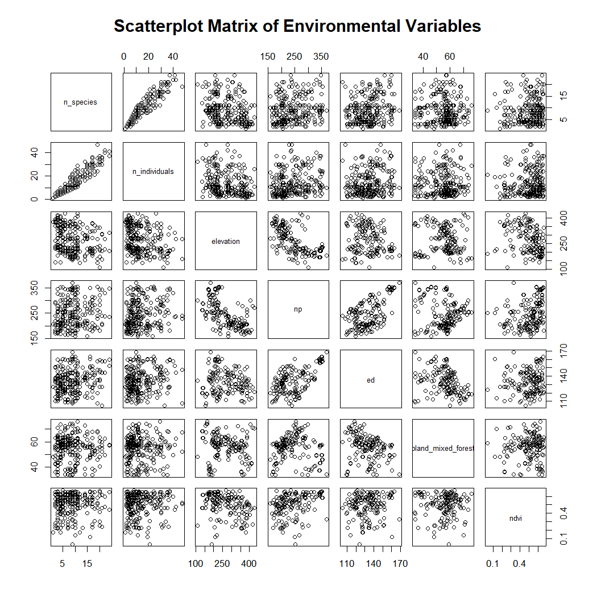

Inspect the distribution and 'skewness' of the environmental data using a histogram plot.


``` r
# Select variables and pivot longer for faceting
hist_data <- enviro_data_df %>%
  dplyr::select(elevation, ed, pland_mixed_forest, ndvi) %>%
  pivot_longer(cols = everything(), names_to = "variable", values_to = "value")

# Create faceted histogram plot
ggplot(hist_data, aes(x = value)) +
  geom_histogram(bins = 10, fill = "skyblue", color = "black") +
  facet_wrap(~ variable, scales = "free") +  # Separate histograms for each variable
  theme_minimal() +
  labs(title = "Multipanel Histogram of Environmental Variables",
       x = "Value",
       y = "Frequency")
```

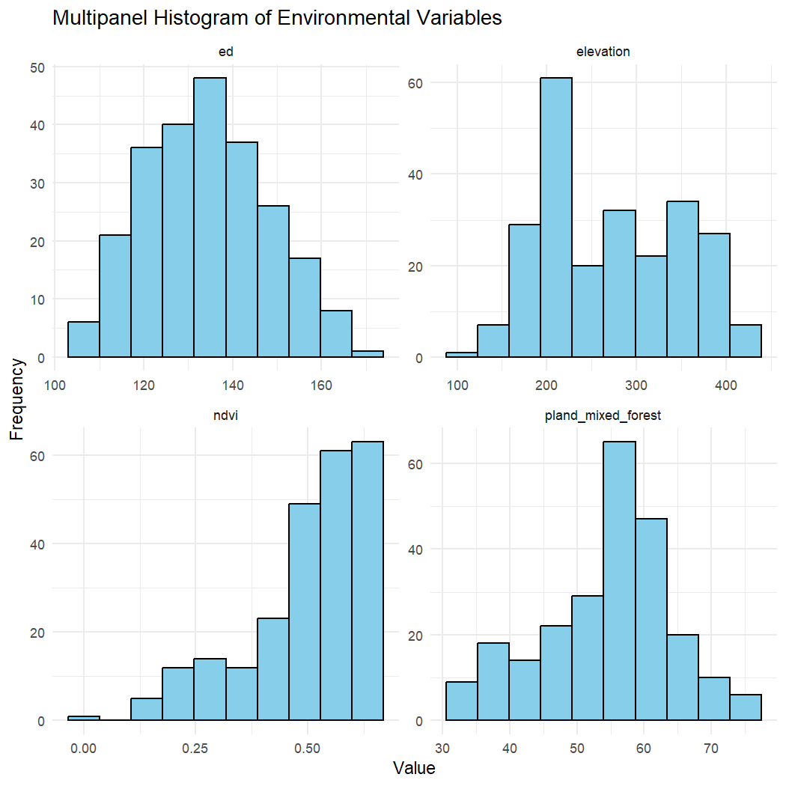

# 7.3 Species Rank Plots {#7.3SpeciesRank}

Species rank plots show the relative abundance (number of individuals) of a species in a community. The number of individuals of each species are sorted in ascending or descending order.

Group the NatureCounts data by species and rank them in order of abundance.


``` r
species_rank <- mauricie_birds_summary %>%
  filter(!is.na(english_name)) %>%  # Remove rows with NA in english_name
  group_by(english_name) %>%  # Group by species only
  summarize(total_abundance = sum(ObservationCount, na.rm = TRUE), .groups = "drop") %>%
  arrange(desc(total_abundance)) %>%  # Sort in descending order of abundance
  slice_max(total_abundance, n = 40) %>%  # Keep only the top 40 species
  mutate(rank = row_number())  # Assign rank to each species
```

Plot the abundance of each species and its rank across the entire park.


``` r
ggplot(species_rank, aes(x = reorder(english_name, rank), y = total_abundance)) +
  geom_line(group = 1, size = 1, color = "black") +
  geom_point(size = 2, color = "darkgreen") +
  theme_minimal() +
  labs(
    title = "Abundance of High Rank Species across La Mauricie Park",
    x = "Species",
    y = "Total Abundance"
  ) +
  theme(
    axis.text.x = element_text(size = 8, angle = 60, hjust = 1)
  )
```

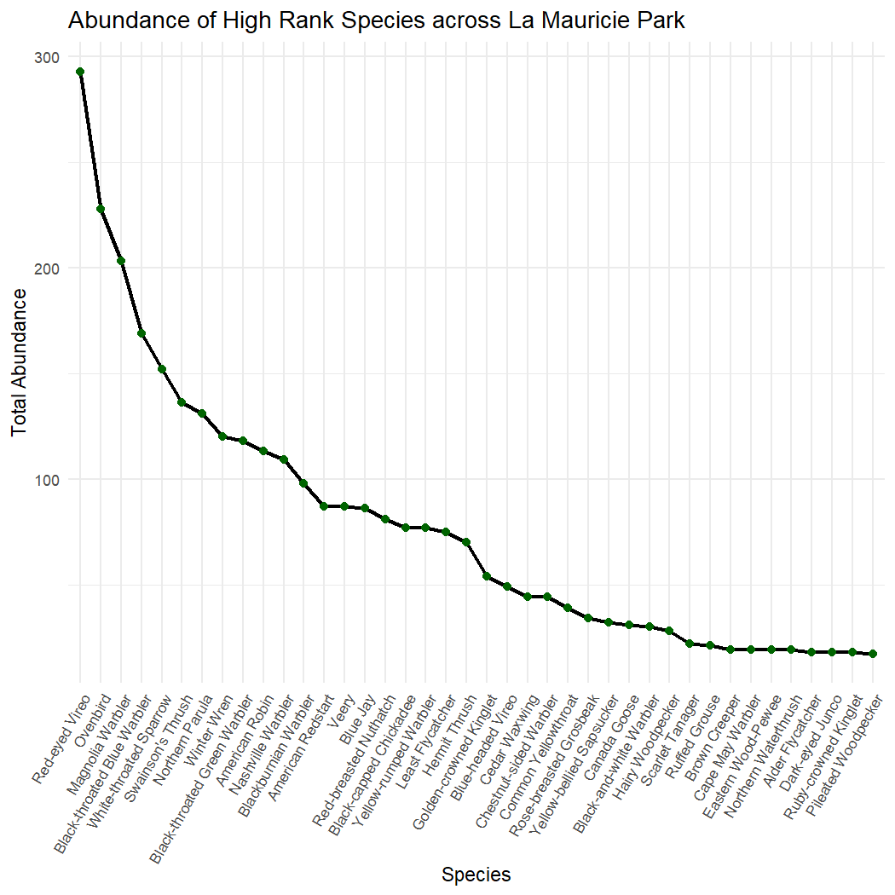

# 7.4 Regression Plots {#7.4Regression}

Create scatter plots with regression lines to explore the relationship of species richness with each environmental variable.


``` r
# Elevation vs. n_species
ggplot(enviro_data_df, aes(x = elevation, y = n_species)) +
  geom_point() +
  geom_smooth(method = "lm", col = "blue") +
  labs(title = "Relationship between Elevation and Species Richness")
#> `geom_smooth()` using formula = 'y ~ x'
```

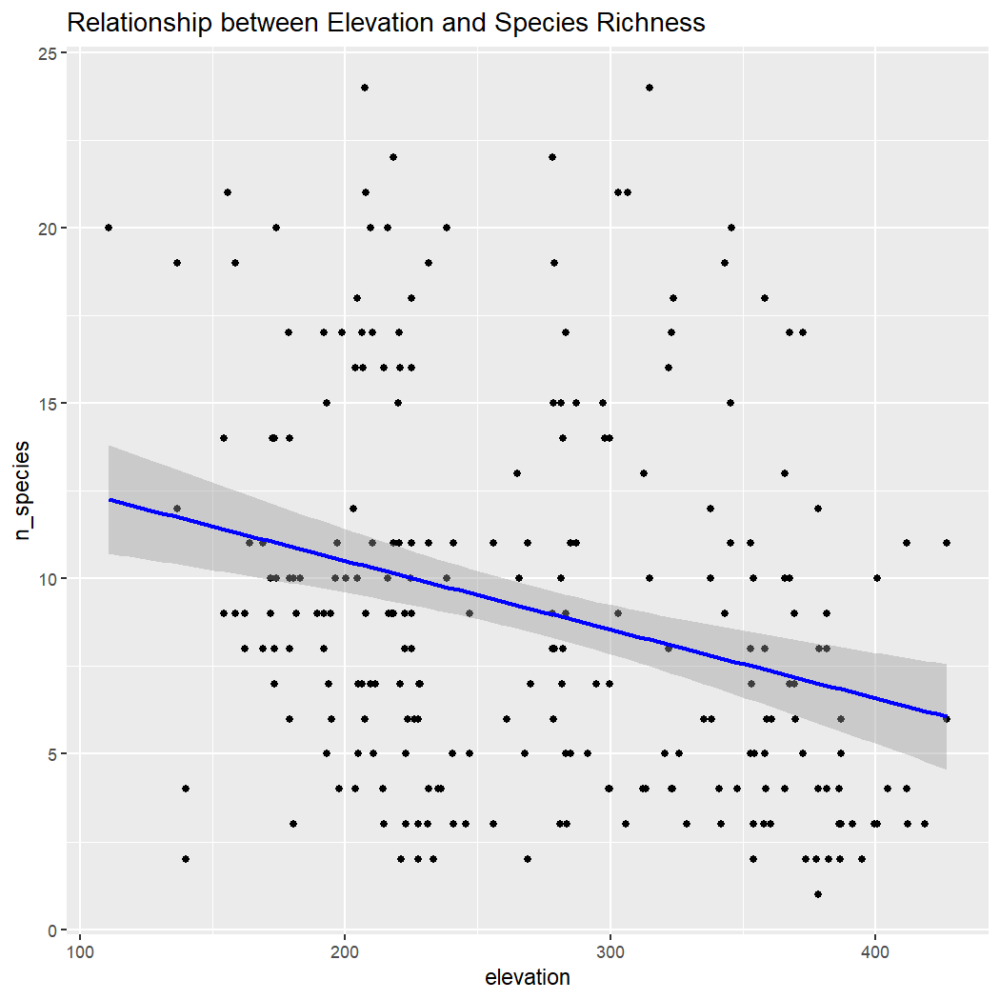

``` r

# PLAND vs. n_species
ggplot(enviro_data_df, aes(x = pland_mixed_forest, y = n_species)) +
  geom_point() +
  geom_smooth(method = "lm", col = "blue") +
  labs(title = "Relationship between PLAND and Species Richness")
#> `geom_smooth()` using formula = 'y ~ x'
```

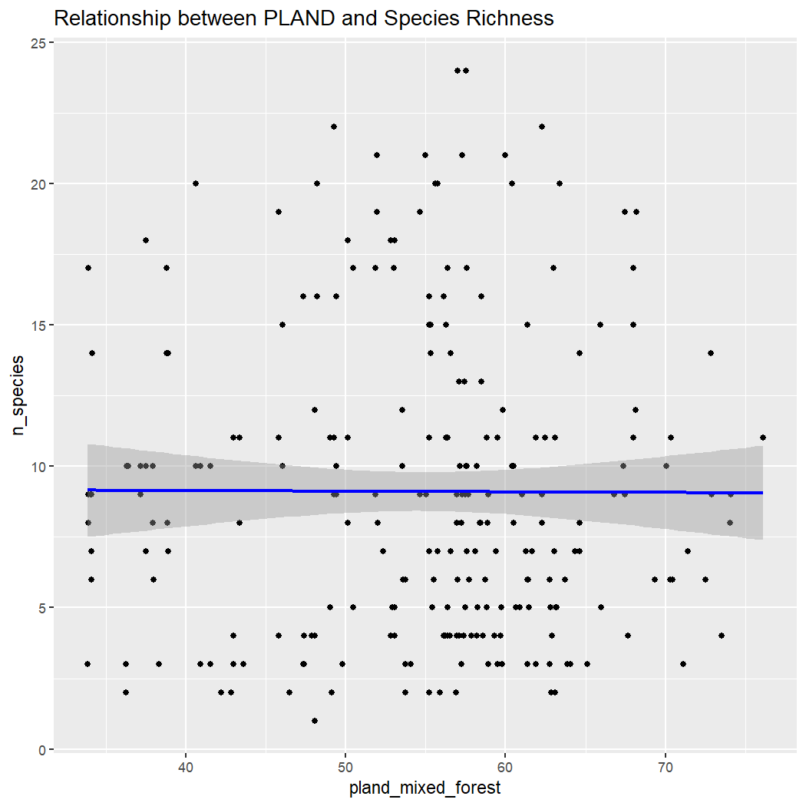

``` r

# Edge Density vs. n_species
ggplot(enviro_data_df, aes(x = ed, y = n_species)) +
  geom_point() +
  geom_smooth(method = "lm", col = "blue") +
  labs(title = "Relationship between Edge Density and Species Richness")
#> `geom_smooth()` using formula = 'y ~ x'
```

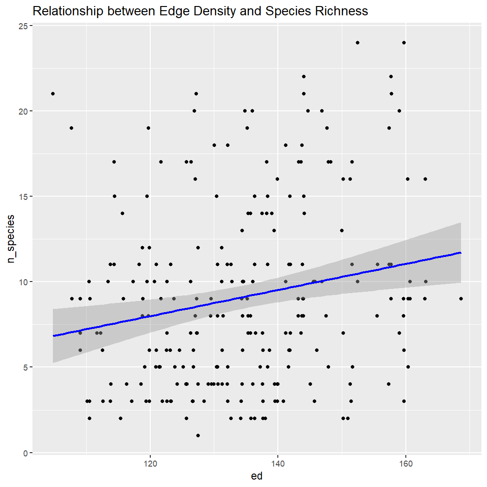

``` r

# NDVI vs. n_species
ggplot(enviro_data_df, aes(x = ndvi, y = n_species)) +
  geom_point() +
  geom_smooth(method = "lm", col = "blue") +
  labs(title = "Relationship between NDVI and Species Richness")
#> `geom_smooth()` using formula = 'y ~ x'
```

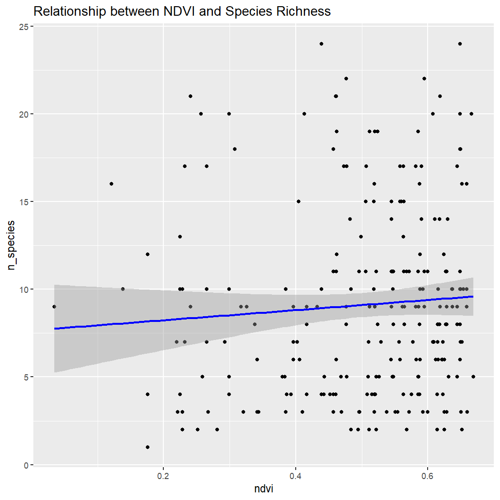

**Conclusion**: There is no clear relationship between species richness and elevation, ED, or NDVI within La Mauricie National Park. **Note**: These results assume that sampling is random with regards to elevation, which is unlikely because sampling is done along roads which tend to be at lower elevations. 

# 7.5 Presence/Absence {#7.5PresenceAbsence}

Create an events matrix containing the geometry for each unique survey event location.

**Recall that most NatureCounts datasets will have a unique SiteCode for each survey point. However, this is not the case the the Quebec Breeding Bird Atlas, which is why this step is required**


``` r
events_matrix <- mauricie_birds_df %>%
  dplyr::select(SiteCode, survey_year, survey_month, survey_day, ObservationCount, latitude, longitude) %>%
  distinct() %>%
  sf::st_as_sf(coords = c("longitude", "latitude"), crs = 4326)
```

Assign a point id identifier to each location based on its unique geometry and return the result as a dataframe. 


``` r
events_matrix <- events_matrix %>% 
  group_by(SiteCode, geometry) %>% 
  mutate(point_id = cur_group_id()) %>%
  ungroup()
```

Restore the longitude and latitude columns, drop the geometry, convert to a dataframe, and keep only the relevant columns.


``` r
events_matrix <- events_matrix %>%
  mutate(longitude = sf::st_coordinates(.)[,1],  # Extract longitude
         latitude = sf::st_coordinates(.)[,2]) %>%  # Extract latitude
  sf::st_drop_geometry() %>%  # Drop geometry column
  as.data.frame() %>%
  dplyr::select(point_id, SiteCode, survey_year, survey_month, survey_day, longitude, latitude)  # Keep relevant columns
```

Join the environmental variables to the events matrix based on `point_id`.


``` r
enviro_events_matrix <- left_join(events_matrix, enviro_data_df, by = "point_id")
```

Filter the NatureCounts data for a species of interest and then merge the events matrix with the species-specific data. This will result in NA values for events where the species was not observed.


``` r
search_species("Golden-crowned Kinglet") #species_id = 14960
#> # A tibble: 1 × 5
#>   species_id scientific_name english_name           french_name               taxon_group
#>        <int> <chr>           <chr>                  <chr>                     <chr>      
#> 1      14960 Regulus satrapa Golden-crowned Kinglet Roitelet à couronne dorée BIRDS

kinglet_events <- mauricie_birds_df %>%
  filter(species_id == "14960")

kinglet_events <- left_join(enviro_events_matrix, kinglet_events,
                          by = c("SiteCode",
                               "survey_year",
                               "survey_month",
                               "survey_day",
                               "latitude",
                               "longitude"))
```

Zero-fill for specific species. Here, we replace the NA values in the `ObservationColumn` with 0 and select the column of interest to inspect your data.


``` r
kinglet_zero_fill <- kinglet_events %>% 
  mutate(ObservationCount = replace(ObservationCount, is.na(ObservationCount), 0)) %>% dplyr::select(point_id, SiteCode, survey_day, survey_month, survey_year, latitude, longitude, elevation:n_individuals, ObservationCount) 
```

Create a Presence/Absence column based on `ObservationCount`.


``` r
kinglet_presence_absence <- kinglet_zero_fill %>%
  mutate(Presence = ifelse(ObservationCount > 0, 1, 0))  # 1 = Presence, 0 = Absence
```

Create a bar plot to summarize the Presence/Absence data, grouped by `survey_year`.  


``` r
kinglet_PA_summary_year <- kinglet_presence_absence %>%
  group_by(survey_year, category = ifelse(ObservationCount > 0, "Presence", "Absence")) %>%
  summarise(count = n(), .groups = "drop")

ggplot(kinglet_PA_summary_year, aes(x = as.factor(survey_year), y = count, fill = category)) +
  geom_col(position = "dodge") +
  scale_fill_manual(values = c("Presence" = "darkgreen", "Absence" = "lightgray")) +
  labs(title = "Golden-crowned Kinglet Presence/Absence per Survey Year",
       x = "Survey Year",
       y = "Number of Observations") +
  theme_minimal()
```

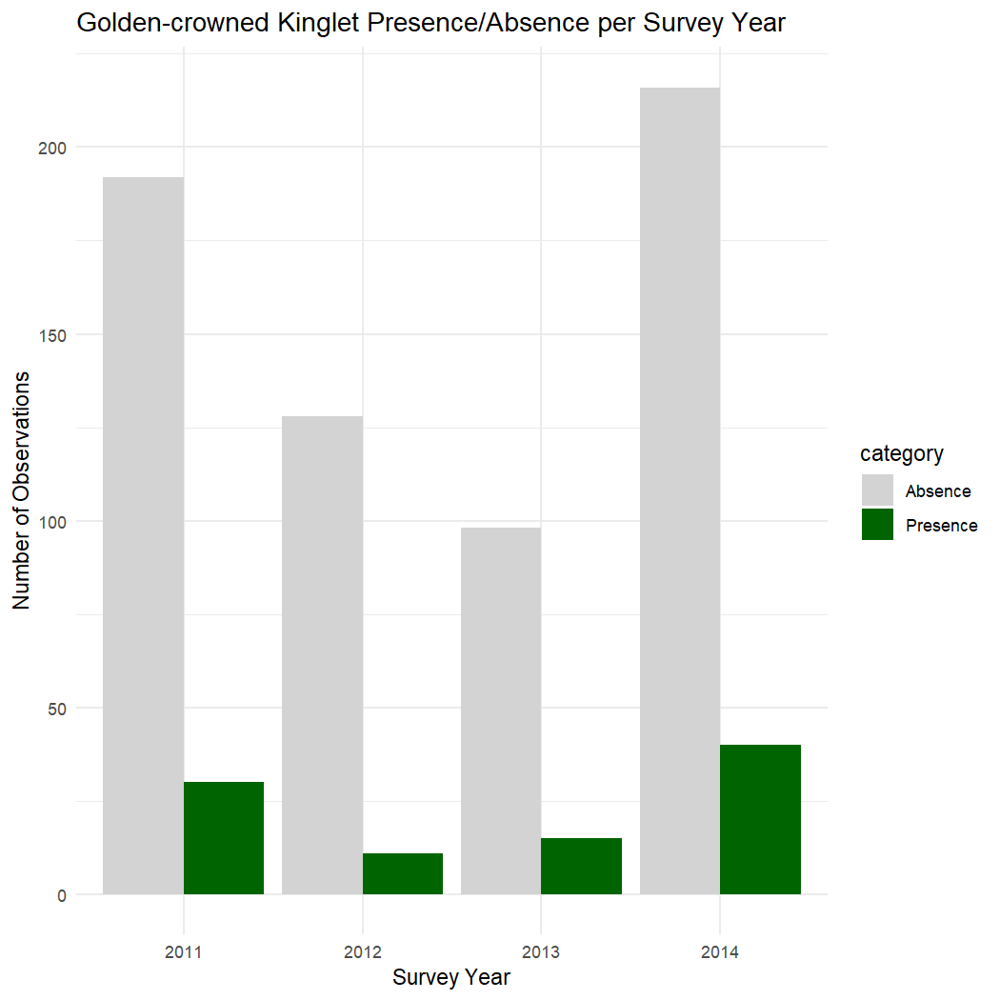

Now we can explore how Golden-crowned Kinglet presence/absence are related to environmental covariates. 

First we will create a box plot for a single covariate.


``` r
ggplot(kinglet_presence_absence, aes(x = factor(Presence), y = ndvi, fill = factor(Presence))) +
  geom_boxplot() +
  labs(x = "Presence/Absence", y = "NDVI") +
  ggtitle("Distribution of NDVI by Presence/Absence") +
  theme_classic()
```

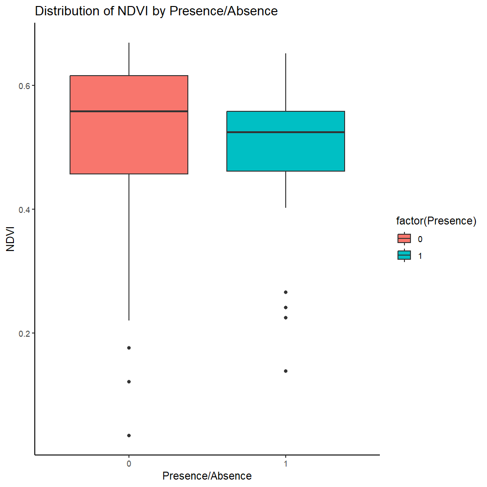

Or you can create a boxplot of multiple covariates using the pivot_longer function.


``` r

# Reshape data for plotting multiple covariates
kinglet_presence_absence_long <- pivot_longer(kinglet_presence_absence, cols = c("elevation", "ed", "pland_needleleaf", "pland_broadleaf", "pland_shrubland", "ndvi"),  names_to = "Covariate", values_to = "Value")

# Create box plots for all covariates
ggplot(kinglet_presence_absence_long, aes(x = factor(Presence), y = Value, fill = factor(Presence))) +
  geom_boxplot() +
  facet_wrap(~ Covariate, scales = "free_y") +
  labs(x = "Presence/Absence", y = "Covariate Value") +
  ggtitle("Distribution of Covariates by Presence/Absence") +
  theme(legend.position = "none")+
  theme_classic()
```

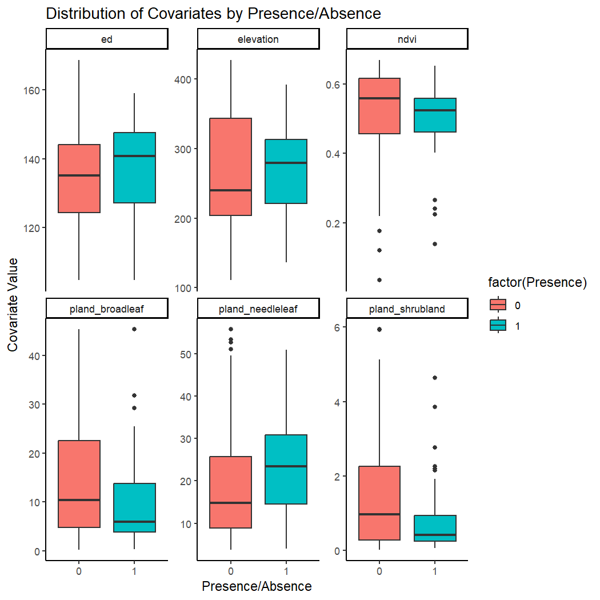

Users may wish to explore these data using simple statistics, like logistic regression, and create response curves showing the relationship between covariates and the probability of a species being present.


``` r
# Fit logistic regression model
model <- glm(Presence ~ ed + elevation + ndvi + pland_broadleaf + pland_needleleaf + pland_shrubland,
            data = kinglet_presence_absence, family = binomial)

# Create sequence for covariate values
covar_range <- seq(min(kinglet_presence_absence$ed), max(kinglet_presence_absence$ed), length = 100)

# Generate predictions while holding other covariates at mean values
newdata <- data.frame(
  ed = covar_range,
  elevation = mean(kinglet_presence_absence$elevation),
  ndvi = mean(kinglet_presence_absence$ndvi),
  pland_broadleaf = mean(kinglet_presence_absence$pland_broadleaf), 
  pland_needleleaf = mean(kinglet_presence_absence$pland_needleleaf), 
  pland_shrubland = mean(kinglet_presence_absence$pland_shrubland)
)

pred_probs <- predict(model, newdata, type = "response")

# Plot response curve
plot(covar_range, pred_probs, type = "l", 
     xlab = "Edge Denisty", ylab = "Probability of Kinglet Presence",
     main = "Response Curve for Edge Density")
```

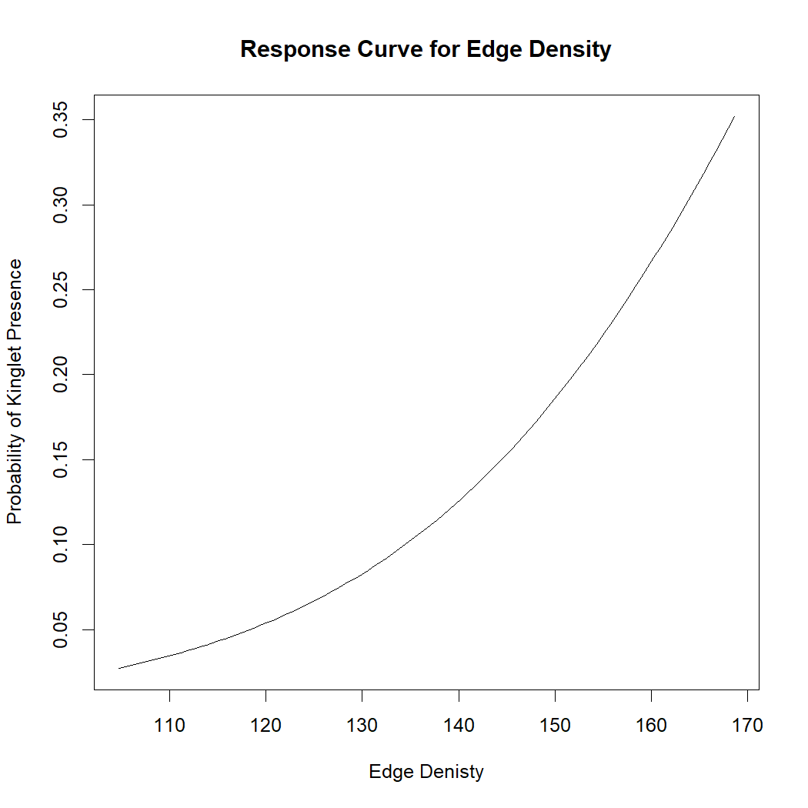
As edge density increase, the probability of a Golden Crown Kinglet increase slightly. Users can explore these relationships for other environmental covariates.  

\_\_\_\_\_\_\_\_\_\_\_\_\_\_\_\_\_\_\_\_\_\_\_\_\_\_\_\_\_\_\_\_\_\_\_\_\_\_\_\_\_\_\_\_\_\_\_\_\_\_\_\_\_\_\_\_\_\_\_\_\_\_\_\_\_\_\_\_\_\_\_\_\_\_\_\_\_\_\_\_\_\_\_\_\_\_\_\_\_\_\_\_\_\_\_\_\_\_\_\_\_\_\_\_\_\_\_\_\_\_\_\_

**Congratulations!** You completed **Chapter 7 - Summary Tools**. In this chapter, you successfully summarized and visualized environmental data, biodiversity counts, and presence/absence data using various plotting techniques. If you'd like to explore some Additional Resources based on previous Spatial Data chapters, the [Raster Tools](Additional%20Resources%20-%20Raster%20Tools.Rmd) article is also available.
