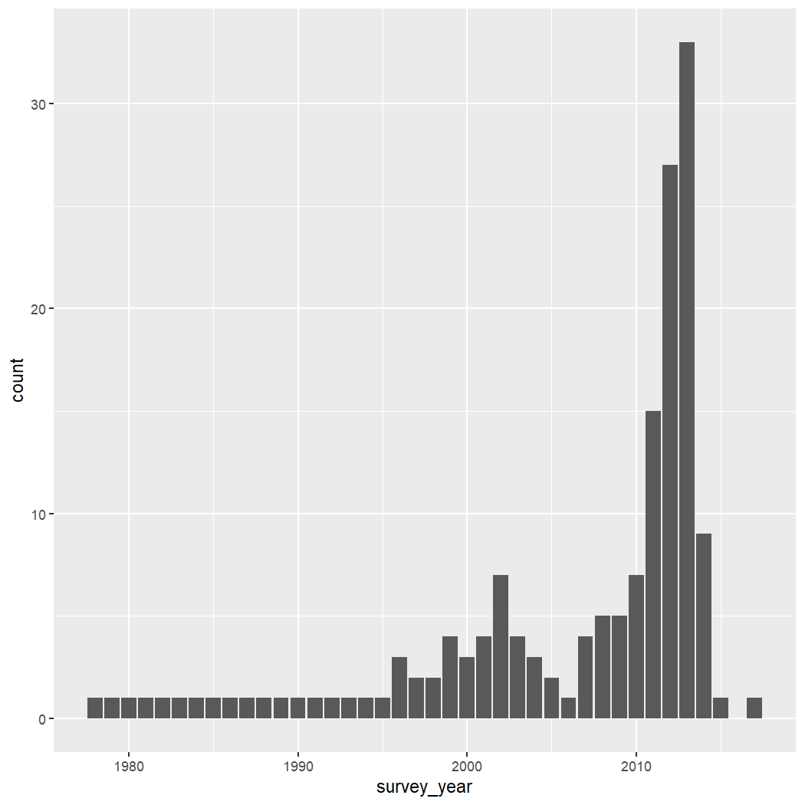
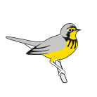

This is an internal reference for creating documentation with images in 
precompiled vignettes.

## Precompile

The precompile script:


```
# Pre-compile vignettes which run for a while
library(knitr)
library(readr)
library(stringr)

# Remove the figures folder (start clean)
unlink("figures", recursive = TRUE)

# Make sure to put figures in local dir in knitr chunk options
v <- list.files("vignettes", ".orig$", full.names = TRUE, recursive = TRUE)

for(i in v) {
  new <- stringr::str_remove(i, ".orig$")
  knit(i, new)
  
  read_lines(new) %>%
    str_replace_all("\"vignettes(/articles)*/", "\"") %>%
    write_lines(new)
}

cache <- list.files("./vignettes", "cache", include.dirs = TRUE,
                    recursive = TRUE, full.names = TRUE)
unlink(cache, recursive = TRUE)

#build vignette
#devtools::build_vignettes()
#unlink("./doc/", recursive = TRUE)
#unlink("./Meta/", recursive = TRUE)
```

This script pre-compiles vignettes and replaces the figure paths appropriately.\
Note that this *relies* on all figures having alt text and at least a `fig.cap = ""`
as this creates a different style of figure and the replacement therefore works.

All precompiled vignettes also need to define the figure path to be in the 
`vignettes/articles/figures` folder. Provide a suffix as well to prevent 
duplicates.

```
knitr::opts_chunk$set(
  collapse = TRUE,
  comment = "#>",
  # For pre-compiling and pkgdown (relative to pkg home)
  fig.path = "figures/suffix_",
  dpi = 150
)
```


## Images: Created in R

>  **Note**: Must use `fig.alt` and set `fig.cap = ""`


``` r
library(naturecounts)
library(ggplot2)

ggplot(data = bcch, aes(x = survey_year)) + 
  geom_bar()
```



## Images: Created elsewhere

- Put the image in the `vignettes/articles/figures_other` folder
- Reference the image from the working directory of the article.

With **`include_graphics()`**

> Use `fig.alt = "Test of birds canada logo", fig.cap = ""`


``` r

```


**Directly with markdown: ``**

> **Note:** Use the `\` at the end to ensure that the text is treated as *alt* 
text and not a caption ([ref](https://github.com/quarto-dev/quarto-cli/discussions/9310#discussioncomment-9056156))

`\`

\


